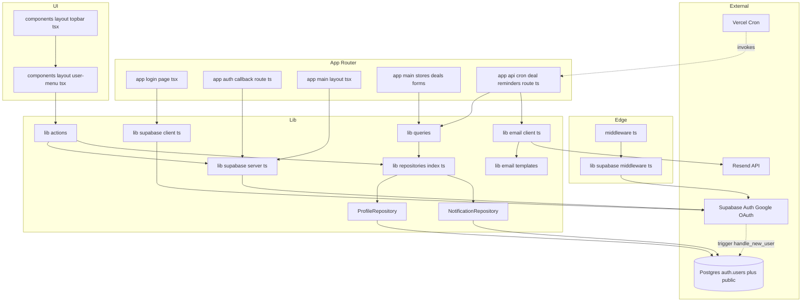
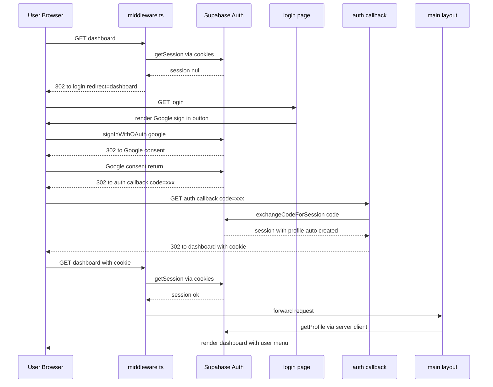
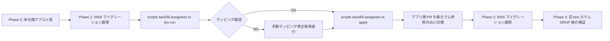
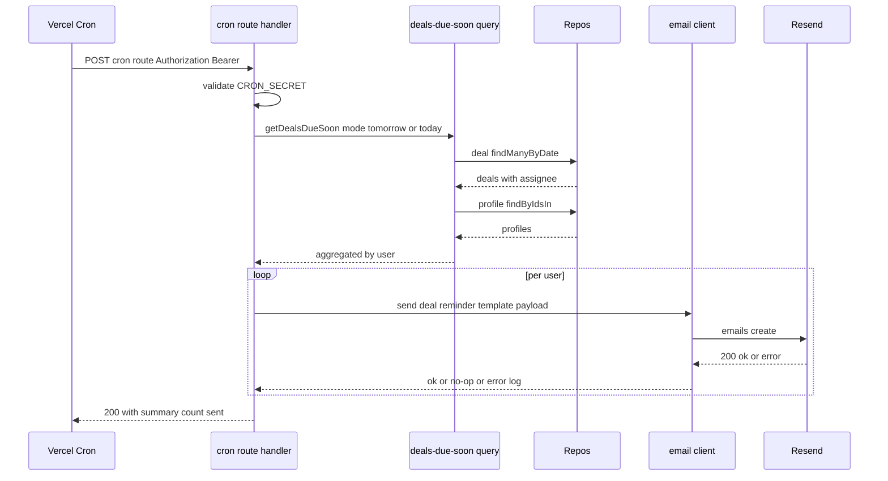
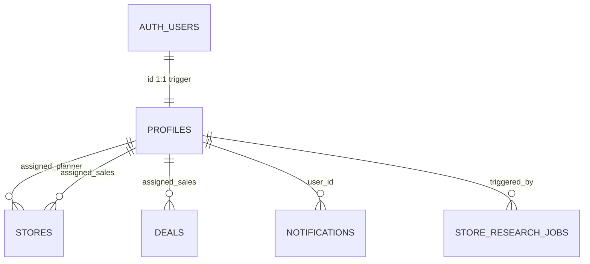
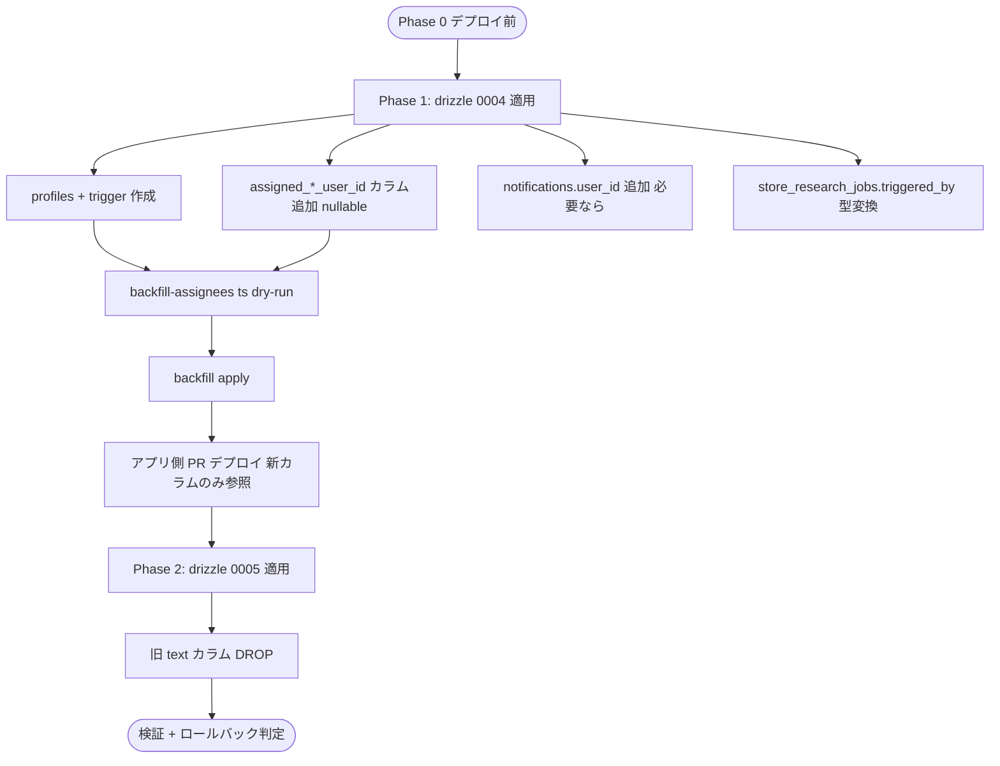

# Design Document — auth-and-notifications

**Status**: Draft
**Language**: ja
**Source Issue**: [#16](https://github.com/ManatoYamashita/fw-sales/issues/16)
**Discovery type**: Light Discovery(既存基盤拡張 + 新規外部統合の混在)
**Companion docs**: `requirements.md`, `research.md`

## Overview

本仕様 (`auth-and-notifications`) は、`fw-sales` ツールに **Supabase Auth (Google OAuth) を導入し、ユーザー識別を起点としたメール通知基盤と担当者カラムの構造化** を 1 つの基盤整備として束ねる。これまで text 自由文字列だった担当者表現はユーザー参照に置換され、認証されたユーザーが「自分宛の店舗 / 商談」を曖昧さなく特定できるようになる。同時に Resend ベースのメール送信と Vercel Cron による定時配信を実装し、調査ジョブ完了通知 / 商談予定日リマインダーを配信する。

**Users**: フリーストWEB の営業 / 企画担当(`fw-sales` ツール利用者全員)が `/login` 経由で Google OAuth サインインし、認証ユーザー本人として店舗 / 商談 / 調査ジョブを操作する。マネージャー / 開発者は profile レコードを通じてユーザーを構造化参照する。

**Impact**: 認証ゼロから middleware ベースの全画面ガードへ移行する破壊的変更。`stores.assigned_planner` / `stores.assigned_sales` / `deals.assigned_sales` の text カラムは 2 段階マイグレーションで完全置換され、`lib/domain/staff.ts:10-13` の固定 `CURRENT_USER` も廃止される。

### Goals

- Google OAuth による認証を `(main)` 配下の全画面に強制する(Req 1)
- `profiles` テーブルを Postgres trigger で auth.users から自動生成する(Req 2)
- `assigned_*` 担当者カラムを uuid FK ベースに完全置換し、UI / Server Action / Mock 経路まで一貫させる(Req 3)
- Resend ベースのメール送信基盤を構築し、API キー未設定時は no-op で動作させる(Req 4)
- 調査ジョブ完了 / 失敗、および商談予定日リマインダーをメール配信する(Req 5, 6)
- アプリ内通知をユーザー単位で絞り込む契約を提供する(Req 7、UI 実装は #14)
- 環境変数雛形と起動時警告を整備する(Req 8)

### Non-Goals

- メール / パスワード認証、招待制、ドメイン制限(将来 Issue)
- ロール別権限分岐(`role='admin'` のセマンティクスは確保するが、本仕様では権限分岐に使わない)
- 編集履歴 / 監査ログ
- placeholder profile を実ユーザーへマージする運用 UI
- Slack / Discord / Web Push 等のメール以外の通知チャネル
- アプリ内通知ベル UI 本体(#14 が所有、本仕様は `user_id` 絞り込み契約のみ)
- `store_research_jobs` / `notifications` テーブルの新設(#14 が所有、本仕様は user 紐付けカラム追加のみ)

## Boundary Commitments

### This Spec Owns

- **認証エントリポイント**: `/login` ページ、`/auth/callback` Route Handler、サインアウト Server Action
- **認証ガード**: ルート `middleware.ts` と `lib/supabase/middleware.ts` の連携によるセッション維持と保護対象判定
- **Supabase クライアント抽象**: `lib/supabase/{server,client,middleware}.ts` の 3 ヘルパ
- **`profiles` テーブル**: スキーマ・自動生成 trigger・`ProfileRepository` 抽象とその DB / Mock 実装
- **担当者カラム移行**: `stores.assigned_*_user_id` / `deals.assigned_sales_user_id` 追加(Phase 1)、旧 text 列 DROP(Phase 2)、バックフィルスクリプト(`stores` / `deals` / `store_research_jobs.triggered_by` の text → uuid マッピングも同スクリプトで担う)
- **メール送信抽象**: `lib/email/client.ts`(Resend ラッパ)と no-op フォールバック、共通 HTML レイアウト、3 種テンプレート(research-job-completed / research-job-failed / deal-reminder)
- **リマインダー Cron**: `app/api/cron/deal-reminders/route.ts`、`vercel.json` のスケジュール、CRON_SECRET 検証
- **#14 連携カラム責務**: `notifications.user_id` 追加(本仕様)、`store_research_jobs.triggered_by` の uuid 化(本仕様)、ジョブステータス遷移時のメール送信フック
- **環境変数雛形と起動時警告**

### Out of Boundary

- **`notifications` テーブル本体 / 通知ベル UI**: #14 が所有。本仕様は `user_id` カラム追加と「ベルが本人通知のみ表示する」契約のみを定義
- **`store_research_jobs` テーブル本体 / ジョブワーカー本体**: #14 が所有。本仕様はジョブ完了 / 失敗時にメール送信フックを呼ぶ契約と `triggered_by` カラムの text → uuid 化のみを定義
- **店舗詳細画面**: #15 が所有。リマインダーメール内のリンク先は #15 公開後の URL を前提とする
- **メール / パスワード認証 / 招待制 / ドメイン制限**: 将来 Issue
- **`role='admin'` を用いた権限分岐**: 将来 Issue
- **placeholder profile マージ UI / 監査ログ**: 将来 Issue
- **`handoffs` 関連の担当者(`ops_assignee` 等)の user 参照化**: 別 Issue。本仕様は `OPS_MEMBERS` 定数を維持し、handoff 関連は text のままとする

### Allowed Dependencies

- **Auth**: `@supabase/ssr` ^0.5.0、`@supabase/supabase-js` ^2.45.0(新規)
- **Email**: `resend` ^4.0.0(新規)
- **DB**: `drizzle-orm` ^0.45.2、`postgres` ^3.4.9(既存)
- **Runtime**: Next.js 16.2.4、React 19.2.4(既存)
- **Cron**: Vercel Cron(`vercel.json` 経由、デプロイ時依存)
- **Test**: `vitest` ^4.1.5(既存)

依存方向(左→右、逆方向 import は禁止):

```
types → cache/domain → repositories → queries/actions → email/supabase → routes/UI
```

`lib/supabase/*` は **routes と middleware からのみ** 呼び出される。`lib/email/*` は **queries / actions / route handlers** から呼び出される。

### Revalidation Triggers

- **`profiles.role` の値追加**: `member` / `placeholder` 以外を導入 → UI 表示 / 担当者選択 UI のフィルタ仕様を再検討
- **`assigned_*_user_id` の nullable 廃止 or 多担当化**: 現在 `nullable + 単一参照`、これが変わると Server Action / フォーム / クエリ全層を再設計
- **Auth プロバイダ追加(email/password など)**: middleware / `/login` UI / OAuth コールバック契約に影響
- **Cron スケジュール変更 (時刻 / 頻度)**: `vercel.json` と運用ドキュメントの更新を要する
- **`notifications.user_id` の filter 契約変更**: #14 の通知ベル UI に影響
- **`store_research_jobs.triggered_by` の型 / FK 関係変更**: #14 のジョブワーカー実装に影響

## Architecture

### Existing Architecture Analysis

`fw-sales` は **Next.js 16 App Router + RSC ファースト** で構成され、`lib/repositories/index.ts:81-139` の `buildRepos()` が `USE_MOCK_DB` で Mock / DB 経路を動的切替する **top-level await + 動的 import** 規約が確立済(`research.md` §1.1 参照)。Drizzle スキーマは text カラム中心で、列挙型は text + Action 層型ガードで担保する規約(`lib/db/schema.ts:1-12` のコメント参照)。Cache タグは `lib/cache.ts:6-22` の `CACHE_TAGS` に集約され、Server Action 後に `revalidateTag` で stale-while-revalidate を発火する。

本仕様はこの規約に **完全準拠** し、新規データ層(profiles / notifications)を `Repos` interface 拡張で組み込む。一方で **認証 / メール / Cron は完全新規** で、`lib/supabase/`、`lib/email/`、`app/api/cron/` を新設する。

### Architecture Pattern & Boundary Map



**Architecture Integration**:

- **選定パターン**: 既存の **RSC + Server Actions + Repository** パターンを踏襲し、`lib/supabase/`(認証アダプタ)と `lib/email/`(送信アダプタ)を **同階層の独立アダプタ層** として追加。Cron は App Router の Route Handler に統合
- **責務境界**:
  - `lib/supabase/*` は **認証セッションの取得 / 検証 / 更新のみ**。プロフィールデータ取得は `ProfileRepository` 経由
  - `lib/email/*` は **送信アクションのみ**。受信者特定は呼び出し側(queries / cron route / job worker)
  - データレイヤー(`profiles` / `notifications`)は既存 Repos パターンに合流。Mock / DB 切替は `USE_MOCK_DB` 1 点に集約
- **既存パターン保持**: top-level await `buildRepos()` / `CACHE_TAGS` 集約 / `'use cache'` + `revalidateTag` / `ActionResult<T>` / `import "server-only"` 規約
- **新コンポーネント根拠**: 認証 / メール / Cron はいずれも Repository パターンに乗せられない外部 I/O を持つため独立アダプタが必要
- **Steering 適合**: `tech.md` の「Server / Client 境界」「Cache タグ集約」「Repository パターン単一窓口」に準拠

### Technology Stack

| Layer | Choice / Version | Role in Feature | Notes |
|-------|------------------|-----------------|-------|
| Frontend | Next.js 16.2.4 / React 19.2.4 | `/login`、UserMenu、Form の担当者選択 UI | 既存 |
| Auth | `@supabase/ssr` ^0.5.0 / `@supabase/supabase-js` ^2.45.0 | Google OAuth フロー、SSR セッション、cookies async 互換 | **新規** |
| Backend | Server Actions + Route Handlers | サインアウト、OAuth callback、Cron、ジョブフック | 既存規約 |
| Data | drizzle-orm 0.45+ / postgres 3.4+ | `profiles` 追加、`assigned_*_user_id` 追加 / DROP、`notifications.user_id`、`store_research_jobs.triggered_by` 型変換 | 既存 + 拡張 |
| Email | `resend` ^4.0.0 | 完了 / 失敗 / リマインダーの SMTP 配信、no-op フォールバック | **新規** |
| Templates | 自前 React JSX → HTML 文字列化(no `react-email` 依存) | 3 テンプレートのみで保守容易 / 依存追加最小化(`research.md` 決定 D-3) | **新規** |
| Cron | Vercel Cron(`vercel.json`) | 前日朝 / 当日朝 の 2 回(JST) | **新規** |
| Identity Linking | Postgres trigger `handle_new_user()` | `auth.users` INSERT → `profiles` 自動生成 | **新規(Supabase 標準パターン)** |

詳細トレードオフは `research.md` §「Design Decisions」に記録。

## File Structure Plan

### Directory Structure

```
fw-sales/
├── middleware.ts                                         (NEW) Next.js middleware セッション維持 + (main) ガード
├── vercel.json                                           (NEW) Vercel Cron スケジュール定義
├── app/
│   ├── login/
│   │   ├── page.tsx                                      (NEW) サインイン画面 RSC
│   │   └── _components/
│   │       └── google-signin-button.tsx                  (NEW) Client Component OAuth 起動
│   ├── auth/
│   │   └── callback/
│   │       └── route.ts                                  (NEW) OAuth コールバック Route Handler
│   ├── api/
│   │   └── cron/
│   │       └── deal-reminders/
│   │           └── route.ts                              (NEW) リマインダー Cron Route Handler
│   ├── (main)/
│   │   ├── layout.tsx                                    (MOD) currentProfile を fetch して children へ
│   │   ├── stores/new/_components/store-new-form.tsx     (MOD) 担当者選択を user 選択へ
│   │   └── deals/new/_components/deal-new-form.tsx       (MOD) 同上
│   └── layout.tsx                                        (MOD) 必要なら SessionProvider(現状不要見込み)
├── components/
│   └── layout/
│       ├── topbar.tsx                                    (MOD) Bell の隣に UserMenu を配置
│       └── user-menu.tsx                                 (NEW) アバター + サインアウト ドロップダウン
├── lib/
│   ├── supabase/
│   │   ├── server.ts                                     (NEW) Server Component 用クライアント (cookies async)
│   │   ├── client.ts                                     (NEW) Client Component 用クライアント
│   │   ├── middleware.ts                                 (NEW) middleware セッション更新ヘルパ
│   │   └── types.ts                                      (NEW) Supabase 由来型エイリアス
│   ├── email/
│   │   ├── client.ts                                     (NEW) Resend SDK ラッパ + no-op フォールバック
│   │   ├── index.ts                                      (NEW) public exports
│   │   └── templates/
│   │       ├── _layout.tsx                               (NEW) 共通 HTML レイアウト
│   │       ├── research-job-completed.tsx                (NEW) ジョブ完了
│   │       ├── research-job-failed.tsx                   (NEW) ジョブ失敗
│   │       └── deal-reminder.tsx                         (NEW) 商談リマインダー
│   ├── repositories/
│   │   ├── index.ts                                      (MOD) Repos / TxRepos に profile / notification 追加
│   │   ├── profile-repository.ts                         (NEW) ProfileRepository interface
│   │   └── notification-repository.ts                    (NEW) NotificationRepository interface (#14 連携)
│   ├── db/
│   │   ├── schema.ts                                     (MOD) profiles 追加 / assigned_*_user_id 追加
│   │   ├── index.ts                                      (MOD) makeProfileRepo / makeNotificationRepo export
│   │   ├── profile-repository.ts                         (NEW) Drizzle 実装
│   │   ├── notification-repository.ts                    (NEW) Drizzle 実装
│   │   ├── store-repository.ts                           (MOD) assigned_*_user_id 対応
│   │   └── deal-repository.ts                            (MOD) assigned_sales_user_id 対応
│   ├── mock/
│   │   ├── profile.ts                                    (NEW) Mock 実装
│   │   ├── notification.ts                               (NEW) Mock 実装
│   │   ├── seed.ts                                       (MOD) seed プロフィール + 担当者 uuid 参照
│   │   ├── store.ts                                      (MOD) フィルタ・ソートで参照する箇所
│   │   └── deal.ts                                       (MOD) 同上
│   ├── queries/
│   │   ├── profiles.ts                                   (NEW) `'use cache'` でプロフィール取得
│   │   └── deals-due-soon.ts                             (NEW) リマインダー対象商談の抽出
│   ├── actions/
│   │   ├── auth-actions.ts                               (NEW) サインアウト Server Action
│   │   ├── store-actions.ts                              (MOD) assigned_*_user_id を FormData から取得
│   │   └── deal-actions.ts                               (MOD) 同上
│   ├── domain/
│   │   └── staff.ts                                      (MOD) PLANNERS/SALES/CURRENT_USER を削除、OPS_MEMBERS は handoff 仕様まで暫定維持(@deprecated コメント付与)
│   ├── cache.ts                                          (MOD) profiles / profile() / notifications / notification() タグ追加
│   └── jobs/                                             (REF) #14 のワーカーから email を呼ぶフックポイント
├── scripts/
│   └── backfill-assignees.ts                             (NEW) dry-run / apply 切替の 1-shot バックフィル
├── drizzle/
│   ├── 0004_add_profiles_and_assignee_user_id.sql        (NEW) Phase 1 + handle_new_user trigger
│   └── 0005_drop_legacy_assignee_text_columns.sql        (NEW) Phase 2
├── types/
│   ├── profile.ts                                        (NEW) Profile / ProfileInput 型
│   ├── notification.ts                                   (NEW) Notification 型(#14 と整合)
│   ├── store.ts                                          (MOD) assigned_*_user_id へ
│   └── deal.ts                                           (MOD) 同上
├── .env.example                                          (MOD) +7 環境変数
└── README.md                                             (MOD) 自由登録のリスク注記
```

### Modified Files の責務(主要のみ抜粋)

- `lib/repositories/index.ts` — `TxRepos` / `Repos` に `profile` / `notification` を追加し、Mock / DB 経路の両方で同 interface を提供。`buildRepos()` のパターンは厳守
- `lib/db/schema.ts` — `profiles` テーブル(uuid PK)、`stores.assigned_planner_user_id` / `stores.assigned_sales_user_id` / `deals.assigned_sales_user_id`(全 nullable uuid → `profiles.id`)、`notifications.user_id`(nullable uuid → `profiles.id`)、`store_research_jobs.triggered_by`(text → uuid)
- `lib/domain/staff.ts` — `PLANNERS` / `SALES` / `CURRENT_USER` を削除し、`@deprecated` コメントで `lib/queries/profiles.ts` への移行を案内。`OPS_MEMBERS` は handoff 関連が user 参照化される別 Issue まで暫定維持(本仕様 Out of Boundary)。`CURRENT_USER` の参照箇所は `getCurrentProfile()` に置換済になる

### Boundary ↔ File Structure 整合確認

- 認証(`lib/supabase/`、`middleware.ts`、`app/login/`、`app/auth/callback/`)と他レイヤーは separate path ✓
- メール(`lib/email/`)とテンプレート(`lib/email/templates/`)は同階層 ✓
- データ層(`lib/repositories/profile-repository.ts` 等)は既存 Repository パターンに合流 ✓
- `notifications` テーブル本体は既存 `lib/db/schema.ts` 内に定義(本仕様で **`user_id` カラムのみ追加**、テーブルそのものの新設責務は #14 が担う前提で本仕様はカラム追加 ALTER のみを担う / もしくは #14 のマイグレーションに本仕様の `user_id` を含めて 1 マイグレーションで通す。決定は §System Flows の Migration Strategy 参照)

## System Flows

### 認証セッションフロー(Sequence)



**Key decisions**:
- middleware は `(main)` 配下のみマッチさせ、`/login` / `/auth/callback` / `/_next/*` / 静的アセットは除外
- `redirect` パラメータでサインイン後に元のルートへ復帰
- profile 自動生成は `handle_new_user` Postgres trigger が担うため、callback 完了時点で profile レコードは存在保証される

### Migration Strategy(担当者カラム移行)



- **Phase 1 マイグレーション内容**:
  - `profiles` テーブル + UNIQUE / FK / trigger を作成
  - `stores.assigned_planner_user_id` / `stores.assigned_sales_user_id` / `deals.assigned_sales_user_id` を **nullable uuid** で追加(NOT NULL は付けない、FK は `profiles.id`)
  - `store_research_jobs.triggered_by` の型変換は **2 段方式**: 新カラム `triggered_by_user_id uuid` を追加(nullable)→ Backfill で値投入 → 後段マイグレーション(0005 と同時 or 別)で旧 `triggered_by` を DROP し、新カラムを `triggered_by` にリネーム。`#14` が `store_research_jobs` を未新設の場合は本仕様で対応せず、#14 側マイグレーションで最初から uuid 列として導入する責務へ振り替える(Boundary Commitments 参照)
- **Backfill 動作**(`scripts/backfill-assignees.ts` がカバーする範囲):
  - 対象: `stores.assigned_planner` / `stores.assigned_sales` / `deals.assigned_sales` / `store_research_jobs.triggered_by`(後者は #14 が text で導入済のときのみ)
  - 各テーブル / カラムの distinct な旧 text 値リストを取得
  - `profiles.display_name` で完全一致を試行 → ヒットした profile.id にマップ
  - 不一致値は `placeholder profile`(`role='placeholder'`、`email='placeholder-{slug}@local.invalid'`)を新規生成しマップ
  - dry-run モード: マッピング表(対象テーブル / 旧値 / マッチ種別 / 新 uuid)を stdout に出して終了
  - apply モード: UPDATE 文を実行
- **Phase 2 マイグレーション内容**:
  - `stores.assigned_planner` / `stores.assigned_sales` / `deals.assigned_sales` を DROP
  - `store_research_jobs.triggered_by`(text)を DROP し `triggered_by_user_id` を `triggered_by` にリネーム(該当時のみ)
  - 注意: Phase 1 + Backfill + アプリ切替を **同一デプロイサイクルに含めることが安全**(`research.md` D-2 参照)

#### Phase 1 ロールバック手順

Phase 1 適用後に本番で重大な問題が発覚した場合、以下の SQL を逆順で実行する(データ依存はないため安全):

1. `DROP TRIGGER IF EXISTS on_auth_user_created ON auth.users;`
2. `DROP FUNCTION IF EXISTS public.handle_new_user;`
3. `ALTER TABLE store_research_jobs DROP COLUMN IF EXISTS triggered_by_user_id;`(本仕様で追加した場合のみ。`#14` 側で追加した場合は #14 の rollback 手順を参照)
4. `ALTER TABLE notifications DROP COLUMN IF EXISTS user_id;`(本仕様で追加した場合のみ)
5. `ALTER TABLE stores DROP COLUMN IF EXISTS assigned_planner_user_id, DROP COLUMN IF EXISTS assigned_sales_user_id;`
6. `ALTER TABLE deals DROP COLUMN IF EXISTS assigned_sales_user_id;`
7. `DROP TABLE IF EXISTS profiles;`
8. アプリ側コードを Phase 0 状態のコミットへ revert(担当者 text 参照に戻る)

注意: 上記は **Phase 1 専用の rollback 手順**。Phase 2(旧 text DROP)適用後の rollback はデータ復元が必要なため、Phase 2 投入前にステージング環境での十分な検証を必須とする。

### Cron 起動とリマインダーフロー



**Key decisions**:
- Cron スケジュール(JST 基準): 前日朝 7:00 = UTC 22:00、当日朝 8:00 = UTC 23:00 → `vercel.json` に 2 件登録
- `mode` クエリパラメータ(`tomorrow` / `today`)で同一ハンドラを再利用
- `RESEND_API_KEY` 未設定時は `EmailClient.send()` が no-op + warn ログ → ハンドラは 200 を返す
- 0 件抽出時はメール送信スキップ(Req 6.8)

## Requirements Traceability

| Req | Summary | Components | Interfaces / Contracts | Flows |
|---|---|---|---|---|
| 1.1 | 未認証 → `/login` | `middleware.ts`, `lib/supabase/middleware.ts` | `updateSession()` | 認証フロー |
| 1.2 | Google サインイン起動 | `app/login/page.tsx`, `google-signin-button.tsx`, `lib/supabase/client.ts` | `signInWithOAuth({provider:'google'})` | 認証フロー |
| 1.3 | OAuth 完了で元ルート復帰 | `app/auth/callback/route.ts`, `lib/supabase/server.ts` | `exchangeCodeForSession()` + `redirect` パラメータ | 認証フロー |
| 1.4 | OAuth 失敗時エラー表示 | `app/auth/callback/route.ts`, `app/login/page.tsx` | `error` クエリ受け取り | 認証フロー |
| 1.5 | 認証済 → ユーザーメニュー表示 | `components/layout/user-menu.tsx`, `topbar.tsx`, `app/(main)/layout.tsx` | `getCurrentProfile()` | — |
| 1.6 | サインアウト → `/login` | `user-menu.tsx`, `lib/actions/auth-actions.ts` | `signOutAction()` | — |
| 1.7 | Google OAuth のみ提供 | `/login` UI、Supabase 設定 | (UI 制約) | — |
| 2.1 | 初回サインインで profile 自動生成 | `drizzle/0004_*.sql` `handle_new_user` trigger | Postgres trigger 契約 | 認証フロー |
| 2.2 | profile.role を `member` 初期化 | `handle_new_user` trigger | trigger 内 DEFAULT | — |
| 2.3 | 再サインインで profile 再利用 | `handle_new_user` ON CONFLICT 不要(初回 INSERT のみ) | — | — |
| 2.4 | 自由登録方式 | Supabase Auth 設定 | (運用) | — |
| 2.5 | role=`member`/`placeholder` | `profiles.role` text + アプリ層型ガード | `ProfileRole` 型 | — |
| 3.1 | stores に planner / sales user 参照 | `lib/db/schema.ts` `stores`, `types/store.ts` | カラム追加 | Migration |
| 3.2 | deals に sales user 参照 | `lib/db/schema.ts` `deals`, `types/deal.ts` | カラム追加 | Migration |
| 3.3 | 担当者未割当許容 | nullable uuid | — | — |
| 3.4 | バックフィル完全一致マッピング | `scripts/backfill-assignees.ts` | dry-run / apply | Migration |
| 3.5 | placeholder profile 自動生成 | `backfill-assignees.ts`、`role='placeholder'` | — | Migration |
| 3.6 | 旧 text カラム DROP | `drizzle/0005_*.sql` | ALTER TABLE | Migration |
| 3.7 | 担当者選択 UI を user 選択へ | `store-new-form.tsx`, `deal-new-form.tsx`, `lib/queries/profiles.ts` | Combobox | — |
| 3.8 | user 参照ベース絞り込み | 既存 `lib/queries/*` の WHERE 条件 | — | — |
| 4.1 | トリガでメール送信 | `lib/email/client.ts` | `EmailClient.send()` | Cron / Job |
| 4.2 | API キー未設定で no-op | `lib/email/client.ts` | warn ログ + return ok | — |
| 4.3 | 送信失敗で業務継続 | `lib/email/client.ts` | try/catch → error ログ | Cron / Job |
| 4.4 | プレフィックス `[fw-sales]` | `lib/email/templates/_layout.tsx` | 件名関数 | — |
| 5.1 | triggered_by を user 参照に | `drizzle/0004_*.sql` ALTER + `scripts/backfill-assignees.ts` (text → uuid マッピング) | カラム型変更 + バックフィル | Migration |
| 5.2 | completed → 完了メール | `lib/jobs/research-worker.ts`(#14)→ `lib/email/client.ts` | `sendResearchJobCompleted()` | Cron / Job |
| 5.3 | failed → 失敗メール | 同上 | `sendResearchJobFailed()` | Cron / Job |
| 5.4 | 件名に成功/失敗件数 | `templates/research-job-completed.tsx` | テンプレート契約 | — |
| 5.5 | 本文に対象一覧 + `/stores` リンク | 同上 | — | — |
| 5.6 | 失敗本文に概要 + 再実行案内 | `templates/research-job-failed.tsx` | — | — |
| 5.7 | triggered_by 不明時はスキップ + ログ | `lib/jobs/research-worker.ts`(#14 統合点) | エラーログ | — |
| 6.1 | JST 基準 | `lib/queries/deals-due-soon.ts` | TZ 固定 `Asia/Tokyo` | Cron |
| 6.2 | 前日朝抽出 | `app/api/cron/deal-reminders/route.ts` | `?mode=tomorrow` | Cron |
| 6.3 | 当日朝抽出 | 同上 | `?mode=today` | Cron |
| 6.4 | ユーザー単位集約 1 通 | cron route 内集約 | `Map<userId, Deal[]>` | Cron |
| 6.5 | 件名に種別 + 件数 | `templates/deal-reminder.tsx` | — | — |
| 6.6 | 本文に商談 + 店舗詳細リンク | 同上 | — | — |
| 6.7 | 担当者未割当を除外 | `lib/queries/deals-due-soon.ts` | WHERE assigned_sales_user_id IS NOT NULL | Cron |
| 6.8 | 0 件で送信スキップ | cron route | early return | Cron |
| 7.1 | notifications.user_id | `drizzle/0004_*.sql` ALTER または #14 マイグレーション内に組込 | カラム追加 | Migration |
| 7.2 | 通知発生時に user_id 記録 | #14 のジョブ通知発火点 + 本仕様の挿入 helper | (契約のみ提供) | — |
| 7.3 | ベル表示は本人通知のみ | #14 の bell UI が `WHERE user_id = currentProfile.id` | クエリ契約 | — |
| 8.1 | `.env.example` に環境変数列挙 | `.env.example` | テキスト | — |
| 8.2 | 認証関連未設定で警告 + 失敗 | `lib/supabase/server.ts` 起動チェック | warn + throw | — |
| 8.3 | メール API キー未設定で no-op | `lib/email/client.ts` | warn + return ok | — |

## Components and Interfaces

### Component Summary

| Component | Layer | Intent | Req Coverage | Key Dependencies (P0/P1) | Contracts |
|---|---|---|---|---|---|
| `middleware.ts` | Edge | `(main)` ルートでセッション検証 + リダイレクト | 1.1 | `lib/supabase/middleware.ts`(P0) | API |
| `lib/supabase/{server,client,middleware}` | Adapter | Supabase Auth クライアント抽象 | 1.1, 1.2, 1.3, 1.5, 1.6, 8.2 | `@supabase/ssr`(P0) | Service |
| `app/login/page.tsx` + `google-signin-button.tsx` | Route + UI | サインイン UI | 1.2, 1.4, 1.7 | `lib/supabase/client.ts`(P0) | API |
| `app/auth/callback/route.ts` | Route | OAuth コールバック | 1.3, 1.4, 2.1 | `lib/supabase/server.ts`(P0) | API |
| `lib/actions/auth-actions.ts` | Action | サインアウト | 1.6 | `lib/supabase/server.ts`(P0) | Service |
| `components/layout/user-menu.tsx` | UI | アバター + サインアウト | 1.5, 1.6 | `auth-actions.ts`(P0)、`getCurrentProfile`(P0) | — |
| `lib/queries/profiles.ts` | Query | 現在ユーザー / 全ユーザー取得(`'use cache'`) | 1.5, 3.7 | `repos.profile`(P0) | Service |
| `ProfileRepository`(interface + DB/Mock 実装) | Repository | profile CRUD と検索 | 2.x, 3.7 | `lib/db`(P0) | Service |
| `drizzle/0004_*.sql` | Migration | profiles + assignee user_id 追加 + trigger | 2.1, 3.1, 3.2, 5.1, 7.1 | postgres(P0) | Batch |
| `drizzle/0005_*.sql` | Migration | 旧 text カラム DROP | 3.6 | postgres(P0) | Batch |
| `scripts/backfill-assignees.ts` | Script | dry-run / apply のバックフィル | 3.4, 3.5 | `repos.profile` / `repos.store` / `repos.deal`(P0) | Batch |
| `lib/email/client.ts` | Adapter | Resend 送信 + no-op フォールバック | 4.1, 4.2, 4.3, 4.4, 8.3 | `resend`(P0) | Service |
| `lib/email/templates/*` | Template | 3 種テンプレート + 共通レイアウト | 4.4, 5.4, 5.5, 5.6, 6.5, 6.6 | — | — |
| `app/api/cron/deal-reminders/route.ts` | Route | リマインダー Cron ハンドラ | 6.1〜6.8 | `lib/queries/deals-due-soon`(P0)、`lib/email/client`(P0) | Batch |
| `lib/queries/deals-due-soon.ts` | Query | 前日 / 当日商談抽出 | 6.1〜6.4, 6.7 | `repos.deal` / `repos.profile`(P0) | Service |
| `vercel.json` | Config | Cron スケジュール定義 | 6.2, 6.3 | Vercel Cron(P0) | — |
| `lib/jobs/research-worker.ts`(#14 連携) | Adapter | ジョブ完了 / 失敗時に email 呼出 | 5.2, 5.3, 5.7 | `lib/email/client`(P0)、#14 のワーカー(P0) | Service |
| `NotificationRepository`(本仕様で interface 定義) | Repository | 通知一覧取得(user_id フィルタ前提) | 7.1, 7.3 | `lib/db`(P0) | Service |

UI のみのコンポーネント(`google-signin-button`, `user-menu`)は presentational のため Implementation Note のみで足りる。以下、新規境界を持つコンポーネントを Detail Block で定義する。

### Edge / Middleware

#### `middleware.ts`

| Field | Detail |
|---|---|
| Intent | `(main)` 配下リクエストでセッション検証、未認証は `/login?redirect={pathname}` へ |
| Requirements | 1.1, 1.5 |

**Responsibilities & Constraints**

- セッション検証は `lib/supabase/middleware.ts:updateSession()` に委譲
- マッチパターンは `(main)` 配下のみ。除外: `/login`, `/auth/*`, `/api/cron/*`, `/_next/*`, 静的アセット
- 認証失敗時は **同一レスポンス内で `redirect`** を発行(クライアント遷移を待たない)
- `USE_MOCK_DB=true` の場合は **セッション検証をバイパス** し、固定 mock profile (`PLACEHOLDER_DEV_PROFILE_ID`) を request に注入する経路を許容(`research.md` D-5)

**Dependencies**

- Outbound: `lib/supabase/middleware.ts`(P0)、Next.js `NextResponse`(P0)
- External: `@supabase/ssr` cookie helpers(P0)

**Contracts**: API ✓

##### API Contract

| Method | Pattern | Request | Response | Errors |
|---|---|---|---|---|
| ANY | `(main)` 配下全ルート | request cookies | 200 forwarded / 302 to `/login` | — |

**Implementation Notes**

- Integration: middleware は **Edge Runtime** で動作、`postgres` 直接接続は不可。`lib/supabase/middleware.ts` 経由でのみ Supabase API を叩く
- Validation: matcher は `config.matcher` 配列で宣言、誤って `/api/cron` を保護しないこと
- Risks: cookies async 互換性 → `@supabase/ssr` v0.5+ の `createServerClient` を使い、Next.js 16 の `cookies()` 非同期 API に追従(`research.md` D-1)

### Adapter Layer

#### `lib/supabase/server.ts`

| Field | Detail |
|---|---|
| Intent | Server Component / Server Action で使う Supabase クライアント生成 |
| Requirements | 1.3, 1.5, 1.6, 8.2 |

**Responsibilities & Constraints**

- `createServerClient(url, anonKey, { cookies: { getAll, setAll } })` を Next.js 16 の async `cookies()` に追従して構築
- 公開関数は `getSupabaseServerClient()`(クライアント取得)と `getCurrentSession()` / `getCurrentProfile()`(よく使うラッパ)
- 環境変数(`NEXT_PUBLIC_SUPABASE_URL` / `NEXT_PUBLIC_SUPABASE_ANON_KEY`)未設定時は **起動時に warn 出力 + サインイン経路は throw**(Req 8.2)

**Dependencies**

- Outbound: `lib/repositories` (`getCurrentProfile()` 内で `repos.profile.findById`)
- External: `@supabase/ssr@^0.5`(P0)、`next/headers`(P0)

**Contracts**: Service ✓

##### Service Interface

```typescript
// lib/supabase/server.ts
import "server-only";
import type { SupabaseClient } from "@supabase/supabase-js";
import type { Profile } from "@/types/profile";

export function getSupabaseServerClient(): Promise<SupabaseClient>;

export interface CurrentSession {
  readonly userId: string;
  readonly email: string;
}

export function getCurrentSession(): Promise<CurrentSession | null>;
export function getCurrentProfile(): Promise<Profile | null>;
```

- Preconditions: 環境変数 `NEXT_PUBLIC_SUPABASE_URL` / `NEXT_PUBLIC_SUPABASE_ANON_KEY` が設定済 / Mock モード時はバイパス
- Postconditions: `getCurrentProfile()` が non-null を返した時点で `profiles` テーブルにレコードが存在保証(trigger により自動生成)
- Invariants: 同一リクエスト内では同一クライアントが再利用される(Next.js のリクエストキャッシュに依存)

**Implementation Notes**

- Integration: `cookies()` は **必ず await** してから `getAll()` / `setAll()` を呼ぶ
- Validation: `getCurrentSession()` は session 不在時に null を返す(throw しない)
- Risks: Supabase が一時障害で session 取得が失敗した場合、middleware で `/login` リダイレクトに倒すことで graceful degradation

#### `lib/supabase/client.ts`

| Field | Detail |
|---|---|
| Intent | Client Component で使うブラウザ Supabase クライアント |
| Requirements | 1.2 |

**Responsibilities & Constraints**

- `createBrowserClient(url, anonKey)` を返す singleton
- 主用途は `signInWithOAuth({ provider: 'google' })` の起動

**Contracts**: Service ✓

```typescript
// lib/supabase/client.ts
import type { SupabaseClient } from "@supabase/supabase-js";
export function getSupabaseBrowserClient(): SupabaseClient;
```

#### `lib/supabase/middleware.ts`

| Field | Detail |
|---|---|
| Intent | middleware から呼ばれるセッション更新 + protect 判定ヘルパ |
| Requirements | 1.1 |

**Contracts**: Service ✓

```typescript
// lib/supabase/middleware.ts
import type { NextRequest, NextResponse } from "next/server";

export interface UpdateSessionResult {
  readonly response: NextResponse;
  readonly isAuthenticated: boolean;
  readonly userId: string | null;
}

export function updateSession(request: NextRequest): Promise<UpdateSessionResult>;
```

- Postconditions: `response` には refresh されたセッション cookie が反映される
- Invariants: `USE_MOCK_DB=true` 時は `isAuthenticated: true`、`userId: PLACEHOLDER_DEV_PROFILE_ID` を返す

### Auth Actions

#### `lib/actions/auth-actions.ts`

| Field | Detail |
|---|---|
| Intent | サインアウト Server Action |
| Requirements | 1.6 |

**Contracts**: Service ✓

```typescript
"use server";
import type { ActionResult } from "@/lib/actions/_helpers";
export async function signOutAction(): Promise<ActionResult<{ redirectTo: string }>>;
```

- Preconditions: 認証済リクエスト
- Postconditions: Supabase セッションが破棄され、`redirectTo: "/login"` が返る
- Invariants: 失敗時も `failure` を返し、UI 側でエラー表示する

### Repository Layer

#### `ProfileRepository`

| Field | Detail |
|---|---|
| Intent | profiles の読み取り / placeholder 作成 |
| Requirements | 1.5, 2.x, 3.4, 3.5, 3.7 |

**Responsibilities & Constraints**

- `auth.users` への INSERT は trigger が担う → 本リポジトリには **member プロフィールを作る公開メソッドは置かない**
- 本リポジトリで作成可能なのは **placeholder profile のみ**(バックフィル用途)
- 一覧取得は `findAll({ excludePlaceholders?: boolean })` で `placeholder` を分けて取得可能

**Contracts**: Service ✓

```typescript
// lib/repositories/profile-repository.ts
import type { Profile, ProfileInput } from "@/types/profile";

export interface ProfileRepository {
  findById(id: string): Promise<Profile | null>;
  findByEmail(email: string): Promise<Profile | null>;
  findByDisplayName(name: string): Promise<Profile | null>;
  findManyByIds(ids: readonly string[]): Promise<readonly Profile[]>;
  findAll(options?: { readonly excludePlaceholders?: boolean }): Promise<readonly Profile[]>;
  /** バックフィル用途のみ。member は trigger 経由で作る */
  createPlaceholder(input: PlaceholderProfileInput): Promise<Profile>;
}

export interface PlaceholderProfileInput {
  readonly displayName: string;
  /** 一意性確保用のスラグ。`placeholder-${slug}@local.invalid` で組み立てる */
  readonly slug: string;
}
```

- Preconditions: `createPlaceholder` の `slug` は `[a-z0-9-]+` 制約
- Postconditions: 生成された Profile は `role: 'placeholder'` を持つ
- Invariants: `placeholder` の email は常に `@local.invalid` で終わる(本物のメールに送らないガード)

**Implementation Notes**

- Integration: DB 実装は `drizzle.profiles` を読む / Mock 実装は `lib/mock/db.ts` の Map に保存
- Risks: `createPlaceholder` が member とぶつかる(同名ヒトが既に member として存在する) → backfill スクリプトは **member 一致を先に試す** 設計で衝突回避

#### `NotificationRepository`(本仕様で interface 定義、実装は #14 と協調)

| Field | Detail |
|---|---|
| Intent | アプリ内通知の user_id ベース取得契約 |
| Requirements | 7.1, 7.2, 7.3 |

**Contracts**: Service ✓

```typescript
// lib/repositories/notification-repository.ts
import type { Notification } from "@/types/notification";

export interface NotificationRepository {
  findByUserId(userId: string, options?: { readonly unreadOnly?: boolean }): Promise<readonly Notification[]>;
  markAsRead(notificationId: string, userId: string): Promise<void>;
  /** 本仕様での挿入は通知発生点(#14 のジョブハンドラなど)から呼ばれる */
  insert(input: NotificationInput): Promise<Notification>;
}
```

- Invariants: `markAsRead` は `userId` 一致を必ず確認(他人の既読化を禁止)
- 詳細は #14 の Boundary Commitments と整合させる(本仕様は contract のみ)

### Email Layer

#### `lib/email/client.ts`

| Field | Detail |
|---|---|
| Intent | Resend SDK ラッパ + no-op フォールバック |
| Requirements | 4.1, 4.2, 4.3, 4.4, 8.3 |

**Responsibilities & Constraints**

- 公開 API は `EmailClient.send(message: EmailMessage): Promise<EmailSendResult>`
- `RESEND_API_KEY` 未設定時は **no-op + warn**(throw しない、業務処理は継続)
- 送信失敗(API 4xx/5xx)は **error ログ記録** + `EmailSendResult.kind === 'failed'` を返す(throw しない)
- 件名は **常に `[fw-sales] ` プレフィックス** を付ける(`buildSubject(rawSubject)` 強制ヘルパ)

**Contracts**: Service ✓

```typescript
// lib/email/client.ts
import "server-only";

export interface EmailMessage {
  readonly to: string;
  readonly subject: string;
  readonly html: string;
  readonly text?: string;
}

export type EmailSendResult =
  | { readonly kind: "ok"; readonly id: string }
  | { readonly kind: "noop"; readonly reason: "missing_api_key" }
  | { readonly kind: "failed"; readonly error: string };

export const emailClient: {
  send(message: EmailMessage): Promise<EmailSendResult>;
  buildSubject(raw: string): string;
};
```

- Preconditions: `to` は有効なメールアドレス、`@local.invalid` 宛は **送信せず noop を返す**(placeholder 保護)
- Postconditions: 戻り値は決して throw を伴わない
- Invariants: 件名は `[fw-sales]` プレフィックスで始まる

**Implementation Notes**

- Integration: 環境変数 `RESEND_API_KEY` / `RESEND_FROM_EMAIL` を初回 import 時に読む
- Validation: `to.endsWith('@local.invalid')` の場合 noop 返却(placeholder 宛保護)
- Risks: Resend API のレート上限に達した場合の挙動 → SDK の retry に任せ、失敗時は failed を返す

### Cron Route

#### `app/api/cron/deal-reminders/route.ts`

| Field | Detail |
|---|---|
| Intent | リマインダー配信の Cron ハンドラ |
| Requirements | 6.1, 6.2, 6.3, 6.4, 6.7, 6.8 |

**Contracts**: Batch ✓ / API ✓

##### API Contract

| Method | Endpoint | Request | Response | Errors |
|---|---|---|---|---|
| GET | `/api/cron/deal-reminders?mode=tomorrow|today` | `Authorization: Bearer ${CRON_SECRET}` | 200 `{ sent: number, skipped: number }` | 401(認可不正)、500(致命的エラー) |

##### Batch / Job Contract

- **Trigger**: Vercel Cron(`vercel.json` の 2 件)
  - 前日朝: `0 22 * * *`(UTC) → 7:00 JST、`?mode=tomorrow`
  - 当日朝: `0 23 * * *`(UTC) → 8:00 JST、`?mode=today`
- **Input validation**: `mode` クエリ ∈ `{tomorrow, today}`、`Authorization` ヘッダ一致
- **Output**: 集約結果 stdout ログ + JSON レスポンス
- **Idempotency & recovery**: 同一日に複数回実行されても **個別配信が冪等になる保証はない**(運用ガード)。Vercel Cron 自体は単一発火のみ → 再実行制御はインフラに委譲。失敗した個別メール送信はログのみ記録、ジョブ全体の status code は 200 を返す(部分失敗で 500 にしない)

**Implementation Notes**

- Integration: `lib/queries/deals-due-soon.ts` で抽出 → ユーザー単位で集約 → `EmailClient.send()` ループ
- Validation: `mode` 不正時は 400、`Authorization` 不一致は 401
- Risks: 大量商談時のループ blocking → 当面は 100 件未満想定、将来必要なら Promise.all バッチ化

### Job Hook(#14 連携)

#### `lib/jobs/research-worker.ts` 内のフック(本仕様で挿入)

| Field | Detail |
|---|---|
| Intent | ジョブステータス遷移時に email を呼ぶ |
| Requirements | 5.2, 5.3, 5.7 |

**Contracts**: Service ✓(契約のみ、実装は #14 のワーカー本体に挿入)

```typescript
// 契約: #14 のジョブワーカーが status を遷移させる際に呼ぶ
export interface JobNotificationHook {
  onCompleted(job: ResearchJob): Promise<void>;
  onFailed(job: ResearchJob, error: string): Promise<void>;
}
```

- Preconditions: `job.triggered_by` は uuid (`profiles.id`) 形式
- Postconditions: `onCompleted` / `onFailed` は **必ず resolve**(throw しない)
- Invariants: `triggered_by` 不明 → email スキップ + error ログのみ(Req 5.7)

## Data Models

### Domain Model



- **Profile**: ユーザー識別子の唯一の真実 (auth.users と 1:1)
- **assigned_*_user_id**: nullable uuid、未割当を許容
- **placeholder profile**: バックフィル時の暫定プロフィール、email は `@local.invalid`、role=`placeholder`

### Logical Data Model

#### `profiles`

| Column | Type | Constraints | Notes |
|---|---|---|---|
| `id` | `uuid` | PRIMARY KEY、FK → `auth.users(id)` ON DELETE CASCADE | Supabase 管理 |
| `email` | `text` | NOT NULL UNIQUE | 自動同期 by trigger |
| `display_name` | `text` | NOT NULL | Google name or email fallback |
| `avatar_url` | `text` | NULL 許容 | Google picture |
| `role` | `text` | NOT NULL DEFAULT `'member'` | `member` / `placeholder` |
| `created_at` | `text` | NOT NULL | `YYYY-MM-DD` 既存規約 |
| `updated_at` | `text` | NOT NULL | 既存規約 |

Index: PK (id), UNIQUE (email)。`role` への index は不要(2 値しかない)。

#### `stores`(変更分のみ)

| Column | Type | Notes |
|---|---|---|
| `assigned_planner_user_id` | `uuid` NULL FK → `profiles(id)` | Phase 1 追加 |
| `assigned_sales_user_id` | `uuid` NULL FK → `profiles(id)` | Phase 1 追加 |
| `assigned_planner` | (DROP) | Phase 2 |
| `assigned_sales` | (DROP) | Phase 2 |

#### `deals`(変更分のみ)

| Column | Type | Notes |
|---|---|---|
| `assigned_sales_user_id` | `uuid` NULL FK → `profiles(id)` | Phase 1 追加 |
| `assigned_sales` | (DROP) | Phase 2 |

#### `store_research_jobs`(#14 が新設、本仕様は型変更責務のみ)

| Column | Type | Notes |
|---|---|---|
| `triggered_by` | `uuid` NULL FK → `profiles(id)` | text → uuid 変換(本仕様)。Phase 1 で `triggered_by_user_id uuid` を追加 → backfill → Phase 2 で旧 text を DROP し新カラムをリネーム。`#14` が未新設の場合は #14 側で最初から uuid 導入(本仕様 Out of Boundary に振替)|

#### `notifications`(#14 が新設、本仕様は user_id 追加責務)

| Column | Type | Notes |
|---|---|---|
| `user_id` | `uuid` NULL FK → `profiles(id)` | 通知先ユーザー(本仕様で追加)|

Index: `user_id` への B-tree index(ベル UI のクエリ高頻度)。

### Postgres Trigger

```sql
CREATE OR REPLACE FUNCTION public.handle_new_user()
RETURNS TRIGGER
LANGUAGE plpgsql SECURITY DEFINER
AS $$
BEGIN
  INSERT INTO public.profiles (id, email, display_name, avatar_url, role, created_at, updated_at)
  VALUES (
    NEW.id,
    NEW.email,
    COALESCE(NEW.raw_user_meta_data ->> 'name', NEW.email),
    NEW.raw_user_meta_data ->> 'picture',
    'member',
    to_char(now() AT TIME ZONE 'Asia/Tokyo', 'YYYY-MM-DD'),
    to_char(now() AT TIME ZONE 'Asia/Tokyo', 'YYYY-MM-DD')
  );
  RETURN NEW;
END;
$$;

CREATE TRIGGER on_auth_user_created
  AFTER INSERT ON auth.users
  FOR EACH ROW EXECUTE FUNCTION public.handle_new_user();
```

- Idempotency: `auth.users` への INSERT は initial signup でのみ発火するため idempotent
- Failure mode: trigger 失敗時は signup 自体が失敗(Supabase の挙動) → エラーログから検出可能

## Error Handling

### Error Strategy

| 領域 | 失敗パターン | 戦略 |
|---|---|---|
| 認証 | OAuth キャンセル / Google 側エラー | `/login` に `?error=xxx` で戻し、UI でメッセージ表示(Req 1.4) |
| 認証 | session 検証失敗(Edge) | middleware が `/login?redirect=` にフォールバック |
| 認証 | 環境変数未設定 | サインイン経路は throw、ログ出力(Req 8.2)|
| データ移行 | バックフィル中の text マッチ失敗 | placeholder profile 自動生成(Req 3.5) |
| データ移行 | Phase 1 / Phase 2 間の旧版アプリ書込 | **同一デプロイで Phase 1 + アプリ切替を通す運用** で抑止(`research.md` D-2) |
| メール送信 | API キー未設定 | no-op + warn(Req 4.2, 8.3)、業務処理継続 |
| メール送信 | Resend 4xx/5xx | error ログ + `failed` 返却、業務処理継続(Req 4.3) |
| メール送信 | placeholder 宛 (`@local.invalid`) | no-op(送信せず) |
| Cron | CRON_SECRET 不一致 | 401 |
| Cron | 個別メール失敗 | ループ全体は 200 を返す(部分失敗を 500 にしない) |
| Job hook | `triggered_by` 不明 | email スキップ + error ログ(Req 5.7) |

### Monitoring

- **ログ出力**: 認証失敗 / メール送信失敗 / Cron 実行サマリは `console.error` / `console.warn` に統一(steering 規約)
- **メトリクス**: 当面は Vercel ログのみ。将来 `email_send_logs` テーブル追加余地は残す(本仕様 OUT)
- **アラート**: 本仕様の範囲では未整備、運用導入時に検討

## Testing Strategy

### Unit Tests(Vitest、`*/__tests__/*` 配置)

1. **`lib/email/client.ts`**: `RESEND_API_KEY` 未設定時に noop を返す / `to` が `@local.invalid` で noop を返す / 件名プレフィックス `[fw-sales]` 付与
2. **`scripts/backfill-assignees.ts`**: distinct 抽出が正しい / 既存 profile マッチ優先 / 不一致は placeholder 生成 / dry-run で UPDATE を発行しない
3. **`lib/queries/deals-due-soon.ts`**: `mode=tomorrow` で翌日 JST のみ抽出 / 担当者 NULL を除外 / ユーザー単位集約
4. **`ProfileRepository` (DB / Mock 両方)**: `findByDisplayName` の完全一致動作 / `createPlaceholder` の email 形式

### Integration Tests

1. **OAuth callback フロー**: モック Supabase で `exchangeCodeForSession` 成功 → `redirect` パラメータ尊重
2. **middleware**: 未認証で `(main)` リクエスト → `/login?redirect=...`、認証済 → 200 forward、`/login` へのアクセスは認証済でも素通し
3. **Cron route**: `Authorization` ヘッダ検証、`mode` クエリ検証、emailClient.send が user 数だけ呼ばれる
4. **schema migration 0004 + backfill**: SQL 適用 → backfill dry-run → apply → 旧 text と新 user_id が一致

### E2E / 手動チェックリスト

1. 未ログインで `/dashboard` → `/login` リダイレクト
2. Google サインイン成功 → `/dashboard` 復帰、ヘッダーにアバター
3. サインアウト → `/login` へ戻る
4. 店舗新規登録フォームの担当者欄が user 選択(text input ではない)
5. 商談新規登録フォームの担当者欄が user 選択
6. backfill 実行後、`stores.assigned_planner_user_id` がすべて埋まっている / 旧 text が DROP されている
7. 商談 `date` を翌日にしたレコードを作成 → 翌朝 7:00 JST にメール受信
8. `RESEND_API_KEY` を空にして起動 → 認証 / 主要機能は動作 / メール送信時は warn ログのみ
9. `pnpm typecheck && pnpm lint && pnpm build && pnpm test` 通過

### Performance / Load(任意)

- リマインダー Cron: 商談 100 件未満想定で順次送信、超過時はバッチ化を検討(本仕様 OUT)
- middleware: Edge Runtime で 1 リクエスト当り <50ms 想定

## Security Considerations

- **OAuth Scope**: `openid email profile` の最小スコープに限定。Google Drive 等のスコープは要求しない
- **Cookie**: Supabase 標準の HttpOnly / Secure / SameSite=Lax 設定を踏襲
- **Service Role Key**: `SUPABASE_SERVICE_ROLE_KEY` は **環境変数のみで保持**、Server-only モジュール内のみ参照、Client Component / Edge Middleware では使用禁止
- **Cron 認可**: `Authorization: Bearer ${CRON_SECRET}` を厳格検証、不一致は 401
- **placeholder profile 保護**: `EmailClient.send()` 内で `@local.invalid` 宛は no-op(誤配信防止)
- **自由登録のリスク**: Google アカウント所有者なら誰でもサインイン可能 → README に注意明記、招待制 / ドメイン制限は別 Issue
- **PII**: Profile に保存するのは email / display_name / avatar_url のみ。OAuth refresh token は Supabase 側に閉じる

## Performance & Scalability

- **middleware**: matcher で `(main)` 配下のみ → 静的アセットを保護対象から除外
- **`lib/queries/profiles.ts`**: `'use cache'` + `cacheTag(CACHE_TAGS.profiles)`、Server Action 後 `revalidateTag(CACHE_TAGS.profiles, "max")`
- **`'use cache'` 寿命**: 既存規約(default cacheLife)を流用、長期 stale を避ける
- **Cron**: 1 日 2 回 × ユーザー数程度のメール送信。Resend Free プラン(3,000 通/月)で十分

## Migration Strategy



- **Rollback**: Phase 2 適用後の rollback は **0005 の逆 ALTER + データ復元** が必要 → Phase 1 + Backfill + アプリ切替は **十分な検証後にまとめてデプロイ**
- **Validation checkpoints**: dry-run ログのレビュー、`pnpm test` 通過、ステージング環境での手動 E2E 通過

## Supporting References

- `research.md` — Discovery findings、Architecture Pattern Evaluation、Design Decisions、Risks、References
- `requirements.md` — EARS 要件と Boundary Context
- Issue #16 — 元の要件と技術選定の背景
- `lib/repositories/index.ts:81-139` — `buildRepos()` パターン(本仕様も準拠)
- `lib/db/schema.ts` — 既存 Drizzle スキーマ(本仕様で profiles 追加 / assigned_* 変更)
- `node_modules/next/dist/docs/` — Next.js 16 の middleware / cookies async 公式ガイド(`research.md` D-1 で参照)
