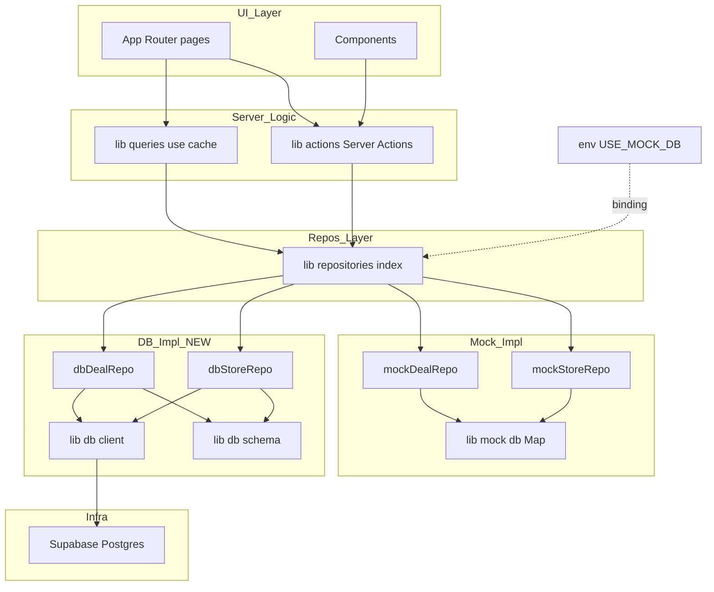
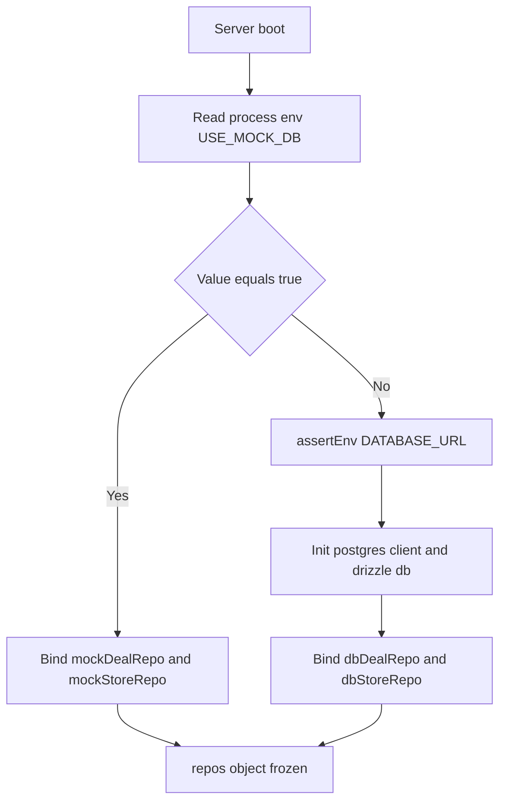
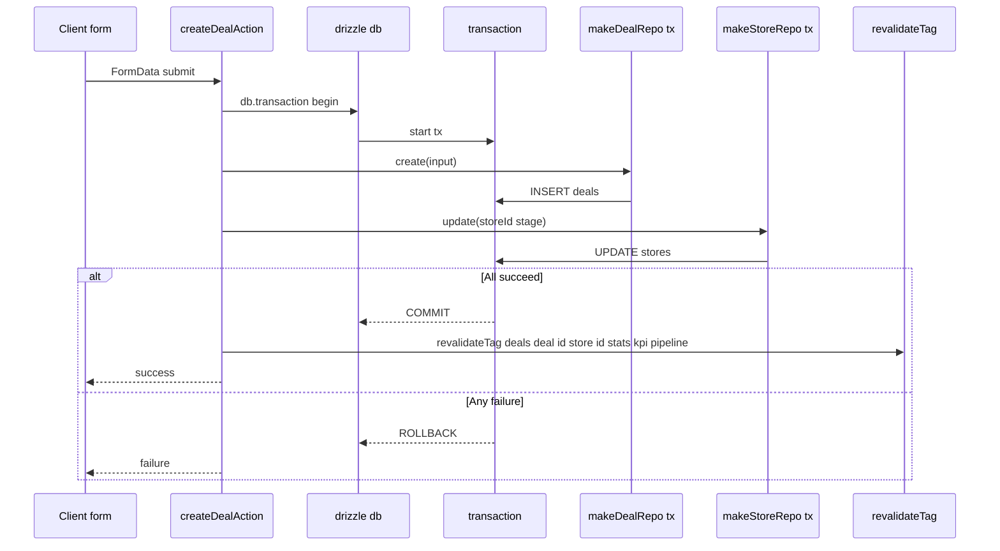
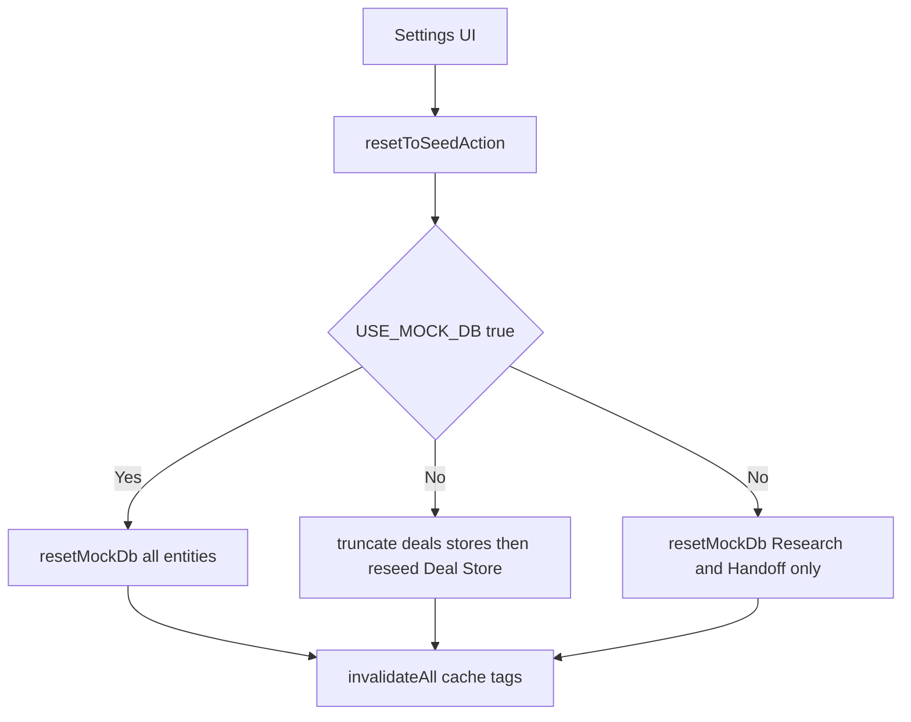
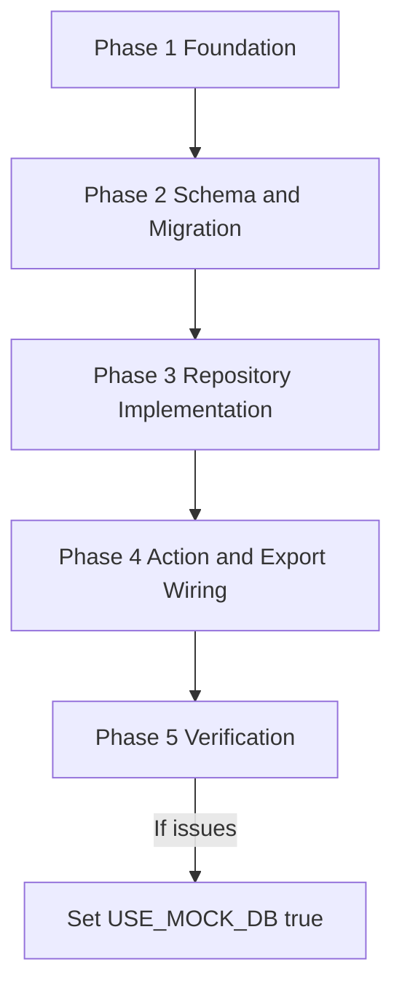

# Technical Design — deals-stores-db-migration

## Overview

**Purpose**: 商談 (Deal) と店舗 (Store) のデータをインメモリ Mock から **Supabase (Postgres)** に永続化し、`Drizzle ORM` を介した型安全な実 DB 実装を、既存 Repository 抽象越しに差し替える。

**Users**: 営業担当者・マネージャー・開発者・運用担当者。利用者観点では「再起動を跨いでデータが残る」「複数端末で共有される」状態を実現する。開発者観点では既存の Server Action / `'use cache'` クエリ / Cache タグ戦略を完全に維持しつつ、`USE_MOCK_DB` 環境変数で従来 Mock モードへ即座に戻せる二重運用体制を提供する。

**Impact**: `lib/repositories/index.ts` の `repos` を env 起動時 1 回のみ Mock または DB 実装にバインドする形に変更。新規ディレクトリ `lib/db/` 一式と `scripts/seed.ts` を追加し、`lib/actions/deal-actions.ts` の `createDealAction` / `updateDealAction` をトランザクション対応に内部書換。`lib/actions/data-actions.ts` と `app/api/export/route.ts` には Mock モード/DB モードの分岐を追加。UI / `'use cache'` クエリ / Server Action のシグネチャは無修正。

### Goals
- 商談・店舗データを Supabase 上に永続化し、サーバー再起動後も保持する
- `USE_MOCK_DB=true` で従来 Mock モードに即時切替可能なフォールバック体制
- `createDealAction` / `updateDealAction` における Deal 永続化と Store ステージ同期を不可分(transaction)に
- 既存 Server Action / `'use cache'` クエリ / `CACHE_TAGS` / Repository interface のシグネチャを **完全に無修正で動作**

### Non-Goals
- Research / Handoff の DB 化(別 Issue)
- 認証・認可リファクタ(`assigned_sales` の user_id 化)
- Supabase Realtime / Row Level Security の本格設定
- Supabase Storage 連携
- ID 体系を `uuid` へ変更すること(`<entity>_<id>` text PK を継続)
- `created_at` / `updated_at` を `timestamptz` へ変更すること(text `YYYY-MM-DD` を継続)
- Migration の起動時自動実行(`pnpm drizzle-kit migrate` を明示実行する運用)

## Boundary Commitments

### This Spec Owns
- 新規ディレクトリ `lib/db/` 配下のスキーマ・クライアント・Repository 実装
- `lib/env.ts`(環境変数バリデーション)
- `drizzle.config.ts`、`drizzle/` 配下の生成 SQL マイグレーション
- `scripts/seed.ts`(SEED 投入の TS スクリプト)
- `.env.example`(環境変数雛形)
- `lib/repositories/index.ts` の env 起動時分岐ロジック
- `lib/actions/deal-actions.ts:createDealAction / updateDealAction` のトランザクション化(内部実装のみ、シグネチャ無修正)
- `lib/actions/data-actions.ts` および `app/api/export/route.ts` の Deal/Store 部分の DB/Mock 分岐
- README の Supabase + DB セットアップ手順追記

### Out of Boundary
- Research / Handoff の DB 化(`lib/mock/research.ts` `lib/mock/handoff.ts` は無修正)
- 認証・認可・RLS・Realtime・Storage
- UI 層 (`app/`, `components/`) の変更
- 既存 Server Action / `'use cache'` クエリのシグネチャ変更
- `lib/cache.ts` `CACHE_TAGS` 定数の変更
- `types/deal.ts` `types/store.ts` のフィールド追加・改名

### Allowed Dependencies
- 上流(import 元): `types/*`、`lib/repositories/*-repository.ts`(interface)、`lib/cache.ts`、`lib/utils/id.ts`、`lib/utils/date.ts`、`lib/mock/*`(env 分岐先)
- 横方向: `lib/domain/*`(列挙定数等の参照のみ)
- 新規ライブラリ: `drizzle-orm@^0.x`、`postgres@^3.x`(runtime)、`drizzle-kit`、`tsx`(devDep)
- 禁止: UI / Server Action / Query 内部から `lib/mock/*` または `lib/db/*` を **直接** import すること(必ず `lib/repositories` 経由。tx もまた `repos.transaction(...)` API 経由のみ許可)
- **Documented exception**: `lib/actions/data-actions.ts` および `scripts/seed.ts` は TRUNCATE / BULK UPSERT 等 Repository interface で表現できない DDL 級操作のため、`lib/db/client.ts` と `lib/db/schema.ts` の直接 import を許容。これら 2 ファイル以外で同様の例外を増やしてはならない

### Revalidation Triggers
- `DealRepository` / `StoreRepository` interface へのメソッド追加・削除・シグネチャ変更
- `Deal` / `Store` 型のフィールド追加・改名・型変更
- `CACHE_TAGS` の追加・改名
- DB ドライバまたはコネクション戦略の変更(postgres.js → 別ドライバ等)
- `USE_MOCK_DB` を含む環境変数キーの改名
- ID 形式の変更(text → uuid 等)
- `created_at` / `updated_at` の型変更(text → timestamptz)

---

## Architecture

### Existing Architecture Analysis

- **Repository パターンが既に Mock/DB 切替の単一窓口**として機能している(`lib/repositories/index.ts`)。本設計は **この窓口の中身だけを env 分岐に置き換える** ことで、UI / Server Action / Query を無修正で実 DB 化する
- **Cache Components 戦略**(`'use cache'` + `cacheTag` + `revalidateTag(tag, "max")`)は Repository 層に対して透過。Drizzle 呼び出しは `'use cache'` 関数内に閉じ込められ、無修正で stale-while-revalidate が機能する
- **既存の整合性破綻ポイント**: `createDealAction` / `updateDealAction` で `repos.deal.create()` と `repos.store.update()` を独立 await している (`lib/actions/deal-actions.ts:80-86 / :101-113`)。本設計でトランザクション化する
- **データ移送 (`data-actions.ts` / `app/api/export/route.ts`)** は現状 Mock を直接 import している唯一の例外。本 Issue で「Deal/Store は DB 経路、Research/Handoff は Mock 経路」の混在処理を許容しつつ、env で分岐させる

### Architecture Pattern & Boundary Map



**Architecture Integration**:
- **Pattern**: Layered + Repository (既存)。env 分岐は **Composition Root** (`repos`) に閉じ込める
- **Boundaries**: UI/Action/Query は `repos` 経由のみで永続化レイヤを参照。Mock と DB の存在を意識しない
- **Preserved**: `'use cache'` / `cacheTag` / `revalidateTag` 戦略、`server-only` 隔離、命名規約、依存方向(`app → lib/queries|actions → lib/repositories → lib/mock|lib/db`)
- **New rationale**: `lib/db/` は Mock と対称な実装をもう一つ提供する追加の実装層であり、新たな抽象層を増やすものではない
- **Steering compliance**: `tech.md` の「Repository Pattern による DB 抽象化」「Cache Components 戦略」を完全準拠

### Technology Stack

| Layer | Choice / Version | Role in Feature | Notes |
|---|---|---|---|
| Backend / Server Logic | Next.js 16.2.4 (既存) | Server Actions / RSC / `'use cache'` | 無修正 |
| Data / ORM | drizzle-orm `^0.x` (新規) | スキーマ定義・型推論・transaction | postgres.js とのペアで採用 |
| Data / Driver | postgres `^3.x` (新規) | postgres.js: 軽量・Pooler 互換 | `prepare: false` を Transaction Pooler 使用時に設定 |
| Data / Storage | Supabase Postgres (新規) | 永続化先 | 本 Issue は Service Role Key 直接接続 |
| Tooling | drizzle-kit (devDep) | スキーマ → SQL 生成、`migrate` | `pnpm drizzle-kit generate / migrate` |
| Tooling | tsx (devDep) | `scripts/seed.ts` 実行 | TS のまま runtime 実行 |
| Validation | 自前 `assertEnv` (新規、新規依存なし) | 起動時 env 検証 | zod 導入は不採用 (依存最小化) |

> 詳細トレードオフは `research.md` §7.2 を参照

---

## File Structure Plan

### Directory Structure (新規 + 修正)

```
fw-sales/
├── drizzle.config.ts                      # 新規: Drizzle Kit 設定
├── drizzle/                               # 新規: 生成 SQL マイグレーション (git 管理)
│   └── 0000_init.sql
├── .env.example                           # 新規: DATABASE_URL / USE_MOCK_DB 等の雛形
├── scripts/
│   └── seed.ts                            # 新規: SEED 投入スクリプト (tsx で実行)
├── lib/
│   ├── env.ts                             # 新規: assertEnv ヘルパ
│   ├── db/                                # 新規ディレクトリ
│   │   ├── client.ts                      # postgres + drizzle インスタンス (server-only)
│   │   ├── schema.ts                      # stores / deals テーブル定義
│   │   ├── deal-repository.ts             # makeDealRepo(executor) + dbDealRepo
│   │   └── store-repository.ts            # makeStoreRepo(executor) + dbStoreRepo
│   ├── repositories/
│   │   └── index.ts                       # 修正: env 起動時分岐
│   ├── mock/                              # 維持 (フォールバック用)
│   └── actions/
│       ├── deal-actions.ts                # 修正: createDeal/updateDeal を transaction 化
│       └── data-actions.ts                # 修正: Deal/Store の DB 経路を追加
├── app/api/export/route.ts                # 修正: Deal/Store の DB 経路を追加
├── package.json                           # 修正: drizzle-orm / postgres / drizzle-kit / tsx 追加
└── README.md                              # 修正: Supabase + DB セットアップ手順を追記
```

### Modified Files
- `lib/repositories/index.ts` — 起動時 1 回 `process.env.USE_MOCK_DB` を読み、`mockDealRepo`/`mockStoreRepo` または `dbDealRepo`/`dbStoreRepo` をバインド
- `lib/actions/deal-actions.ts` — `createDealAction` / `updateDealAction` 内部で `db.transaction()` を呼ぶ。Mock モード時は従来通りシリアル await
- `lib/actions/data-actions.ts` — `resetToSeedAction` / `clearAllAction` / `importJsonAction` / `getSnapshotForExportAction` に `USE_MOCK_DB` 分岐を追加。Deal/Store のみ DB 経路、Research/Handoff は Mock 経路
- `app/api/export/route.ts` — Deal/Store を DB から取得するロジックに切替(Mock モード時は従来動作)
- `package.json` — 依存追加 (`drizzle-orm`, `postgres`, `drizzle-kit`, `tsx`)
- `README.md` — DB セットアップ手順、env 設定例、SEED 実行コマンド、Mock モード切替手順を追記

> 各ファイルは単一責務を守る。`lib/db/` 配下は新規ディレクトリで他レイヤとの import 関係は `repos` 越しのみ。

---

## System Flows

### Flow 1: Repository Resolution (起動時)



- env が欠落していれば `assertEnv` が起動を中断 (Req 6.1)
- DB 接続初期化失敗は postgres.js の遅延接続のため、**最初のクエリ実行時** にエラー化。本設計では `lib/db/client.ts` で `await sql\`select 1\`` を起動時 health check として実行し fail-fast (Req 6.2)

### Flow 2: createDealAction transaction (Req 3)



- Mock モードでは tx は仮想的に擬似化 (シリアル await のまま、ロールバック不可)。Mock は開発用フォールバックのため許容
- DB モードでは `db.transaction(async (tx) => { ... })` 内で `makeDealRepo(tx)` / `makeStoreRepo(tx)` ファクトリを呼ぶ

### Flow 3: data-actions の env 分岐 (Req 8)



---

## Requirements Traceability

| Requirement | Summary | Components | Interfaces / Files | Flows |
|---|---|---|---|---|
| 1.1 | 作成・更新・削除を永続化 | dbDealRepo / dbStoreRepo / lib/db/schema.ts | `DealRepository.create/update/delete`, `StoreRepository.create/update/delete` | — |
| 1.2 | 再起動後もデータ保持 | Postgres / lib/db/client.ts | postgres.js 接続 | Flow 1 |
| 1.3 | 複数端末で同一最新状態 | Postgres / dbDealRepo / dbStoreRepo | DealRepository / StoreRepository | — |
| 1.4 | 永続化中の整合性 | Drizzle transaction | `db.transaction()` | Flow 2 |
| 2.1 | 全商談一覧を created_at 降順表示 | dbDealRepo.list | `listDealsCached` (無修正) | — |
| 2.2 | store 単位の商談抽出 | dbDealRepo.list(storeId) | DealRepository.list | — |
| 2.3 | 新規商談作成 | createDealAction (tx 内 dbDealRepo.create) | `createDealAction` (シグネチャ無修正) | Flow 2 |
| 2.4 | 商談編集 | updateDealAction (tx 内 dbDealRepo.update) | `updateDealAction` | Flow 2 |
| 2.5 | 商談削除 | deleteDealAction → dbDealRepo.delete | `deleteDealAction` | — |
| 3.1 | DealStatus → StageId マッピング同期 | createDealAction / updateDealAction | `STAGE_BY_DEAL_STATUS` (既存) | Flow 2 |
| 3.2 | Deal + Store 同時更新の不可分性 | drizzle db.transaction | `makeDealRepo(tx)` / `makeStoreRepo(tx)` | Flow 2 |
| 3.3 | 失敗時はいずれも永続化しない | drizzle ROLLBACK | transaction error path | Flow 2 |
| 4.1 | 集計を永続化データから算出 | 既存 `lib/queries/*.ts` | repos 越しに透過 | — |
| 4.2 | 変更後の Cache タグ失効 | invalidateDealScopes (既存) | `revalidateTag(_, "max")` | — |
| 4.3 | 次回読み出しで最新化 | `'use cache'` + cacheTag (既存) | 無修正 | — |
| 5.1, 5.2 | env で Mock/DB 切替 | lib/repositories/index.ts | `repos` バインド | Flow 1 |
| 5.3 | Mock モードで従来動作 | mockDealRepo / mockStoreRepo (無修正) | — | — |
| 5.4 | 起動時 1 回確定 | repos の `Object.freeze` | バインド後 immutable | Flow 1 |
| 6.1 | 必須 env 欠落で起動中断 | lib/env.ts assertEnv | `assertEnv("DATABASE_URL")` | Flow 1 |
| 6.2 | 接続失敗で起動中断 | lib/db/client.ts health check | `select 1` 起動時実行 | Flow 1 |
| 6.3 | 環境変数経由のみ受理 | lib/env.ts | DATABASE_URL は env 経由必須 | — |
| 6.4 | Client バンドル混入禁止 | `import "server-only"` | lib/db/* 全ファイル | — |
| 7.1 | SEED 同等の投入 | scripts/seed.ts | `pnpm tsx scripts/seed.ts` | — |
| 7.2 | ベキ等な再投入 | INSERT … ON CONFLICT DO UPDATE | scripts/seed.ts 内 SQL | — |
| 7.3 | env に応じた投入先 | scripts/seed.ts (USE_MOCK_DB 分岐) | seed CLI | — |
| 8.1 | Export | app/api/export/route.ts (env 分岐) | `GET /api/export` | Flow 3 |
| 8.2 | Import | importJsonAction (env 分岐) | `importJsonAction` | Flow 3 |
| 8.3 | Reset | resetToSeedAction (env 分岐) | `resetToSeedAction` | Flow 3 |
| 8.4 | DB+Mock 混在処理 | data-actions.ts / route.ts | env 分岐 + 部分処理 | Flow 3 |
| 8.5 | Mock 単独動作 | data-actions.ts (Mock 経路) | 既存ロジック | — |
| 9.1–9.5 | 既存 API 契約維持 | dbDealRepo / dbStoreRepo / Action / Query | DealRepository / StoreRepository interface (無修正) | — |
| 10.1 | text PK + generateId 継続 | lib/db/schema.ts | `text("id").primaryKey()` | — |
| 10.2 | text 日付継続 | lib/db/schema.ts | `text("created_at")` / `text("updated_at")` | — |
| 10.3 | 不存在 store_id の Deal 作成拒否 | dbDealRepo.create + FK | `references(stores.id)` | — |
| 11.1 | typecheck/lint/build 通過 | 全実装 | — | — |
| 11.2 | DB モード E2E | 全実装 | — | Flow 2 |
| 11.3 | Mock モード E2E | repos 分岐 + Mock | — | Flow 1 |

---

## Components and Interfaces

### Summary

| Component | Domain/Layer | Intent | Req Coverage | Key Dependencies (P0/P1) | Contracts |
|---|---|---|---|---|---|
| `lib/env.ts` (assertEnv) | Config | 環境変数バリデーション | 6.1, 6.3 | — | Service |
| `lib/db/schema.ts` | Data | Drizzle テーブル定義 | 1.1, 10.1, 10.2, 10.3 | drizzle-orm (P0) | State |
| `lib/db/client.ts` | Data | postgres + drizzle インスタンス、起動時 health check | 1.2, 6.2, 6.4 | postgres (P0), env.ts (P0) | Service |
| `lib/db/deal-repository.ts` (`makeDealRepo`, `dbDealRepo`) | Data | DealRepository の Drizzle 実装(tx 受け渡し対応) | 1.1, 1.4, 2.x, 3.x, 9.x | client.ts (P0), schema.ts (P0), DealRepository interface (P0) | Service |
| `lib/db/store-repository.ts` (`makeStoreRepo`, `dbStoreRepo`) | Data | StoreRepository の Drizzle 実装(tx 受け渡し対応) | 1.1, 1.4, 9.x | client.ts (P0), schema.ts (P0), StoreRepository interface (P0) | Service |
| `lib/repositories/index.ts` (修正) | Composition | env 起動時分岐で `repos` をバインド + `repos.transaction()` API を提供 | 3.2, 3.3, 5.1, 5.2, 5.4, 9.4 | env.ts (P0), mock/* (P1), db/* (P1, lazy) | Service |
| `lib/actions/deal-actions.ts` (修正) | Action | `repos.transaction()` 越しに Deal 作成 + Store ステージ同期 | 3.x, 9.1, 9.4 | repos (P0) | Service |
| `lib/actions/data-actions.ts` (修正) | Action | Export/Import/Reset の env 分岐 | 8.x | repos (P0), mock/db (P1) | Service |
| `app/api/export/route.ts` (修正) | API | Export route の env 分岐 | 8.1, 8.4, 8.5 | repos (P0), mock/db (P1) | API |
| `scripts/seed.ts` | Tooling | SEED 投入(ベキ等) | 7.x | client.ts (P0), schema.ts (P0), seed 配列 (P0) | Batch |

### Data Layer

#### `lib/env.ts` (assertEnv)

| Field | Detail |
|---|---|
| Intent | 必須環境変数の存在検証と値取得 |
| Requirements | 6.1, 6.3 |

**Responsibilities & Constraints**
- 必須キーが欠落していれば例外を throw し、メッセージに不足キー名を含める
- 値の trim を行い、空文字は欠落として扱う
- 機密値の中身をエラーメッセージに含めない(キー名のみ)

**Dependencies**
- Outbound: `process.env`(External, P0)

**Contracts**: Service [x]

##### Service Interface

```typescript
export function assertEnv(key: string): string;
export function readEnv(key: string, fallback?: string): string | undefined;
```

- Preconditions: `process.env` が利用可能(Node ランタイム)
- Postconditions: 必須キーが存在するときその値、存在しないとき `Error("Missing required env: ${key}")` を throw
- Invariants: I/O 副作用なし、純関数として扱う

**Implementation Notes**
- Integration: `lib/db/client.ts` および `lib/repositories/index.ts` から利用
- Validation: 必須キー: `DATABASE_URL`(DB モード時)。任意キー: `USE_MOCK_DB`
- Risks: 起動時 throw が Next.js の dev 起動を不安定化させないよう、エラーメッセージは明確に

#### `lib/db/schema.ts`

| Field | Detail |
|---|---|
| Intent | Drizzle スキーマで stores / deals テーブルを定義 |
| Requirements | 1.1, 10.1, 10.2, 10.3 |

**Responsibilities & Constraints**
- `Store` / `Deal` 型のフィールドと 1:1 対応
- 主キー `text` (`<entity>_<id>`)、`created_at` / `updated_at` を `text`
- `deals.store_id` は `stores.id` への外部キー(削除時の整合性は別途設計)

**Dependencies**
- External: drizzle-orm (P0)
- Inbound: `lib/db/client.ts`, `lib/db/*-repository.ts`, `scripts/seed.ts` (P0)

**Contracts**: State [x]

##### State Management

- スキーマは TypeScript で定義し、`drizzle-kit generate` で SQL を生成
- 定義例(概念):

```typescript
import { pgTable, text, integer, real } from "drizzle-orm/pg-core";

export const stores = pgTable("stores", {
  id: text("id").primaryKey(),
  name: text("name").notNull(),
  prefecture: text("prefecture").notNull(),
  city: text("city").notNull(),
  address: text("address").notNull(),
  genre: text("genre").notNull(),
  priority: text("priority").notNull(),
  stage: text("stage").notNull(),
  channel: text("channel").notNull(),
  has_contact_form: text("has_contact_form").notNull(),
  map_url: text("map_url").notNull(),
  site_url: text("site_url").notNull(),
  instagram_url: text("instagram_url").notNull(),
  phone: text("phone").notNull(),
  target_service: text("target_service").notNull(),
  review_count: integer("review_count").notNull(),
  review_avg: real("review_avg").notNull(),
  memo: text("memo").notNull(),
  assigned_planner: text("assigned_planner").notNull(),
  assigned_sales: text("assigned_sales").notNull(),
  created_at: text("created_at").notNull(),
  updated_at: text("updated_at").notNull(),
});

export const deals = pgTable("deals", {
  id: text("id").primaryKey(),
  store_id: text("store_id").notNull().references(() => stores.id),
  store_name: text("store_name").notNull(),
  date: text("date").notNull(),
  meeting_type: text("meeting_type").notNull(),
  discussion: text("discussion").notNull(),
  proposal: text("proposal").notNull(),
  estimate_amount: integer("estimate_amount").notNull(),
  order_amount: integer("order_amount"), // nullable
  lost_reason: text("lost_reason").notNull(),
  status: text("status").notNull(),
  assigned_sales: text("assigned_sales").notNull(),
  created_at: text("created_at").notNull(),
  updated_at: text("updated_at").notNull(),
});
```

- Persistence & consistency: `deals.store_id` の FK で参照整合性を強制 (Req 10.3)
- Concurrency strategy: Postgres の MVCC に委譲。アプリ層の追加ロックは持たない

**Implementation Notes**
- Integration: 列挙型(`Priority` / `StageId` / `Channel` / `DealStatus`)は **Postgres ENUM 化せず** TS 側のリテラル型で担保(マイグレーションコスト最小化、本 Issue スコープ簡素化)。値の妥当性は Action 層 (`asDealStatus` / `asStage` 等の既存ヘルパ) で確認
- Risks: 列挙型 ENUM 化を後で行う場合は別 Issue。現状は `text` で柔軟性を取る

#### `lib/db/client.ts`

| Field | Detail |
|---|---|
| Intent | postgres.js + drizzle インスタンスの単一エクスポート、初回 import 時の fire-and-forget health check |
| Requirements | 1.2, 6.2, 6.4 |

**Responsibilities & Constraints**
- `import "server-only"` で Client バンドル混入を完全防止
- 単一の `db` および underlying `sql` (postgres.js) を export
- 初回 import 時に **fire-and-forget で `select 1` を発行**(Issue 3 / Option C)。失敗時は `console.error` + `process.exit(1)` で fail-fast
- HMR 跨ぎでの多重接続を防ぐため、Mock の手法を踏襲して `globalThis Symbol` で singleton 化

**Dependencies**
- External: postgres (P0), drizzle-orm/postgres-js (P0)
- Inbound: `lib/repositories/index.ts` (動的 import、P0), `scripts/seed.ts` (P0)
- Outbound: `lib/env.ts` (P0)

**Contracts**: Service [x]

##### Service Interface

```typescript
import "server-only";
import postgres from "postgres";
import { drizzle } from "drizzle-orm/postgres-js";
import * as schema from "./schema";
import { assertEnv } from "@/lib/env";

const GLOBAL_KEY = Symbol.for("__FW_SALES_DB__");
type Cached = { sql: ReturnType<typeof postgres>; db: ReturnType<typeof drizzle<typeof schema>> };
const g = globalThis as unknown as { [GLOBAL_KEY]?: Cached };

function buildClient(): Cached {
  const sql = postgres(assertEnv("DATABASE_URL"), {
    // Supabase Transaction Pooler 互換のため prepare: false が必須
    prepare: false,
    // 接続プールサイズ:
    //   - Vercel/serverless 配備時: 1 (各実行で 1 接続、Pooler が多重化)
    //   - 自ホスト Node 長期プロセス: 10 程度
    // 現状 Self-host 想定のため 10
    max: Number(process.env.DATABASE_POOL_MAX ?? "10"),
  });
  const db = drizzle(sql, { schema });
  return { sql, db };
}

const cached: Cached = g[GLOBAL_KEY] ?? (g[GLOBAL_KEY] = buildClient());

export const sql = cached.sql;
export const db = cached.db;
export type DbClient = typeof db;
export type Tx = Parameters<Parameters<typeof db.transaction>[0]>[0];

// 初回 import 時に fire-and-forget の health check(Issue 3 / Option C)
// 失敗時は process.exit(1) で fail-fast
void sql`select 1`.catch((err) => {
  console.error("[db/client] health check failed:", err);
  process.exit(1);
});
```

- Preconditions: `DATABASE_URL` が設定済み
- Postconditions: `db` は再利用可能な singleton
- Invariants: モジュール再 import で再接続しない (Next.js HMR でも単一接続を維持)

**Implementation Notes**
- Integration: 唯一の入口は `lib/repositories/index.ts` の動的 import 経由(Issue 1/2 対応)。SEED スクリプトのみ例外的に直接 import を許容
- Validation: 初回 import 時の `select 1` failure で `process.exit(1)`(Req 6.2)。最初のリクエストを待たずにプロセスを落とす
- Risks: `process.exit(1)` がテスト環境で問題になる場合は `NODE_ENV !== "test"` ガードを追加。Self-host で Vercel 配備の場合は `DATABASE_POOL_MAX=1` で上書き

#### `lib/db/deal-repository.ts` / `lib/db/store-repository.ts`

| Field | Detail |
|---|---|
| Intent | DealRepository / StoreRepository を Drizzle 実装で満たし、tx 受け渡し可能にする |
| Requirements | 1.1, 1.4, 2.x, 3.x, 9.x, 10.1, 10.2 |

**Responsibilities & Constraints**
- `makeDealRepo(executor)` / `makeStoreRepo(executor)` ファクトリで `db` または `Tx` を受け取り、`DealRepository` / `StoreRepository` を返す
- 既存 interface (`list / get / create / update / delete`) を 1:1 で実装
- ID は `generateId("deal")` / `generateId("store")` 由来を使用
- `created_at` / `updated_at` は `today()` 由来の `YYYY-MM-DD` 文字列を使用
- `list()` は `created_at` 降順ソート、`storeId` フィルタ対応(Deal)、`StoreFilter` 対応(Store: q / stage / channel / priority)

**Dependencies**
- Inbound: `lib/repositories/index.ts` (P0), `lib/actions/deal-actions.ts` (tx 経由で `makeDealRepo(tx)`) (P0)
- Outbound: `lib/db/client.ts`, `lib/db/schema.ts`, `lib/utils/id.ts`, `lib/utils/date.ts` (P0), `lib/repositories/*-repository.ts` (interface, P0)

**Contracts**: Service [x]

##### Service Interface

```typescript
import type { DealRepository } from "@/lib/repositories/deal-repository";
import type { DbClient, Tx } from "./client";

export function makeDealRepo(executor: DbClient | Tx): DealRepository;
export const dbDealRepo: DealRepository; // = makeDealRepo(db)
```

- Preconditions: `executor` は Drizzle の `db` または transaction `tx`
- Postconditions: 返値は `DealRepository` interface を完全に満たす
- Invariants: 内部状態を持たない(executor 以外の closure 変数なし)

**Implementation Notes**
- Integration: `dbDealRepo` は既定エクスポートで `db` 固定。tx 内では呼び出し側が `makeDealRepo(tx)` を都度生成
- Validation: nullable 値 (`order_amount`) は Drizzle 側で `null` として往復
- Risks: `StoreFilter.q` の LIKE 検索は Postgres 側で `ILIKE` を使用。日本語文字列のため `lower()` は使わず大文字小文字の差異は許容範囲

### Composition Layer

#### `lib/repositories/index.ts` (修正)

| Field | Detail |
|---|---|
| Intent | env 起動時 1 回の判定で `repos` を Mock または DB に確定バインドし、`repos.transaction()` を Composition Root として提供 |
| Requirements | 3.2, 3.3, 5.1, 5.2, 5.4, 9.4 |

**Responsibilities & Constraints**
- `process.env.USE_MOCK_DB === "true"` のみで Mock 選択(他は DB)
- バインド後の `repos` は `Object.freeze` で immutable にし、リクエストごとの切替を不可能化
- **DB 実装は遅延読み込み**(`lib/db/*` のトップレベル評価が Mock モードで走らないことを保証 — Issue 2 対応)
- **`repos.transaction(...)` API を提供**し、Action 層から `lib/db/*` の直接 import を禁止(Issue 1 対応)

**Dependencies**
- Inbound: `lib/queries/*`, `lib/actions/*` (P0)
- Outbound: `lib/mock/*` (P0)、DB モード時のみ動的 import で `@/lib/db` (P0)

**Contracts**: Service [x]

##### Service Interface

```typescript
import "server-only";
import {
  mockDealRepo,
  mockStoreRepo,
  mockResearchRepo,
  mockHandoffRepo,
} from "@/lib/mock";
import type { DealRepository } from "./deal-repository";
import type { StoreRepository } from "./store-repository";
import type { ResearchRepository } from "./research-repository";
import type { HandoffRepository } from "./handoff-repository";

export interface TxRepos {
  deal: DealRepository;
  store: StoreRepository;
}

export interface Repos {
  store: StoreRepository;
  research: ResearchRepository;
  deal: DealRepository;
  handoff: HandoffRepository;
  transaction: <T>(fn: (tx: TxRepos) => Promise<T>) => Promise<T>;
}

async function buildRepos(): Promise<Repos> {
  const useMock = process.env.USE_MOCK_DB === "true";

  if (useMock) {
    return Object.freeze({
      store: mockStoreRepo,
      research: mockResearchRepo,
      deal: mockDealRepo,
      handoff: mockHandoffRepo,
      // Mock 経路: tx は擬似的にシリアル実行(rollback なし)
      transaction: async <T>(fn: (tx: TxRepos) => Promise<T>) =>
        fn({ deal: mockDealRepo, store: mockStoreRepo }),
    });
  }

  // 静的に解析可能なパスで動的 import(bundle-analyzable-paths 準拠)
  const dbModule = await import("@/lib/db");
  const { db, dbDealRepo, dbStoreRepo, makeDealRepo, makeStoreRepo } = dbModule;

  return Object.freeze({
    store: dbStoreRepo,
    research: mockResearchRepo, // 別 Issue
    deal: dbDealRepo,
    handoff: mockHandoffRepo,   // 別 Issue
    transaction: <T>(fn: (tx: TxRepos) => Promise<T>) =>
      db.transaction(async (tx) =>
        fn({ deal: makeDealRepo(tx), store: makeStoreRepo(tx) }),
      ),
  });
}

// モジュール初回 import 時に 1 回だけ評価(top-level await)
export const repos: Repos = await buildRepos();
```

**Implementation Notes**
- Integration: 既存の `import { repos } from "@/lib/repositories"` 利用箇所は完全無修正。Server Action は `repos.transaction(async ({ deal, store }) => { ... })` で tx スコープを取得
- Validation: Mock モードでは `@/lib/db` を一切 import しないため、`DATABASE_URL` 未設定でも `pnpm dev` が起動できる
- Risks: top-level await を使うため、`lib/repositories/index.ts` を import するだけでブロッキングが発生 → ただし他の同期処理を待たないため実害は無視できる規模

### Action Layer

#### `lib/actions/deal-actions.ts` (修正)

| Field | Detail |
|---|---|
| Intent | `repos.transaction(...)` 越しに Deal 作成と Store ステージ同期をアトミック実行 |
| Requirements | 3.1, 3.2, 3.3, 9.1, 9.4 |

**Responsibilities & Constraints**
- `repos.transaction(async ({ deal, store }) => { ... })` で Deal + Store 更新を 1 つの単位に
- DB モード時は Drizzle tx でラップ、Mock モード時は擬似 tx(rollback なし、シリアル実行)
- 既存シグネチャ・戻り値型・FormData ハンドリングは無修正
- `invalidateDealScopes` は tx 成功時のみ呼ぶ(失敗時は呼ばない)
- **`lib/db/*` を直接 import しない**(Issue 1 / Boundary 制約準拠)

**Dependencies**
- Inbound: UI form (P0)
- Outbound: `lib/repositories` (`repos.transaction`、P0)、`next/cache` revalidateTag (P0)

**Contracts**: Service [x]

##### Service Interface (シグネチャ無修正)

```typescript
export async function createDealAction(
  storeId: string,
  _prev: ActionResult<{ id: string }> | null,
  formData: FormData,
): Promise<ActionResult<{ id: string }>>;

export async function updateDealAction(
  dealId: string,
  _prev: ActionResult<{ id: string }> | null,
  formData: FormData,
): Promise<ActionResult<{ id: string }>>;

export async function deleteDealAction(dealId: string): Promise<ActionResult>;
```

- Preconditions: 既存と同じ(store / deal の存在確認)
- Postconditions: ROLLBACK 時に永続化なし、COMMIT 時のみキャッシュ失効
- Invariants: `STAGE_BY_DEAL_STATUS` マッピングは既存をそのまま使用

##### Implementation Sketch

```typescript
export async function createDealAction(...) {
  const store = await repos.store.get(storeId);
  if (!store) return failure("店舗が見つかりませんでした");
  const status = asDealStatus(...);
  const input = buildDealInput(formData, store, status);

  try {
    const created = await repos.transaction(async ({ deal, store: storeTx }) => {
      const c = await deal.create(input);
      const targetStage = STAGE_BY_DEAL_STATUS[status];
      if (store.stage !== targetStage) {
        await storeTx.update(storeId, { stage: targetStage });
      }
      return c;
    });
    invalidateDealScopes(created.id, storeId);
    return success({ id: created.id }, "商談を作成しました");
  } catch (err) {
    return failure(err instanceof Error ? err.message : "作成に失敗しました");
  }
}
```

**Implementation Notes**
- Integration: tx 抽象は `repos` 越しのみ。Action から `lib/db/*` を直接 import しない
- Validation: tx 開始前に `repos.store.get(storeId)` で店舗存在確認(既存どおり)
- Risks: tx 内で予期しない例外発生時、Drizzle が ROLLBACK を保証。`invalidateDealScopes` は try/catch の外側で呼ぶことで部分失敗時のキャッシュ汚染を防ぐ

### API Layer

#### `app/api/export/route.ts` (修正)

| Field | Detail |
|---|---|
| Intent | Export を env に応じて DB or Mock 経路で実行(Node.js runtime 強制) |
| Requirements | 8.1, 8.4, 8.5 |

**Responsibilities & Constraints**
- ファイル冒頭で `export const runtime = "nodejs"` を **明示宣言**(postgres.js は Edge Runtime 非対応のため誤設定事故防止)
- DB モード時: `repos.deal.list()` + `repos.store.list()` で **並列取得**(`Promise.all`)し、Research/Handoff は `snapshotMockDb` から該当部分のみ抽出
- Mock モード時: 従来通り `snapshotMockDb()` を一括出力
- レスポンスヘッダ・ファイル名・Content-Type は無修正

**Dependencies**
- Inbound: ブラウザの GET リクエスト (P0)
- Outbound: `lib/repositories` (P0), `lib/mock/db.ts:snapshotMockDb` (P0)

**Contracts**: API [x]

##### API Contract

| Method | Endpoint | Request | Response | Errors |
|---|---|---|---|---|
| GET | /api/export | (none) | `{ stores, research, deals, handoffs }` JSON, attachment | 500 (DB 接続失敗) |

**Implementation Notes**
- Integration: env 分岐は本ファイル内で完結。`data-actions.ts` の `getSnapshotForExportAction` も同等のロジックに修正。`runtime = "nodejs"` を Server Action 経由のページにも必要なら付与
- Validation: 出力 JSON は既存のスキーマと完全互換 (Import で読み戻せる)
- Performance: `Promise.all([repos.deal.list(), repos.store.list()])` で waterfall 排除(vercel-react-best-practices `async-parallel`)
- Risks: DB と Mock のスナップショット同時取得時の整合性 → 単一画面のみで実用上問題なし

#### `lib/actions/data-actions.ts` (修正)

| Field | Detail |
|---|---|
| Intent | Reset / Clear / Import の env 分岐 |
| Requirements | 8.2, 8.3, 8.4, 8.5 |

**Responsibilities & Constraints**
- `resetToSeedAction` (DB): `truncate deals; truncate stores; insert SEED_STORES; insert SEED_DEALS;`(transaction 内)+ Mock 側 Research/Handoff も `resetMockDb()` の該当部分のみ
- `clearAllAction` (DB): `truncate deals; truncate stores;`(transaction 内)+ Mock 側 Research/Handoff の clear
- `importJsonAction` (DB): JSON の `stores` / `deals` を `INSERT … ON CONFLICT DO UPDATE`、Research/Handoff は Mock へ復元
- 既存シグネチャ・戻り値型は無修正

**Dependencies**
- Outbound: `lib/db/client.ts`, `lib/db/schema.ts`, `lib/mock/db.ts`(P0)
- External: `next/cache` revalidateTag (P0)

**Contracts**: Service [x]

**Implementation Notes**
- Integration: env 判定は単一ヘルパ `isMockMode()` を本ファイル冒頭に置き、各関数で参照
- Validation: 入力 JSON のスキーマ簡易検証は既存の `Array.isArray` チェックを継続
- Risks: TRUNCATE と INSERT の組合せは `db.transaction` 内で実行(部分失敗回避)

### Tooling Layer

#### `scripts/seed.ts`

| Field | Detail |
|---|---|
| Intent | DB に SEED_STORES / SEED_DEALS をベキ等に投入する |
| Requirements | 7.1, 7.2, 7.3 |

**Responsibilities & Constraints**
- `tsx` で実行(`pnpm tsx scripts/seed.ts`)
- `INSERT … ON CONFLICT (id) DO UPDATE SET …` でベキ等性を担保
- `process.env.USE_MOCK_DB === "true"` の場合は警告を出して終了(誤実行防止)

**Dependencies**
- Outbound: `lib/db/client.ts`, `lib/db/schema.ts`, `lib/mock/seed.ts:SEED_STORES,SEED_DEALS` (P0)

**Contracts**: Batch [x]

##### Batch / Job Contract

- Trigger: 開発者の手動実行
- Input / validation: SEED_STORES / SEED_DEALS 定数
- Output / destination: `stores` / `deals` テーブル
- Idempotency & recovery: 主キー競合時は UPDATE。途中失敗時は再実行で最終状態に収束

**Implementation Notes**
- Integration: README に `pnpm tsx scripts/seed.ts` を明記
- Validation: 投入後の件数を console.log で出力
- Risks: order_amount が null の Deal は Drizzle で明示的に null を渡す必要あり

---

## Data Models

### Domain Model
- 集約ルート: `Store`(`Deal` は `store_id` で `Store` を参照する子)
- 整合性: Deal 作成・更新時に Store のステージは Deal の status に従属
- 不変条件: `Deal.store_id` は必ず存在する `Store.id` を参照すること (Req 10.3)

### Logical Data Model

```mermaid
erDiagram
    stores ||--o{ deals : has
    stores {
        text id PK
        text name
        text prefecture
        text city
        text address
        text genre
        text priority
        text stage
        text channel
        text has_contact_form
        integer review_count
        real review_avg
        text created_at
        text updated_at
    }
    deals {
        text id PK
        text store_id FK
        text date
        text meeting_type
        integer estimate_amount
        integer order_amount NULL
        text status
        text created_at
        text updated_at
    }
```

- 主キーは text (`<entity>_<id>`)
- `deals.store_id` → `stores.id` に外部キー制約
- 列挙値は text で保持し、アプリ層で型ガード (`asStage` / `asDealStatus` 等)
- 全カラム NOT NULL を基本とし、`order_amount` のみ NULL 許容

### Physical Data Model
- インデックス: `deals.store_id` に btree index(`/stores/{storeId}` での絞り込み高速化)、`deals.created_at` desc index(一覧降順)、`stores.created_at` desc index
- パーティション: 不要(レコード数が少ない社内ツール)
- マイグレーション SQL: `drizzle-kit generate` で `drizzle/0000_init.sql` 等として保存し git 管理

### Data Contracts & Integration
- API: `GET /api/export` の JSON レスポンスは既存スキーマと互換 (`{ stores, research, deals, handoffs }`)
- Import 取り込みは `Array.isArray(...)` の最低限ガード後 upsert

---

## Error Handling

### Error Strategy
- **起動時エラー (Req 6)**: env 欠落 / DB 接続失敗は起動を中断し標準エラー出力に明記
- **ランタイムエラー (CRUD)**: postgres.js の例外を `ActionResult<never>` に包んで UI に返す
- **トランザクションエラー (Req 3.3)**: tx callback 内の throw で自動 ROLLBACK。`failure(message)` で UI に返却し、キャッシュ失効を実行しない

### Error Categories and Responses
- **User Errors**: 必須フィールド欠落 → `failure("...")` で UI へ
- **System Errors**: DB 接続切断 → 起動 fail-fast、または各 Action で例外捕捉
- **Business Logic Errors**: 不存在 store_id への Deal 作成 → FK 制約エラーを `failure("店舗が見つかりませんでした")` に変換

### Monitoring
- 本 Issue では追加ログ機構は導入しない(別 Issue)。`console.error` に postgres.js のエラーオブジェクトを出力する程度に留める
- Supabase Dashboard のクエリログを運用面で活用

---

## Testing Strategy

### Unit Tests
- `lib/env.ts:assertEnv` — 必須キー欠落時に throw、存在時に値返却
- `lib/db/deal-repository.ts:makeDealRepo` — `list / get / create / update / delete` の各メソッドが Drizzle SQL を期待通り発行(モック executor)
- `lib/db/store-repository.ts:makeStoreRepo` — `StoreFilter` の各フィールド組合せで適切な WHERE が組まれる
- **テスト容易性パターン**: `makeXxxRepo(executor)` ファクトリは `db` または `tx` の他にテスト用モック executor を受けられる。`lib/db/client.ts` のシングルトン `db` を import せずに Repository 単体をテスト可能

### Integration Tests
- `createDealAction` の transaction 化 — tx 内で Deal 作成と Store ステージ更新が 1 単位で COMMIT/ROLLBACK される(Postgres テスト DB に対し実行)
- `data-actions.ts:resetToSeedAction` の DB モード — TRUNCATE → INSERT が一括成功し、件数が SEED と一致する
- `repos` の env 分岐 — `USE_MOCK_DB=true` で Mock、未設定で DB がバインドされる

### E2E Tests (手動)
- Req 11.2 の手順: 商談作成 → 再起動 → `/deals` で残存 → `/stores/{id}` で stage 同期確認 → `/dashboard` `/kpi` `/pipeline` で集計反映確認
- Req 11.3 の手順: `USE_MOCK_DB=true` で再起動し同等操作で Mock 動作を確認

### Performance / Load
- 本 Issue では対象外(社内ツールでデータ量小)。Supabase 無料プラン枠内で十分

---

## Migration Strategy

### Phases



### Phase Details
- **Phase 1**: 依存追加、`lib/env.ts`、`lib/db/client.ts`、`drizzle.config.ts`、`.env.example`、`README` 更新
- **Phase 2**: `lib/db/schema.ts` 定義、`pnpm drizzle-kit generate` で SQL 生成、Supabase で `pnpm drizzle-kit migrate` 適用、`scripts/seed.ts` 投入
- **Phase 3**: `lib/db/deal-repository.ts` `lib/db/store-repository.ts` 実装、`lib/repositories/index.ts` env 分岐
- **Phase 4**: `deal-actions.ts` の transaction 化、`data-actions.ts` `app/api/export/route.ts` の env 分岐
- **Phase 5**: typecheck/lint/build、E2E (Req 11)、Mock fallback 検証

### Rollback Triggers / Strategy
- DB 接続不安定 / Drizzle ランタイム不具合 → `USE_MOCK_DB=true` を設定して再起動するだけで従来 Mock 動作に復帰
- DB スキーマ問題発覚 → `drizzle-kit drop`(別環境)→ 修正 → 再 `migrate`
- Validation Checkpoints: 各 Phase 完了時に `pnpm typecheck && pnpm lint && pnpm build` を実行

---

## Open Questions / Risks

- **Q1**: Supabase の Pooler モードは Session か Transaction か → 本設計は **Transaction Pooler + `prepare: false`** を既定。実運用で問題があれば Session Pooler に切替可能
- **Q2**: `tsx` の代わりに `node --import tsx` でも動作するか → 動作するが、`tsx` を devDep に入れる方が運用シンプル(本設計で採用)
- **Q3**: 既存 SEED の `daysAgo(N)` で生成される `created_at` が SEED 投入の度に変わる挙動を許容するか → 運用上「直近 N 日」を維持するのは便利。許容
- **Q4** (Issue 3 / Option C 採用): 初回 import 時の fire-and-forget `select 1` で `process.exit(1)` を呼ぶことで「最初のリクエストを待たずに起動を中断」する。Req 6.2 をこの解釈で満たすことに合意済み
- **R1**: postgres.js v3 で `prepare: false` が要件 (Transaction Pooler 制約)。`max` は配備形態で可変(Self-host: 10、Vercel/serverless: 1)。`DATABASE_POOL_MAX` env で上書き可
- **R2**: HMR で `lib/db/client.ts` が複数 import される懸念 → `Symbol.for("__FW_SALES_DB__")` で `globalThis` 経由 singleton 化(Mock の `__FW_SALES_MOCK_DB__` パターンを踏襲)
- **R3**: Research / Handoff DB 化(別 Issue)時に同じ `makeXxxRepo(executor)` + `repos.transaction()` パターンを反復するため、これらを公式パターンとして `tech.md` に追記する余地あり
- **R4** (Issue 1/2 対応): Action 層から `lib/db/*` を直接 import せず、`repos.transaction()` API 越しに tx スコープを取得する。DB モジュールは `lib/repositories/index.ts` で **動的 import** され Mock モード時は評価されない
- **R5** (vercel-react-best-practices `async-parallel`): Export route で `repos.deal.list()` と `repos.store.list()` を `Promise.all` で並列化。waterfall を排除
- **R6** (next-best-practices runtime-selection): postgres.js は Edge Runtime 非対応。`app/api/export/route.ts` および DB 接続を伴う Server Action で `export const runtime = "nodejs"` を明示

---

## Supporting References
- 詳細トレードオフ・代替案・Effort 評価: `research.md`
- 既存実装の根拠: `lib/repositories/index.ts`、`lib/actions/deal-actions.ts:80-86 / :101-113`、`lib/mock/db.ts`
- Steering: `.kiro/steering/product.md`、`.kiro/steering/tech.md`、`.kiro/steering/structure.md`
