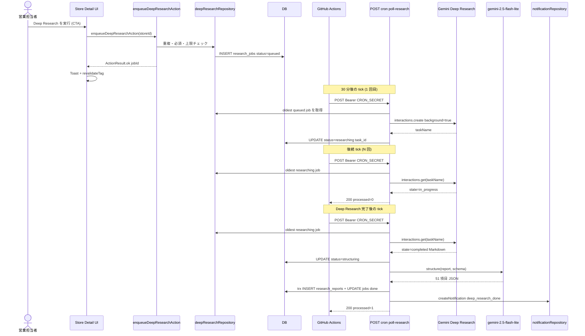
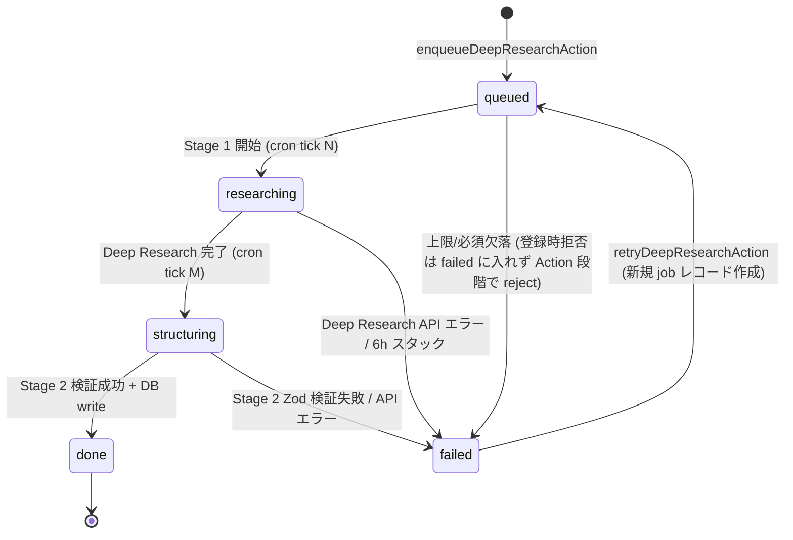
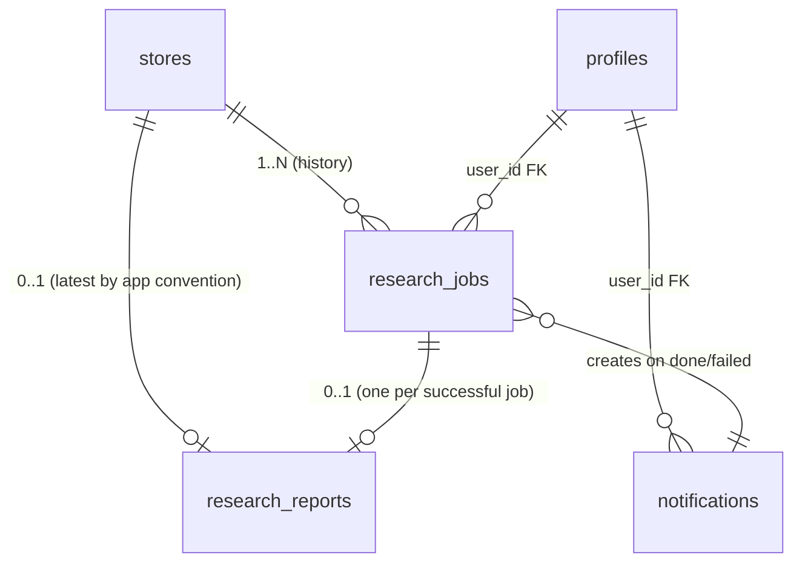
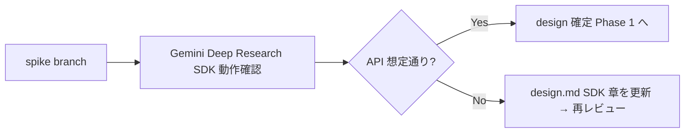

# Design Document — deep-research-pipeline

> **2026-09-03 更新**: 本仕様の実装は **全撤去済み** です (#102 で運用停止 →
> #116 / #125 / #180 / #185 / #213 / #110 で物理削除)。以下の設計記述は
> **すべて削除済機能の履歴** であり、対応する実装・テーブル・env・ワークフローは
> 現行コードベースに一つも存在しません。後継は AI 店舗調査 (Plan v3.2 / Issue #180): `app/(main)/research/**` / `lib/ai/research/**` / `workflows/store-research.ts`。

**Status**: Removed (2026-09-03)

## Overview

**Purpose**: fw-sales の店舗ごとに、夜間バッチで Gemini Deep Research を呼び出し 8 カテゴリ・51 項目の構造化レポートを生成・蓄積する非同期パイプラインを提供する。営業担当者が「寝る前にキューに 1 件投入 → 翌朝アプリ内通知で結果を確認」できる動線を成立させる。

**Users**: fw-sales を利用する営業担当者（1 店舗単位でジョブ登録）、プロダクトオーナー（コスト・上限・運用品質の監督）。

**Impact**: 既存の同期 5 項目 AI 分析（`lib/ai/client.ts` 経由）は変更せず併存させる。新規 2 テーブル（`research_jobs` / `research_reports`）、新規 API エンドポイント、外部 GitHub Actions ワークフローを追加する。`notifications.kind` に新規値を追加。`vercel.json` は引き続き空のまま（Vercel Cron は利用しない）。

### Goals
- 1 店舗単位の Deep Research ジョブをキュー登録 → 非同期実行 → 構造化レポート生成 → アプリ内通知 まで一気通貫で達成する
- 8 カテゴリ・51 項目を漏れなく出力し、A/B/C 区分・confidence・source_urls・hearing_question を付与する
- 既存同期 AI 分析を一切変更せず併存させる
- 月次の API コストと 1 ユーザー・1 日あたりの登録件数を運用設定値で制御する
- Vercel Hobby (60s Function 制約) + GitHub Actions cron (`*/30 * * * *`) という外部スケジューラ前提で完結させる

### Non-Goals
- エリア検索結果からの一括ジョブ登録（Phase 2 で再検討）
- メール・Slack・LINE 等の外部通知チャネル
- 同期 5 項目 AI 分析の置換または挙動変更
- 自動リトライ（失敗時は手動再投入のみ）
- レポートの編集・コメント機能
- 通知センター UI の新設（既存 `notifications` テーブルを Topbar Bell でドロップダウン表示するのみ）

## Boundary Commitments

### This Spec Owns
- `research_jobs` テーブル（ジョブのライフサイクル: `queued` / `researching` / `structuring` / `done` / `failed`）の唯一の書き手
- `research_reports` テーブル（生成済みレポート、8 カテゴリ jsonb、`full_markdown`、`all_source_urls`、`total_cost_yen`、`total_duration_sec`）の唯一の書き手
- `lib/ai/deep-research/*`（Deep Research SDK 呼出・プロンプト・51 項目スキーマ・Stage 2 構造化）
- `app/api/cron/poll-research/route.ts`（GitHub Actions からの Bearer 認可付き POST）
- `.github/workflows/poll-research.yml`（30 分間隔の scheduled workflow）
- 店舗詳細画面の「Deep Research」タブと、Topbar の通知 Bell ドロップダウン
- `notifications.kind` に追加する 3 値: `deep_research_done` / `deep_research_failed` / `deep_research_budget_warning` の意味論

### Out of Boundary
- `stores` テーブル本体（店舗マスタの編集は本機能では行わない。`stores.id` を FK として参照のみ）
- 既存同期 AI 分析 (`lib/ai/client.ts` / `lib/actions/ai-analysis-actions.ts` / 既存 `AiAnalysisDetailSection`) — 機能維持のため一切変更しない
- 既存 `notifications` テーブルのスキーマ変更（カラム追加・削除は禁止。`kind` の text 値追加のみ）
- エリア検索画面 (`app/(main)/stores/new/_components/area-search-results.tsx`) の動線
- 既存 Vercel Cron 機構の復活（前コミット `c382619` で削除済、本機能では使用しない）
- 通知センター（一覧画面）の新設

### Allowed Dependencies
- 既存 Repository 層（`lib/repositories/index.ts`、`repos.transaction()`、`TxRepos` interface）
- 既存 Cache 層（`lib/cache.ts` の `CACHE_TAGS` パターン、`revalidateTag` / `cacheTag`）
- 既存 Server Action ヘルパ（`lib/actions/_helpers.ts` の `ActionResult<T>` / `success` / `failure` / `readString`）
- 既存環境変数ローダ（`lib/env.ts` の `readEnv` / `assertEnv`）
- 既存 UI プリミティブ（`components/ui/{card,tabs,badge,toast,modal,spinner,button}.tsx`）
- 既存通知テーブル（`notifications` の `kind` text 列に新規値追加のみ）
- 既存認証層（`auth-and-notifications` spec が提供する `getCurrentUser()` 等）
- `@google/genai@1.52.0`（既存依存）

### Revalidation Triggers
| 変更 | 影響先 |
|---|---|
| `research_jobs.status` の列挙値追加・削除 | UI の状態バッジ、cron エンドポイントの遷移ロジック、本 spec 内全コンポーネント |
| `research_reports` の 8 カテゴリ jsonb スキーマ構造変更 | `lib/ai/deep-research/schema.ts`、`deep-research-tab.tsx` 表示ロジック |
| `notifications.kind` の意味論変更 | Topbar Bell の表示分岐、通知作成側のヘルパ |
| GitHub Actions workflow の cron 表現変更 | R8 の SLA（22:00→08:00 JST 翌朝）達成可否 |
| Gemini Deep Research SDK のメソッドシグネチャ変更 | `lib/ai/deep-research/client.ts` のみ（呼出元 Action 層には影響させない契約） |
| Vercel Function `maxDuration` の 60→他値変更 | `Date.now() + 55_000` デッドライン定数の見直し |

## Architecture

### Existing Architecture Analysis

- **Layered architecture**: `app/` → `components/` / `lib/`、`lib` 内は `domain` → `repositories` → `mock`/`db` → `queries`/`actions` の単方向（`.kiro/steering/structure.md`）
- **Server boundary**: `lib/ai/*`・`lib/db/*`・`lib/env.ts` は `import "server-only"`、Server Actions は `"use server"`、Client Component は `"use client"`
- **Repository pattern**: `lib/repositories/index.ts` の `repos` オブジェクトと `TxRepos` interface が DB 切替の単一窓口
- **Cache strategy**: `lib/cache.ts` の `CACHE_TAGS` 定数 + `cacheTag()`（query 側）+ `revalidateTag()`（action 側）
- **AI 既存資産**: `AiClientError` discriminated union、`getAiAnalysisJsonSchema()` の `stripUnsupportedKeys()`、`validate.ts` の二段 Zod 検証 — 本 spec で共通化対象

### Architecture Pattern & Boundary Map

```mermaid
graph TB
    subgraph External
        GHA[GitHub Actions cron]
        GenAI[Gemini Deep Research API]
        Lite[gemini-2.5-flash-lite]
    end

    subgraph Client
        StoreDetailTabs[StoreDetailTabs RSC]
        EnqueueBtn[DeepResearchEnqueueButton Client]
        ReportView[DeepResearchReportView RSC]
        BellMenu[NotificationBell Client]
    end

    subgraph ServerActions
        EnqueueAction[enqueueDeepResearchAction]
        RetryAction[retryDeepResearchAction]
    end

    subgraph Queries
        ReportQuery[getDeepResearchReport]
        JobQuery[getDeepResearchJobByStore]
        NotifQuery[getRecentNotifications]
    end

    subgraph API
        CronEndpoint[POST api cron poll-research]
    end

    subgraph DeepResearch
        DRClient[DeepResearchClient]
        DRPrompt[buildDeepResearchPrompt]
        DRSchema[deepResearchSchema]
        Structurer[StructurerClient]
    end

    subgraph Repos
        Repos[repos]
        DRRepo[deepResearchRepository]
        NotifRepo[notificationRepository]
    end

    subgraph DB
        ResearchJobs[research_jobs]
        ResearchReports[research_reports]
        Notifications[notifications]
    end

    EnqueueBtn -->|server action| EnqueueAction
    EnqueueAction --> DRRepo
    EnqueueAction -->|revalidateTag| ReportQuery

    GHA -->|Bearer CRON_SECRET| CronEndpoint
    CronEndpoint --> DRRepo
    CronEndpoint --> DRClient
    DRClient --> GenAI
    CronEndpoint --> Structurer
    Structurer --> Lite
    CronEndpoint --> NotifRepo

    StoreDetailTabs --> ReportView
    StoreDetailTabs --> EnqueueBtn
    ReportView --> ReportQuery
    BellMenu --> NotifQuery

    DRRepo --> ResearchJobs
    DRRepo --> ResearchReports
    NotifRepo --> Notifications

    Repos --> DRRepo
    Repos --> NotifRepo
```

**Key Decisions**:
- ジョブ実行の駆動は **GitHub Actions cron** が唯一。Vercel Cron は使用しない（Hobby 制約）
- 1 cron tick 内では **(a) スタック sweep → (b) `researching` を最大 M 件並列 polling → (c) in-flight 上限に達していなければ `queued` を 1 件 Stage 1 起動** を時間内に全て実行する。同時 in-flight 上限 N は環境変数化し、`@google/genai` の Deep Research タスクは Google 側で並列実行されるため Vercel Function 60s 制約は本ロジック内の DB/API 呼出のみを縛る
- 60s 制約に対し `Date.now() + 55_000` をデッドラインとし、各サブ操作前に残り時間をチェック。Stage 2 構造化（≤ 10 秒目安）は残り時間 ≥ 10s の場合のみ着手し、それ以外は次 tick へ送る
- Stage 1（Deep Research, 数十分〜数時間）と Stage 2（構造化, ≤ 10 秒目安）の処理境界は明示的に状態（`researching` / `structuring`）で分離する
- Stage 1 失敗と Stage 2 失敗は同じ `failed` 状態に落ちるが、`error_log.stage` で区別する
- `researching` または `structuring` 状態のジョブを `failed` へ遷移させる際は、Google 側の Deep Research タスクを `DeepResearchClient.cancelTask` でキャンセルしてから状態書換を行う（API 課金漏れ防止）。SDK が cancel 非対応な場合は warn ログのみで状態書換は実行する

### Technology Stack

| Layer | Choice / Version | Role in Feature | Notes |
|-------|------------------|-----------------|-------|
| Frontend | React 19.2.4 RSC + Client Component | Deep Research タブ表示・キュー登録 CTA・通知 Bell ドロップダウン | 既存 UI プリミティブを再利用 |
| Server Actions | Next.js 16.2.4 App Router (`"use server"`) | ジョブ登録・再投入・状態取得 | `ActionResult<T>` で戻り値統一 |
| API Route | Next.js 16.2.4 Route Handler (`maxDuration = 60`) | GitHub Actions からの Bearer 認可付き POST 受口 | Node.js runtime（postgres.js が Edge 非対応） |
| AI: Stage 1 | `@google/genai@1.52.0` Deep Research model (e.g. `deep-research-preview-04-2026`) | 51 項目相当の Web リサーチ（Markdown レポート） | 非同期: `interactions.create({ background: true })` → `interactions.get(taskName)` 想定。Phase 0 PoC で確認 |
| AI: Stage 2 | `@google/genai@1.52.0` `gemini-2.5-flash-lite` | Stage 1 の Markdown を 51 項目 JSON へ構造化（`responseJsonSchema` 強制） | 既存 `responseJsonSchema` パターンを再利用 |
| Data Storage | PostgreSQL + Drizzle ORM 0.45.2 | `research_jobs`、`research_reports`、`notifications` (既存) | マイグレーション 0008 で 2 テーブル新規 |
| Job Scheduler | GitHub Actions scheduled workflow (`*/30 * * * *`) | Vercel エンドポイントを Bearer 認可付きで叩く | 最短 5 分、遅延 10〜30 分常態化。60 日無活動で自動無効化 |
| Concurrency Knobs | Env Vars: `DEEP_RESEARCH_MAX_IN_FLIGHT` (default 10), `DEEP_RESEARCH_POLL_PER_TICK` (default 5) | 同時 in-flight 上限と 1 tick あたりの polling 件数を運用調整 | Phase 0 PoC の結果に応じて初期値を確定 |
| Validation | Zod ^4.4.3 | Stage 2 出力の二段検証（既存 `validate.ts` パターン） | `stripUnsupportedKeys()` を共通化 |
| Cache | Next.js Cache Components (`"use cache"` + `cacheTag` / `revalidateTag`) | レポート・ジョブ状態の SWR | `CACHE_TAGS.deepResearchByStore(storeId)` / `deepResearchJob(jobId)` を追加 |

> Vercel Hobby ToS グレーゾーンと GitHub Actions 60 日自動無効化は受容済リスク（Issue #43 §8 R9・R11、`research.md` §4 参照）

## File Structure Plan

### Directory Structure
```
.github/
└── workflows/
    └── poll-research.yml                    # GitHub Actions cron: */30 * * * * + workflow_dispatch + 週次 noop ping

app/
├── api/
│   └── cron/
│       └── poll-research/
│           └── route.ts                     # POST: Bearer auth + 1 job/tick + 55s deadline
└── (main)/
    └── stores/
        └── [id]/
            └── _components/
                ├── deep-research-tab.tsx             # RSC: タブ全体、Report or Enqueue UI 分岐
                ├── deep-research-enqueue-button.tsx  # Client: CTA + 状態 Badge + 再投入
                ├── deep-research-report-view.tsx     # RSC: 8 カテゴリ・51 項目の表示
                └── store-detail-tabs.tsx             # MODIFIED: 「Deep Research」タブを追加

components/
├── feature/
│   └── research-status-badge.tsx            # NEW: queued/researching/structuring/done/failed Badge
└── layout/
    ├── notification-bell.tsx                # NEW: Topbar Bell + ドロップダウン
    └── topbar.tsx                            # MODIFIED: NotificationBell マウント

drizzle/
└── 0008_add_deep_research.sql               # NEW: research_jobs + research_reports

lib/
├── ai/
│   ├── _shared/
│   │   └── json-schema-utils.ts             # NEW: stripUnsupportedKeys, propertyOrdering ヘルパ抽出
│   ├── client.ts                             # MODIFIED: _shared の import 切替（挙動変更なし）
│   ├── schema.ts                             # MODIFIED: _shared の import 切替（挙動変更なし）
│   └── deep-research/
│       ├── client.ts                         # NEW: DeepResearchClient (interactions.create/get)
│       ├── prompt.ts                         # NEW: 51 項目用 system + user prompt
│       ├── schema.ts                         # NEW: 8 カテゴリ・51 項目 Zod + JSON Schema getter
│       └── structurer.ts                     # NEW: gemini-2.5-flash-lite で Stage 2 構造化
├── actions/
│   └── deep-research-actions.ts             # NEW: enqueueDeepResearchAction / retryDeepResearchAction
├── queries/
│   └── deep-research.ts                      # NEW: getDeepResearchReport / getDeepResearchJobByStore
├── repositories/
│   ├── deep-research-repository.ts          # NEW: DeepResearchRepository interface
│   └── index.ts                              # MODIFIED: TxRepos に deepResearch 追加
├── db/
│   ├── schema.ts                             # MODIFIED: researchJobs + researchReports テーブル定義追加
│   └── notification-helpers.ts              # NEW: createDeepResearchNotification ヘルパ
├── cache.ts                                  # MODIFIED: CACHE_TAGS に deepResearchByStore / deepResearchJob 追加
└── env.ts                                    # MODIFIED: getDeepResearchModel / assertCronSecret 追加

types/
└── deep-research.ts                          # NEW: ドメイン型（DeepResearchJob, DeepResearchReport, A/B/C 区分）
```

### Modified Files

- `app/(main)/stores/[id]/_components/store-detail-tabs.tsx` — 「Deep Research」タブを 4 つ目として追加（既存「基本情報」「補足情報」「AI 分析」の後）
- `components/layout/topbar.tsx` — 既存スタブの Bell アイコン箇所に `NotificationBell` Client Component をマウント
- `lib/ai/client.ts` / `lib/ai/schema.ts` — `_shared/json-schema-utils.ts` を import するよう内部リファクタ（外部 API は不変）
- `lib/repositories/index.ts` — `TxRepos` interface と `repos` build に `deepResearch` を追加
- `lib/db/schema.ts` — `researchJobs` / `researchReports` テーブル定義追加。`notifications` 既存スキーマは触らない
- `lib/cache.ts` — `CACHE_TAGS` に新規キー 2 件追加
- `lib/env.ts` — `getDeepResearchModel()` / `assertCronSecret()` 追加

## System Flows

### Flow 1: Enqueue → 完了通知（成功パス）



### Flow 2: ジョブ状態遷移（State Machine）



**Key Decisions**:
- 登録時に上限・必須未満で拒否する場合は **`research_jobs` レコードを作らず** `ActionResult.failure` で返す（DB に `failed` 行を増やさない）
- 6 時間スタック検出は cron 起動時のスイープで行う（`researching` または `structuring` で `research_started_at < now - 6h` を `failed` に遷移）
- リトライは元レコードの状態書換ではなく **新規 `research_jobs` 行**を作る（監査性確保、R5#6 整合）

## Requirements Traceability

| Requirement | Summary | Components | Interfaces | Flows |
|---|---|---|---|---|
| 1.1 | 単店舗キュー登録 | `enqueueDeepResearchAction`, `deepResearchRepository` | `enqueueDeepResearchAction(storeId)` | Flow 1 |
| 1.2 | 重複ジョブ拒否 | `deepResearchRepository.findActiveByStore`, `enqueueDeepResearchAction` | — | Flow 1 前段 |
| 1.3 | 必須欠落で拒否 | `enqueueDeepResearchAction` (`stores` 参照) | — | Flow 1 前段 |
| 1.4 | エリア検索画面に CTA を出さない | `store-detail-tabs.tsx` のみ追加 / `area-search-results.tsx` 不可侵 | — | — |
| 1.5 | 登録 5 秒以内 | `enqueueDeepResearchAction`（同期 DB write のみ） | — | Flow 1 前段 |
| 2.1 | 非同期進行 | `poll-research/route.ts`, GitHub Actions workflow | Cron contract | Flow 1, Flow 2 |
| 2.2 | ブラウザ閉鎖後も継続 | 同上 | — | Flow 1 中段 |
| 2.3 | 5 状態の必ず保持 | `research_jobs.status` 列挙、`deep-research-repository` | `JobStatus` 型 | Flow 2 |
| 2.4 | 長時間実行を許容 | `poll-research` の polling 設計 | — | Flow 1 中段 |
| 2.5 | 実行枠タイムアウト時のジョブ保持 | `poll-research/route.ts` の 55s デッドライン | — | Flow 1 中段 |
| 3.1 | 51 項目完全網羅 | `deep-research-schema`, `structurer` | `deepResearchSchema` Zod | Flow 1 後段 |
| 3.2 | A/B/C 区分付与 | `deep-research-prompt`, `deepResearchSchema` | — | — |
| 3.3 | B 項目に confidence/source_urls/source_quote | `deepResearchSchema` | — | — |
| 3.4 | C 項目に hearing_question | `deepResearchSchema`, `deep-research-prompt` | — | — |
| 3.5 | 未充足項目の可視化 | `deepResearchSchema` の必須化（空欄禁止） | — | — |
| 3.6 | Markdown 全文 + 全 URL 保存 | `research_reports.full_markdown`, `research_reports.all_source_urls` | — | — |
| 4.1 | 完了通知 | `createDeepResearchNotification`, `notification-bell.tsx` | — | Flow 1 末尾 |
| 4.2 | 失敗通知 | 同上、kind=deep_research_failed | — | Flow 2 failed 分岐 |
| 4.3 | 1 アクションでレポート遷移 | `notification-bell.tsx` の link 構造 | — | — |
| 4.4 | 外部チャネル禁止 | 通知は `notifications` テーブルのみ | — | — |
| 5.1 | 進行中バッジ表示 | `deep-research-enqueue-button.tsx`, `research-status-badge.tsx` | — | — |
| 5.2 | 状態・日時開示 | `deep-research-tab.tsx`, `getDeepResearchJobByStore` | — | — |
| 5.3 | 失敗理由保存 | `research_jobs.error_log` (jsonb) | — | Flow 2 |
| 5.4 | 6h スタック → failed | `poll-research/route.ts` スイープ処理 + `DeepResearchClient.cancelTask` | `cancelTask` | Flow 2 |
| 5.5 | 手動再投入 | `retryDeepResearchAction` | — | Flow 2 |
| 5.6 | 自動リトライ無し | `poll-research/route.ts` の no-auto-retry 方針 | — | Flow 2 |
| 6.1 | 1 日上限 | `enqueueDeepResearchAction` の日次集計 + 環境変数 | — | Flow 1 前段 |
| 6.2 | 月次上限 | 同上、月次集計 | — | Flow 1 前段 |
| 6.3 | 80% 警告通知 | `poll-research/route.ts` 完了処理時に閾値判定 | — | Flow 1 末尾 |
| 6.4 | Bearer 認可必須 | `poll-research/route.ts` の auth ミドルウェア | — | Flow 1 中段 |
| 6.5 | 認可失敗で 401 | 同上 | — | — |
| 6.6 | キー/ID マスク | `lib/ai/deep-research/client.ts` の `normalizeSdkError`（既存パターン継承） | — | — |
| 7.1 | 既存同期分析と共存 | 既存 `AiAnalysisDetailSection` を変更しない | — | — |
| 7.2 | 視覚的区別 | `store-detail-tabs.tsx` のタブ分離 | — | — |
| 7.3 | 凡例併記 | `deep-research-report-view.tsx` 内に A/B/C 凡例 | — | — |
| 7.4 | notifications 拡張のみ | `notifications.kind` に値追加のみ、スキーマ不可侵 | — | — |
| 7.5 | レポート閲覧権限 | `getDeepResearchReport` で `getCurrentUser()` + 店舗閲覧権限チェック | — | — |
| 8.1 | コスト・所要時間記録 | `research_reports.total_cost_yen`, `total_duration_sec` | — | — |
| 8.2 | 夜間→翌朝 SLA | GitHub Actions cron 30 分間隔の設計目標 | — | — |
| 8.3 | 月次集計可能形式 | `research_jobs.status` + timestamps の素直なテーブル設計 | — | — |
| 8.4 | 失敗理由分類ログ | `research_jobs.error_log.kind` 列挙値設計 | — | — |

## Components and Interfaces

| Component | Domain/Layer | Intent | Req Coverage | Key Dependencies (P0/P1) | Contracts |
|---|---|---|---|---|---|
| `DeepResearchClient` | AI / Stage 1 | Gemini Deep Research の非同期呼出と polling | 3.1, 3.6 | `@google/genai` (P0) | Service |
| `Structurer` | AI / Stage 2 | Markdown を 51 項目 JSON へ構造化 | 3.1, 3.2, 3.3, 3.4, 3.5 | `@google/genai` (P0), `deepResearchSchema` (P0) | Service |
| `deepResearchRepository` | Data | `research_jobs` / `research_reports` の CRUD | 1.1, 1.2, 2.3, 5.5, 8.1 | postgres.js + Drizzle (P0) | Service, State |
| `enqueueDeepResearchAction` | Server Action | 登録・重複検出・上限判定・必須欠落判定 | 1.1, 1.2, 1.3, 1.5, 6.1, 6.2 | `deepResearchRepository` (P0), `getCurrentUser` (P0) | Service |
| `retryDeepResearchAction` | Server Action | 失敗ジョブの手動再投入（新規行を作成） | 5.5 | `deepResearchRepository` (P0) | Service |
| `getDeepResearchReport` | Query | レポート取得（cache タグ付き） | 5.2, 7.5 | `deepResearchRepository` (P0), `getCurrentUser` (P1) | Service |
| `getDeepResearchJobByStore` | Query | 店舗の現行ジョブ状態取得 | 5.1, 5.2 | `deepResearchRepository` (P0) | Service |
| `pollResearchEndpoint` | API Route | Bearer 認可 + 1 job/tick + 55s deadline | 2.1, 2.2, 2.5, 5.4, 6.3, 6.4, 6.5 | `DeepResearchClient` (P0), `Structurer` (P0), `deepResearchRepository` (P0) | API, Batch |
| `DeepResearchTab` | UI / RSC | タブのオーケストレーション | 5.2, 7.2, 7.3 | `getDeepResearchReport` (P0), `getDeepResearchJobByStore` (P0) | — |
| `DeepResearchEnqueueButton` | UI / Client | CTA + 状態バッジ + 再投入導線 | 1.1, 5.1, 5.5 | `enqueueDeepResearchAction` (P0), `retryDeepResearchAction` (P0) | State |
| `DeepResearchReportView` | UI / RSC | 8 カテゴリ・51 項目の表示 + 凡例 | 3.1, 7.3 | — | — |
| `ResearchStatusBadge` | UI / feature | 5 状態の Badge | 5.1, 2.3 | — | — |
| `NotificationBell` | UI / layout | Topbar Bell + ドロップダウン | 4.1, 4.2, 4.3 | `getRecentNotifications` (P0) | — |
| `createDeepResearchNotification` | Data helper | 3 種類の通知を `notifications` に書く | 4.1, 4.2, 6.3, 7.4 | `notificationRepository` (P0) | Service |

### AI / Stage 1

#### DeepResearchClient

| Field | Detail |
|---|---|
| Intent | Gemini Deep Research の非同期投入 (`startTask`) と状態取得 (`getTask`) を抽象化する |
| Requirements | 3.1, 3.6 |

**Responsibilities & Constraints**
- 投入時は `interactions.create({ ..., config: { background: true } })` 相当を呼び `taskName` を返す
- 取得時は `interactions.get(taskName)` 相当を呼び `state` (`in_progress` / `completed` / `failed`) と完了時の Markdown / 引用 URL を返す
- SDK 生エラーを `DeepResearchClientError` discriminated union（既存 `AiClientError` パターン踏襲）に正規化。生メッセージから API キー文字列・request ID を除去
- AbortSignal を受け 55s 内処理を尊重する

**Dependencies**
- External: `@google/genai@1.52.0` (P0) — Deep Research model
- Inbound: `pollResearchEndpoint` (P0)

**Contracts**: Service ✓

##### Service Interface
```typescript
export type DeepResearchClientError =
  | { kind: "missing_api_key" }
  | { kind: "timeout" }
  | { kind: "rate_limit"; retryAfterSeconds?: number }
  | { kind: "auth_error" }
  | { kind: "api_error"; status: number }
  | { kind: "network_error" }
  | { kind: "unknown"; message: string };

export interface DeepResearchTaskHandle {
  taskName: string;
}

export type DeepResearchTaskState =
  | { state: "in_progress" }
  | {
      state: "completed";
      reportMarkdown: string;
      sourceUrls: string[];
      tokenUsage?: { promptTokens: number; outputTokens: number };
    }
  | { state: "failed"; reason: string };

export type DeepResearchCancelResult =
  | { cancelled: true }
  | { cancelled: false; reason: "unsupported" | "already_terminal" | "api_error" };

export interface DeepResearchClient {
  startTask(input: {
    systemPrompt: string;
    userPrompt: string;
  }, signal: AbortSignal): Promise<DeepResearchTaskHandle>;

  getTask(
    handle: DeepResearchTaskHandle,
    signal: AbortSignal,
  ): Promise<DeepResearchTaskState>;

  /**
   * Google 側で実行中の Deep Research タスクを best-effort でキャンセルする。
   * SDK が cancel 非対応の場合 `{ cancelled: false, reason: "unsupported" }` を返し、
   * 呼出側はそれをログに残してジョブ状態書換は実行する（コスト受容として明示扱い）。
   */
  cancelTask(
    handle: DeepResearchTaskHandle,
    signal: AbortSignal,
  ): Promise<DeepResearchCancelResult>;
}
```

- Preconditions: `GEMINI_API_KEY` 設定済、`signal` は AbortController 由来
- Postconditions: 成功時は SDK 生例外を投げず discriminated union のみで失敗を伝える
- Invariants: API キー値・request ID をエラーメッセージに含めない

**Implementation Notes**
- Integration: 既存 `lib/ai/client.ts` の `normalizeSdkError` パターンを `lib/ai/_shared/normalize-error.ts` 等として切出可（共通化判断は実装時）
- Validation: `tokenUsage` が SDK から取れない場合は省略可（コスト概算は推定値で代替）
- Risks: SDK の Deep Research API シグネチャは Phase 0 PoC で実機検証する。バージョン依存の動作差異が判明した場合は `client.ts` 内で吸収

### AI / Stage 2

#### Structurer

| Field | Detail |
|---|---|
| Intent | Stage 1 が返す Markdown + 引用 URL 群を 51 項目 Zod スキーマに合致する JSON へ変換 |
| Requirements | 3.1, 3.2, 3.3, 3.4, 3.5 |

**Responsibilities & Constraints**
- `gemini-2.5-flash-lite` モデルで `responseMimeType: "application/json"` + `responseJsonSchema` を強制
- `tools` は付けない（既存 400 制約を遵守）
- 応答テキストを `JSON.parse` し、二段目で Zod `deepResearchSchema.safeParse` 通過を必須化
- 失敗時は `StructurerError` discriminated union を返す

**Dependencies**
- External: `@google/genai@1.52.0` (P0)
- Outbound: `deepResearchSchema` (P0), `lib/ai/_shared/json-schema-utils.ts` の `stripUnsupportedKeys` (P0)
- Inbound: `pollResearchEndpoint` (P0)

**Contracts**: Service ✓

##### Service Interface
```typescript
export type StructurerError =
  | { kind: "schema_violation"; zodIssues: unknown[] }
  | { kind: "timeout" }
  | { kind: "api_error"; status: number }
  | { kind: "unknown"; message: string };

export interface Structurer {
  structure(input: {
    reportMarkdown: string;
    sourceUrls: string[];
    storeContext: { name: string; address: string };
  }, signal: AbortSignal): Promise<
    | { ok: true; data: DeepResearchReport }
    | { ok: false; error: StructurerError }
  >;
}
```

- Preconditions: `reportMarkdown` 非空、`signal` は残り deadline まで
- Postconditions: 成功時 `data` は 51 項目スキーマ準拠
- Invariants: スキーマ違反は必ず `schema_violation` で返す（部分結果を返さない）

### Data

#### deepResearchRepository

| Field | Detail |
|---|---|
| Intent | `research_jobs` と `research_reports` の唯一の書き手。重複検出と日次/月次集計を担当 |
| Requirements | 1.1, 1.2, 2.3, 5.5, 8.1, 8.3 |

**Responsibilities & Constraints**
- ジョブ状態遷移は本リポジトリの API 経由のみ
- レポート write は `repos.transaction()` 内でジョブ状態更新と原子化
- 日次/月次集計クエリも本リポジトリに置く（環境変数で渡された上限値との比較は Action 層）
- `TxRepos` interface に組み込み、`repos.transaction(async ({ deepResearch, notification }) => ...)` で使われる

**Dependencies**
- Outbound: Drizzle DB client (P0)
- Inbound: `enqueueDeepResearchAction`, `retryDeepResearchAction`, `pollResearchEndpoint`, queries

**Contracts**: Service ✓, State ✓

##### Service Interface
```typescript
export interface DeepResearchRepository {
  findActiveByStore(storeId: string): Promise<DeepResearchJob | null>;
  /** 並走 cron tick による二重起動を防ぐため、行ロックを取った上で最古の queued を 1 件返す */
  claimOldestQueued(): Promise<DeepResearchJob | null>;
  /** polling 用に最古の researching ジョブを最大 limit 件まで返す（ロックは取らない: API 呼出は冪等想定） */
  findOldestResearching(limit: number): Promise<DeepResearchJob[]>;
  /** 同時 in-flight 上限判定用: researching + structuring の合計件数 */
  countInFlight(): Promise<number>;
  findStuckJobs(thresholdAt: Date): Promise<DeepResearchJob[]>;
  getById(jobId: string): Promise<DeepResearchJob | null>;
  getReportByStore(storeId: string): Promise<DeepResearchReport | null>;
  countByUserSinceDay(userId: string, sinceUTC: Date): Promise<number>;
  countByMonth(yearMonthJST: string): Promise<number>;
  insertJob(input: DeepResearchJobInsert): Promise<DeepResearchJob>;
  updateJobStatus(jobId: string, patch: DeepResearchJobStatusPatch): Promise<DeepResearchJob>;
  appendJobError(jobId: string, error: DeepResearchJobError): Promise<DeepResearchJob>;
  insertReport(input: DeepResearchReportInsert): Promise<DeepResearchReport>;
}
```

- Preconditions: `repos.transaction()` 内では同じ tx スコープの instance を使うこと
- Postconditions: `insertJob` 直後の状態は `queued`
- Invariants: ジョブ状態遷移は許可されたペアのみ（コードレベルで Zod ガードで検証）

##### State Management
- 状態モデル: `queued → researching → structuring → done`（および任意状態 → `failed`）
- 永続性: PostgreSQL。`research_jobs.status` に CHECK 制約は付けず Drizzle text 列で運用（既存パターン踏襲）。アプリ層で `JobStatus` 型ガード
- 同時実行: `claimOldestQueued()` のみ `SELECT ... FOR UPDATE SKIP LOCKED` で行ロック取得（並走 cron tick の Stage 1 二重起動を防止）。polling 系（`findOldestResearching`）は Google API 呼出が冪等のためロック不要

### API

#### pollResearchEndpoint (`POST /api/cron/poll-research`)

| Field | Detail |
|---|---|
| Intent | GitHub Actions cron から叩かれ、1 ジョブ/tick で Stage 1 投入・状態確認・Stage 2 構造化・通知作成までを 55s デッドライン内で行う |
| Requirements | 2.1, 2.2, 2.5, 5.4, 6.3, 6.4, 6.5 |

**Responsibilities & Constraints**
- Bearer `CRON_SECRET` 認可必須（一致しない場合 401、ボディは出さない）
- `export const dynamic = "force-dynamic"; export const maxDuration = 60;`
- 処理開始時に `const deadline = Date.now() + 55_000;` を固定
- **1 tick 内で時間が許す限り次の 3 ステージを順次実行**（同時 in-flight 上限は環境変数 `DEEP_RESEARCH_MAX_IN_FLIGHT`、polling 件数は `DEEP_RESEARCH_POLL_PER_TICK`）:
  1. **Stuck sweep (2層防御)**: 進捗の有無を直交する 2 軸で検出する。
     - **(a) 経過時間軸 (6h)**: `findStuckJobs(now - 6h)` で `research_started_at < now-6h` の `researching` / `structuring` を取得 →`cancelTask` (best-effort) →`failed` + 通知。`error_log.kind = "stage1_stuck"` / `"stage2_stuck"`。api_updated_at が NULL のまま (= 一度もポーリング応答が無い) 異常系の最終安全網。
     - **(b) 進捗停滞軸 (既定 90 分, Stage A2)**: `findStalledResearchingJobs(now - STALL_THRESHOLD, now - STALL_GRACE, POLL_PER_TICK)` で「`researching` のまま `api_updated_at` (= Google `interaction.updated`) が `DEEP_RESEARCH_STALL_THRESHOLD_MIN` 以上凍結」したジョブを 6h 待たず検出 →同じ sweep 経路で `failed` + 通知。`error_log.kind = "stage1_stalled_no_progress"`、`TickResult.stalled_swept` に別計上。positive-evidence 方式 (`api_updated_at IS NOT NULL` かつ古い) + grace period (`DEEP_RESEARCH_STALL_GRACE_MIN`) で起動直後/未ポーリングの正当な長尺ジョブ (Stage 1 は 1〜3h 想定) を誤検知しない。R5.6 に従い自動リトライはせず、再投入はユーザー操作 (`retryDeepResearchAction`) に委ねる。失敗時は閾値 env を大きくして即時無効化可能 (再デプロイ不要)。
  2. **Polling fan-out**: `findOldestResearching(DEEP_RESEARCH_POLL_PER_TICK)` で取得した各ジョブに対し `DeepResearchClient.getTask` を呼ぶ。`state === "completed"` なら、残り時間 ≥ 10s の場合のみ Stage 2 (`Structurer.structure`) を実行 → 成功で `done` + レポート書込 + 通知作成、失敗で `failed` + 通知作成。`state === "failed"` なら直ちに `failed` + 通知。`state === "in_progress"` なら次 tick へ
  3. **Start fan-in**: `countInFlight()` < `DEEP_RESEARCH_MAX_IN_FLIGHT` かつ残り時間 ≥ 5s なら、`claimOldestQueued()` で 1 件取り出して `DeepResearchClient.startTask` を呼び `researching` + `deep_research_task_id` 保存。失敗時は `failed` + 通知
- 各サブ操作前に `Date.now() < deadline` をチェック。残り時間が当該操作の想定下限（Stage 2: 10s、startTask: 5s）を下回る場合は当該操作を skip
- 1 tick で複数ジョブが並行進行する。Google 側の Deep Research タスクは並列実行されるため、Vercel Function 60s 制約は本ロジック内の DB / 軽量 API 呼出のみを縛る

**Dependencies**
- Inbound: GitHub Actions workflow (External, P0)
- Outbound: `deepResearchRepository` (P0), `DeepResearchClient` (P0), `Structurer` (P0), `notificationRepository` (P0)

**Contracts**: API ✓, Batch ✓

##### API Contract

| Method | Endpoint | Request | Response | Errors |
|---|---|---|---|---|
| POST | `/api/cron/poll-research` | `Authorization: Bearer <CRON_SECRET>`, body 不要 | `200 { swept: number, polled: number, completed: number, started: number, deadline_reached: boolean }` | 401 (auth), 500 (unexpected) |

##### Batch / Job Contract
- Trigger: GitHub Actions scheduled workflow `*/30 * * * *` + `workflow_dispatch` 手動実行
- Input: なし（DB を見て自決）
- Output: ジョブ状態の進行とレポート/通知の DB 書込
- Idempotency: Stage 1 起動の二重実行を防ぐため `claimOldestQueued()` でのみ `FOR UPDATE SKIP LOCKED` を使用。polling 系は Google API の `getTask` が冪等のためロック不要
- Recovery: 単一 tick が失敗（500）しても次 tick が同じジョブを拾えるよう、トランザクション境界を Stage 1 投入・状態確認・Stage 2 完了でそれぞれ分割

**Implementation Notes**
- Integration: GitHub Actions workflow は `secrets.CRON_SECRET` を `Authorization` ヘッダにセット、`secrets.VERCEL_URL` をエンドポイントに使う
- Validation: 認可失敗時はログ出力を最小限に（ブルートフォース対策）
- Risks: cron 遅延 10〜30 分が常態化することを設計許容（SLA は目標値）。60 日無活動は週次 noop コミット or scheduled `workflow_dispatch` ping で回避

### Server Actions

#### enqueueDeepResearchAction

```typescript
export async function enqueueDeepResearchAction(
  storeId: string,
): Promise<ActionResult<{ jobId: string; status: JobStatus }>>;
```

- Preconditions: ユーザーログイン済 (`getCurrentUser()` が non-null)
- 内部チェック順序: (i) 認証, (ii) 店舗の必須項目 (`name` のみ。所在地等は任意で Stage 1 AI が補完) 取得, (iii) `findActiveByStore` で重複, (iv) `countByUserSinceDay` で日次上限, (v) `countByMonth` で月次上限, (vi) `insertJob`
- 戻り値: 成功時 `ok: true, data: { jobId, status: "queued" }`、失敗時 `ok: false, error: "<message>"`
- revalidateTag: `CACHE_TAGS.deepResearchByStore(storeId)`, `CACHE_TAGS.stores`

#### retryDeepResearchAction

```typescript
export async function retryDeepResearchAction(
  failedJobId: string,
): Promise<ActionResult<{ newJobId: string }>>;
```

- Preconditions: 対象 jobId の status が `failed`
- 動作: 同一店舗で新規 `research_jobs` 行を作る（元行は touch しない）
- 戻り値: 成功時 new jobId

### UI

#### DeepResearchTab (RSC)
- 親: `store-detail-tabs.tsx` の 4 つ目タブ
- 子の表示分岐:
  - レポート存在 → `DeepResearchReportView`
  - 進行中ジョブ存在 → 進行中バッジ + `DeepResearchEnqueueButton` (CTA disabled)
  - どちらもなし → `DeepResearchEnqueueButton` (CTA active)
- データ取得: `getDeepResearchReport(storeId)` + `getDeepResearchJobByStore(storeId)` を並列

#### DeepResearchEnqueueButton (Client)
- 入力 props: `storeId: string`, `currentJob: DeepResearchJob | null`
- 内部 state: `useTransition` で submit 中フラグ
- 振る舞い: `enqueueDeepResearchAction` または `retryDeepResearchAction` を呼び、結果を `useToasts()` でフィードバック
- 状態バッジ: `currentJob?.status` を `ResearchStatusBadge` に渡す

#### NotificationBell (Client)
- 親: `topbar.tsx`（既存スタブ位置に置換）
- 内部: ドロップダウン UI（`components/ui/popover` 相当のシンプル実装。既存にあれば再利用、なければ Modal をベースに新設）
- データ取得: SSR で props 経由（親 RSC が `getRecentNotifications(userId, limit=10)` を渡す）
- リンク: `kind === "deep_research_done"` → `/stores/{storeId}#deep-research`、`kind === "deep_research_failed"` → 同上、`kind === "deep_research_budget_warning"` → 管理者ダッシュボード（既存 KPI 画面）

## Data Models

### Logical Data Model



**Cardinality 注**:
- `research_jobs ↔ stores`: 1 店舗に対し履歴含めて N 件（失敗→再投入で行が増える）
- `research_reports ↔ stores`: 1 店舗あたり 0..N 件存在可（過去レポートも保持）、UI 表示は最新を選ぶ
- `research_reports ↔ research_jobs`: 成功ジョブ 1 件に対しレポート 1 件

### Physical Data Model

#### Table: `research_jobs`

| Column | Type | Nullable | Default | Notes |
|---|---|---|---|---|
| `id` | text | NO | — | `job_<nanoid>` PK |
| `store_id` | text | NO | — | FK → `stores.id` (RESTRICT on delete) |
| `user_id` | uuid | NO | — | FK → `profiles.id` (RESTRICT) |
| `status` | text | NO | `'queued'` | 列挙: `queued` / `researching` / `structuring` / `done` / `failed`（アプリ層 type ガード） |
| `deep_research_task_id` | text | YES | — | Gemini `interactions/...` 識別子 |
| `attempts` | integer | NO | `0` | Stage 1 起動回数（手動再投入とは別カウント） |
| `error_log` | jsonb | YES | — | `{ stage: "stage1"|"stage2"|"sweep", kind: string, message: string, occurredAt: timestamptz }` の配列 |
| `enqueued_at` | timestamptz | NO | `now()` | 登録時刻 |
| `research_started_at` | timestamptz | YES | — | Stage 1 起動時刻 |
| `research_completed_at` | timestamptz | YES | — | Stage 1 完了時刻 |
| `completed_at` | timestamptz | YES | — | `done` または `failed` 確定時刻 |

**Indexes**:
- `idx_research_jobs_status_enqueued` on (`status`, `enqueued_at`) — 1 tick あたりの oldest 探索
- `idx_research_jobs_store` on (`store_id`)
- `idx_research_jobs_user_enqueued` on (`user_id`, `enqueued_at`) — 日次集計
- `idx_research_jobs_enqueued_month` on (`enqueued_at`) — 月次集計

#### Table: `research_reports`

| Column | Type | Nullable | Default | Notes |
|---|---|---|---|---|
| `id` | text | NO | — | `report_<nanoid>` PK |
| `job_id` | text | NO | — | FK → `research_jobs.id` (RESTRICT)、UNIQUE（1 ジョブ 1 レポート） |
| `store_id` | text | NO | — | FK → `stores.id` (RESTRICT)、検索性向上のため複製 |
| `category_1_basic` | jsonb | NO | `'{}'::jsonb` | カテゴリ 1（基本情報・特徴）の項目群 |
| `category_2_owner` | jsonb | NO | `'{}'::jsonb` | カテゴリ 2（店主） |
| `category_3_menu` | jsonb | NO | `'{}'::jsonb` | カテゴリ 3（メニュー） |
| `category_4_customer` | jsonb | NO | `'{}'::jsonb` | カテゴリ 4（顧客層） |
| `category_5_marketing` | jsonb | NO | `'{}'::jsonb` | カテゴリ 5（既存マーケティング） |
| `category_6_competitor` | jsonb | NO | `'{}'::jsonb` | カテゴリ 6（競合） |
| `category_7_owned_media` | jsonb | NO | `'{}'::jsonb` | カテゴリ 7（オウンドメディア） |
| `category_8_other` | jsonb | NO | `'{}'::jsonb` | カテゴリ 8（その他、Issue #43 §2 で確定する分） |
| `hearing_questions` | jsonb | NO | `'[]'::jsonb` | C 区分項目から抽出した `{ category: string, question: string }[]` |
| `full_markdown` | text | NO | — | Stage 1 が返した生 Markdown 全文 |
| `all_source_urls` | jsonb | NO | `'[]'::jsonb` | Stage 1 が引用した URL の重複排除済配列 |
| `total_cost_yen` | numeric(10,2) | YES | — | Stage 1 + Stage 2 のコスト概算（円換算、SDK が token usage を出さない場合は NULL） |
| `total_duration_sec` | integer | NO | `0` | `completed_at - research_started_at` の秒数 |
| `created_at` | timestamptz | NO | `now()` | レポート作成時刻 |

**Indexes**:
- `idx_research_reports_store_created` on (`store_id`, `created_at` DESC) — 最新レポート取得
- `idx_research_reports_job` UNIQUE on (`job_id`)

#### `notifications.kind` 追加値（既存スキーマ不可侵）
- `deep_research_done` — レポート完成
- `deep_research_failed` — ジョブ失敗
- `deep_research_budget_warning` — 月次予算 80% 超過（管理者宛）

#### 各カテゴリ jsonb 内の項目スキーマ（共通）

```typescript
// types/deep-research.ts
export type DifficultyTier = "A" | "B" | "C";

export interface DeepResearchItem {
  key: string;                          // snake_case の項目キー (例 "store_name")
  label: string;                        // 表示用ラベル
  tier: DifficultyTier;                 // A: 高信頼 / B: 推定 / C: 店主ヒアリング必須
  value: string | null;                 // A/B のみ非 null、C は null 可
  confidence?: number;                  // 0-100、B のみ必須
  source_urls?: string[];               // B のみ必須
  source_quote?: string;                // B のみ必須（200 文字程度）
  hearing_question?: string;            // C のみ必須
}
```

- Stage 2 の `deepResearchSchema` (Zod) で「tier=B なら confidence/source_urls/source_quote 必須」を refine 検証
- 「tier=C なら hearing_question 必須」も同様に refine
- 項目キーの正規化マップは `lib/ai/deep-research/schema.ts` 内に const 定義（Issue #43 §2 の 51 項目から確定）

## Error Handling

### Error Strategy

| 区分 | 発生箇所 | 戦略 |
|---|---|---|
| 認可失敗 | `pollResearchEndpoint` | 401 即時返却。ログは「auth failed」相当の最小限 |
| 重複登録 | `enqueueDeepResearchAction` | `ActionResult.failure` で既存 jobId と現状態を文言に含めて返却。Toast で誘導 |
| 必須欠落 | 同上 | 欠落カラム名を含む `failure` |
| 上限超過 | 同上 | 「本日の登録上限に達しました」「月次予算に達しました」と区別して返却 |
| Stage 1 タイムアウト/失敗 | `DeepResearchClient.startTask`/`getTask` | `DeepResearchClientError` を返し、cron は `error_log` に追記して `failed` に遷移 |
| Stage 1 スタック (6h+) | `pollResearchEndpoint` の sweep | `DeepResearchClient.cancelTask` を best-effort で呼んでから `error_log.kind = "stage1_stuck"` で `failed` 化、通知。cancel 失敗時は `error_log.cancel_attempted=true, cancel_result` も記録 |
| Stage 2 スキーマ違反 | `Structurer.structure` | `error_log.kind = "stage2_schema_violation"` で `failed` 化、通知 |
| Stage 2 タイムアウト | 同上 | `stage2_timeout` で `failed` 化 |
| DB 例外 | 全層 | `repos.transaction()` 内のロールバックに任せる。アプリ層は例外を捕捉せず Cron 側で 500 を返す（次 tick で同ジョブを再取得） |
| 通知作成失敗 | `createDeepResearchNotification` | レポート write はコミット済の状態で通知のみ失敗した場合は warn ログのみ。ジョブ状態を巻き戻さない |

### Monitoring
- ジョブログは `research_jobs.error_log` jsonb に追記
- 8.3 / 8.4 の集計は `research_jobs` テーブル単体で SQL 集計可能（外部監視は本 spec の Out of Boundary）

## Testing Strategy

### Unit Tests
1. `deepResearchSchema.safeParse` — B 区分項目で `confidence` 欠落時に schema_violation
2. `deepResearchSchema.safeParse` — C 区分項目で `hearing_question` 欠落時に schema_violation
3. `deepResearchRepository.findActiveByStore` — `queued`/`researching`/`structuring` が拾われ `done`/`failed` は除外される
4. `enqueueDeepResearchAction` — 必須欠落 → failure, 重複 → failure, 日次上限 → failure, 正常 → success
5. `pollResearchEndpoint` の 55s デッドライン判定（モック clock）

### Integration Tests
1. enqueue → cron tick 1（Stage 1 投入）→ cron tick 2（Stage 2 完了 + 通知作成）の一連を SDK モックで通す
2. enqueue → Stage 1 失敗 → `failed` 状態 + 通知作成 + retry で新規行が `queued` で立つ
3. 同時 2 cron tick が並走しても `claimOldestQueued()` の `FOR UPDATE SKIP LOCKED` で同一 `queued` ジョブを二重起動しない
4. 6h 経過した `researching` ジョブが sweep で `failed` 化される

### E2E / UI Tests
1. 店舗詳細の「Deep Research」タブから登録 → Toast 成功 → タブが進行中バッジ表示に切り替わる
2. レポート完成 → Topbar Bell に未読数 +1、ベル展開してリンク → 該当店舗のタブで 8 カテゴリ表示
3. エリア検索画面（`stores/new`）に Deep Research の CTA が露出していないことを目視/スナップショット確認

### Performance / Load
1. `enqueueDeepResearchAction` の P95 5 秒以内（DB write のみ前提）
2. `pollResearchEndpoint` 1 tick の P95 55 秒以内（Stage 2 含む完了パスでも 60s 制約を破らない）

## Security Considerations

- **Bearer 認可**: `CRON_SECRET` は最低 32 バイトのランダム文字列。GitHub Secrets / Vercel Env Vars 両側に登録。ローテーション手順は本 spec の Out of Boundary（運用ドキュメントで管理）
- **API キー漏洩防止**: 既存 `lib/ai/client.ts` の `normalizeSdkError` パターンを踏襲。`error_log.message` には正規化済みメッセージのみ
- **店舗閲覧権限**: `getDeepResearchReport` で `getCurrentUser()` + `stores` のアクセス可否判定（既存 `auth-and-notifications` spec が提供する権限ヘルパを利用）
- **個人情報**: レポートが店主氏名・連絡先を含み得る前提で、`store-detail-tabs.tsx` の閲覧導線以外への露出を作らない

## Performance & Scalability

- **目標 SLA**: 22:00 JST までに登録された全ジョブが翌朝 08:00 JST までに `done` または `failed` に確定（運用目標。R8.2）
- **スループット**: 同時 in-flight 最大 `DEEP_RESEARCH_MAX_IN_FLIGHT` 件（default 10）、polling 最大 `DEEP_RESEARCH_POLL_PER_TICK` 件/tick（default 5）。Stage 1 所要 1〜3h を仮定すると、夜間 10 時間で最大 10×（10h / 平均 Stage 1 所要 2h）≈ 50 ジョブ完了が理論上限。10〜30 件/晩のユーザー要求を構造的に満たす設計
- **デッドライン安全側**: 1 tick の実処理（DB + 軽量 API 呼出）は通常 5〜30 秒。Stage 2 構造化を含む完了 tick は 40〜55 秒。残り時間切れの場合は当該操作を次 tick に持ち越し、Vercel Function タイムアウトを発生させない
- **コスト**: Issue #43 §8 R1 のレンジ（月 ¥4,500〜¥135,000）を超えないよう、月次上限と 80% 警告（R6.3）+ スタック sweep 時の `cancelTask` で三段防御
- **GitHub Actions 無料枠**: Private Repo 2,000 分/月、`*/30 × 60s timeout` = 月 ~1,440 分。許容範囲内
- **DB 負荷**: `claimOldestQueued()` のみ `FOR UPDATE SKIP LOCKED` で行ロック取得し並走 cron tick の二重起動を防止。polling 系は API 呼出が冪等のためロック不要。1 tick あたりクエリ数は 10〜20 想定で問題なし

## Migration Strategy

### Phase 0: PoC（実装着手前、半日〜1 日）



- 目的: `@google/genai@1.52.0` の Deep Research API シグネチャ・コスト/token usage 露出有無・`gemini-2.5-flash-lite` の `responseJsonSchema` 動作を実機で確認
- 成果物: 確認ログを `research.md` に追記、SDK 章の差分が出たら `lib/ai/deep-research/client.ts` の interface を維持したまま実装を調整

### Phase 1.1: DB スキーマ
1. `drizzle/0008_add_deep_research.sql` 生成
2. `lib/db/schema.ts` に `researchJobs` / `researchReports` 追加
3. `lib/repositories/deep-research-repository.ts` interface + `lib/mock/` Mock 実装（または DB 直結）
4. `lib/repositories/index.ts` の `TxRepos` に追加
5. `lib/cache.ts` の `CACHE_TAGS` 拡張
6. ロールバック条件: マイグレーション失敗時は drizzle drop

### Phase 1.2: AI クライアント層
1. `lib/ai/_shared/json-schema-utils.ts` 抽出（既存挙動不変リファクタ）
2. `lib/ai/deep-research/{schema,prompt,client,structurer}.ts` 新規

### Phase 1.3: パイプライン
1. `app/api/cron/poll-research/route.ts` 雛形（auth + 空ループ → 段階的に処理を実装）
2. `.github/workflows/poll-research.yml`
3. GitHub Secrets / Vercel Env Vars に `CRON_SECRET` / `VERCEL_URL` 登録
4. `workflow_dispatch` で疎通確認

### Phase 1.4: Action / Query 層
1. `lib/actions/deep-research-actions.ts`
2. `lib/queries/deep-research.ts`
3. `lib/db/notification-helpers.ts`

### Phase 1.5: UI 層
1. `components/feature/research-status-badge.tsx`
2. `app/(main)/stores/[id]/_components/deep-research-{tab,enqueue-button,report-view}.tsx`
3. `store-detail-tabs.tsx` への組込
4. `components/layout/notification-bell.tsx` + `topbar.tsx` への組込

### Phase 1.6: 観測・上限制御
1. 月次警告閾値の環境変数化と通知発火
2. スタックジョブ sweep の動作確認（6h 経過の擬似データで検証）

**Rollback Trigger**: いずれかの Phase で本番障害が出た場合、`.github/workflows/poll-research.yml` を `workflow_dispatch` のみに切替えて cron 停止（即時、コード変更不要）→ 必要に応じて該当 Phase の PR を revert。
