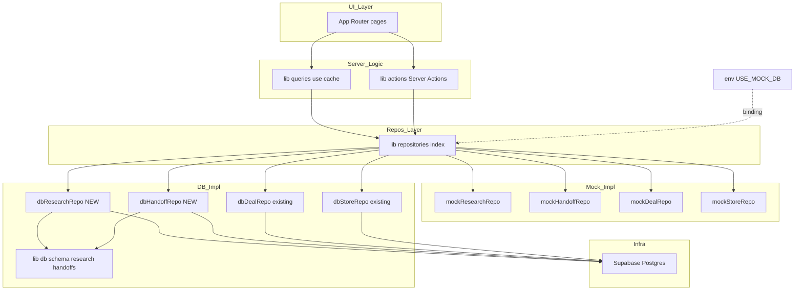
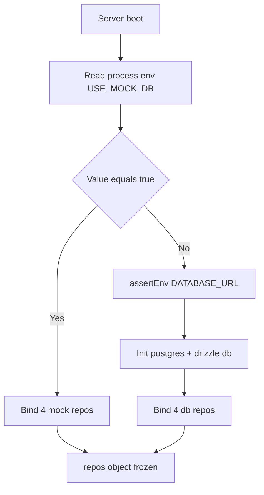
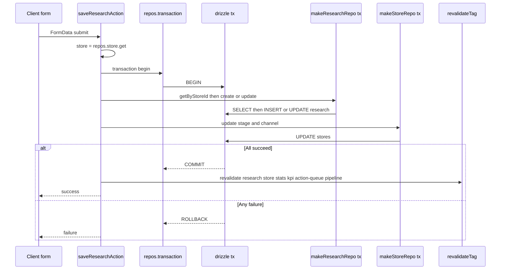
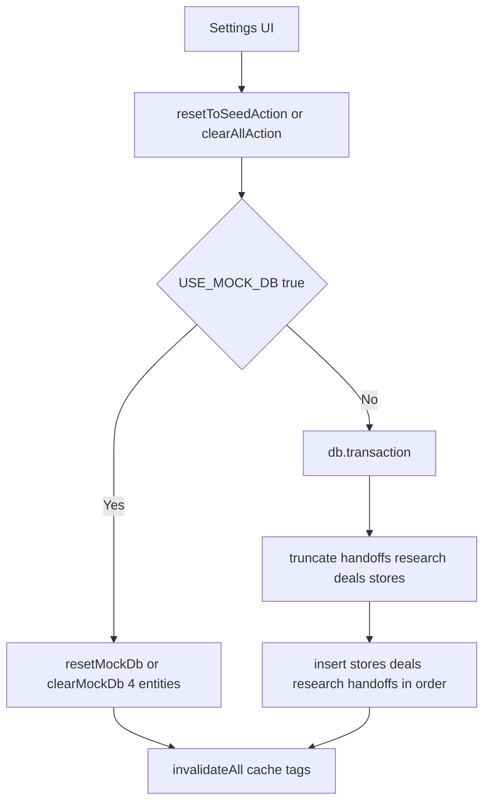
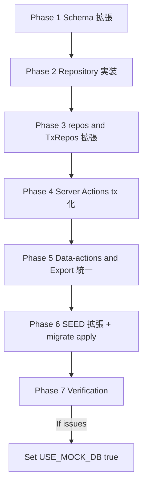

# Technical Design — research-handoff-db-migration

## Overview

**Purpose**: 調査 (Research) と引き継ぎ (Handoff) のデータをインメモリ Mock から **Supabase (Postgres) + Drizzle ORM** に永続化し、`#1 deals-stores-db-migration` で確立した永続化パターンを 4 entity 全体に適用して Wave 1「基盤完成」を完結させる。

**Users**: 調査担当・営業担当・運用担当・マネージャ・開発者・運用担当者。利用者観点では「Research/Handoff も再起動を跨いで残る」「複数端末で共有される」「ダッシュボード/KPI/アクションキューの集計が 4 entity ベースで動く」状態を実現する。開発者観点では既存の Server Action / `'use cache'` クエリ / Cache タグ戦略 / Repository 抽象を完全に無修正で維持し、Mock フォールバックも継続する。

**Impact**: `lib/db/schema.ts` に 2 テーブルを追加、`lib/db/research-repository.ts` / `lib/db/handoff-repository.ts` を新設、`lib/repositories/index.ts` の DB ブランチで 2 entity を実 DB 実装に bind し `TxRepos` を 4 entity に拡張。3 つの Server Action を `repos.transaction` で原子化し、`lib/actions/data-actions.ts` の Mock パススルー(`resetMockResearchAndHandoffOnly` / `clearMockResearchAndHandoffOnly`)を排除して 4 entity 全てを DB トランザクション内に統合。`scripts/seed.ts` を 4 entity 投入に拡張。UI / `'use cache'` クエリ / Server Action のシグネチャは無修正。**新規ライブラリ依存追加なし**。

### Goals
- Research / Handoff を Supabase 上に永続化し、`#1` と同等の挙動を 2 entity に拡張する
- `repos.transaction()` を 4 entity に拡張し、`saveResearchAction` / `createHandoffAction` / `completeHandoffAction` を不可分化する
- `data-actions.ts` / `app/api/export/route.ts` から DB モード時の Mock パススルーを排除し、4 entity 全てを永続化レイヤ越しに統一処理する
- 既存 Server Action / `'use cache'` クエリ / `CACHE_TAGS` / Repository interface のシグネチャを **完全に無修正で動作**

### Non-Goals
- 認証・認可リファクタ(`researcher` / `contract_owner` / `ops_assignee` を user_id 化、別 Issue #3)
- アクション履歴の独立テーブル化(別 Issue #4)
- 添付ファイル管理(別 Issue #9)
- 期日リマインダー / 通知(別 Issue #8)
- マルチテナント対応(別 Issue #12)
- UI(`app/(main)/research/*` / `app/(main)/handoffs/*` 配下)の改修
- ID 体系(`<entity>_<id>` text PK)の変更
- `created_at` / `updated_at` の型変更(text `YYYY-MM-DD` を継続)
- `research.store_id` への DB-level UNIQUE 制約付与(Mock 慣習維持)
- 既存 `db.transaction()` API の置換(`#1` で確立した形を維持)
- 列挙型の Postgres ENUM 化(text 維持)

## Boundary Commitments

### This Spec Owns

- `lib/db/schema.ts` の `research` / `handoffs` テーブル定義(FK 含む)
- `drizzle/0001_*.sql` 新規マイグレーション(drizzle-kit 自動生成)
- `lib/db/research-repository.ts` / `lib/db/handoff-repository.ts` 新設(`makeXxxRepo(executor)` ファクトリ + `dbXxxRepo`)
- `lib/db/index.ts` バレル拡張(re-export 追加のみ)
- `lib/repositories/index.ts` の DB ブランチ拡張(2 entity の DB bind)+ `TxRepos` 拡張(2 フィールド追加)
- `scripts/seed.ts` の SEED_RESEARCH / SEED_HANDOFFS upsert 追記 + 順序保証
- `lib/actions/research-actions.ts:saveResearchAction` の `repos.transaction` 化(内部実装のみ、シグネチャ無修正)
- `lib/actions/handoff-actions.ts:createHandoffAction` / `completeHandoffAction` の `repos.transaction` 化(内部実装のみ、シグネチャ無修正)
- `lib/actions/data-actions.ts` の Mock パススルー削除(`resetMockResearchAndHandoffOnly` / `clearMockResearchAndHandoffOnly` 関数削除)+ DB トランザクションへの 4 entity 統合
- `app/api/export/route.ts` の DB 経路を `repos` 越し 4 entity の並列取得に統一
- README の Supabase セットアップ節の文言更新(「research/handoffs を含む」)

### Out of Boundary

- 認証・認可・RLS・Realtime・Storage(別 Issue)
- アクション履歴・添付ファイル・通知・マルチテナント(別 Issue)
- UI 層の改修(`app/(main)/research/*` / `app/(main)/handoffs/*` のフォーム・一覧コンポーネント)
- Server Action / Query / Repository interface のシグネチャ変更
- `types/research.ts` / `types/handoff.ts` のフィールド追加・改名・型変更
- `CACHE_TAGS.research` 系・`CACHE_TAGS.handoffs` 系 タグキーの改変
- 既存 `lib/db/{deal,store}-repository.ts` / `lib/db/client.ts` / `lib/env.ts` の改修
- 既存 `db.transaction` API の差替え

### Allowed Dependencies

- 上流(import 元): `types/research`, `types/handoff`, `lib/repositories/{research,handoff}-repository.ts`(interface), `lib/cache.ts`, `lib/utils/id.ts`, `lib/utils/date.ts`, `lib/mock/seed.ts`(SEED 配列のみ)
- 横方向: `lib/domain/*`(列挙定数の参照のみ)
- 既存依存: `drizzle-orm@^0.45.2` / `postgres@^3.4.9` / `drizzle-kit` / `tsx`(`#1` で導入済、本 spec で追加なし)
- 禁止: UI / Server Action / Query 内部から `lib/mock/*` または `lib/db/*` を **直接 import** すること(必ず `lib/repositories` 経由、tx もまた `repos.transaction(...)` API 経由のみ許可)
- **Documented exception**(`#1` から継続): `lib/actions/data-actions.ts` および `scripts/seed.ts` は TRUNCATE / BULK UPSERT 等 Repository interface で表現できない DDL 級操作のため、`lib/db/client.ts` と `lib/db/schema.ts` の直接 import を許容。これら 2 ファイル以外で同様の例外を増やしてはならない

### Revalidation Triggers

- `ResearchRepository` / `HandoffRepository` interface のメソッド追加・削除・シグネチャ変更
- `Research` / `Handoff` 型のフィールド追加・改名・型変更
- `CACHE_TAGS.research` / `CACHE_TAGS.researchByStore` / `CACHE_TAGS.handoffs` / `CACHE_TAGS.handoff` / `CACHE_TAGS.handoffsByStore` の追加・改名
- `repos.transaction` の `TxRepos` 型からのフィールド削除(追加は非破壊)
- ID 形式の変更(`res_*` / `hand_*` の text → uuid 等)
- `created_at` / `updated_at` の型変更(text → timestamptz)
- DB ドライバ・コネクション戦略の変更(`#1` の判断を継承)
- `Handoff.payment_confirmed` の nullable 仕様の変更

---

## Architecture

### Existing Architecture Analysis

- **`#1` で確立された永続化基盤を本 spec は完全に再利用する**: `lib/db/client.ts`(postgres + drizzle singleton + 健康チェック)、`lib/env.ts`(assertEnv)、`lib/repositories/index.ts`(env 分岐 + Object.freeze + 動的 import + top-level await + `repos.transaction` API)、`scripts/seed.ts`(USE_MOCK_DB ガード + tx 内 upsert)、`lib/db/{deal,store}-repository.ts`(`makeXxxRepo(executor)` ファクトリ)
- **本 spec が解決する `#1` の不完全領域**:
  1. `lib/repositories/index.ts:96-99` の「research / handoff は別 Issue で DB 化される予定」コメントとそれに紐付く Mock fallback bind
  2. `lib/actions/data-actions.ts` 内の Mock パススルー(`resetMockResearchAndHandoffOnly` / `clearMockResearchAndHandoffOnly`)
  3. `app/api/export/route.ts` 内の `mockSnapshot.research` / `mockSnapshot.handoffs` への参照
  4. `saveResearchAction` / `createHandoffAction` / `completeHandoffAction` の独立 `await` による非トランザクション領域

### Architecture Pattern & Boundary Map



**Architecture Integration**:
- **Pattern**: Layered + Repository(`#1` 既定)を維持。env 分岐は Composition Root (`repos`) に閉じ込めたまま、本 spec で 2 entity を bind 対象に追加するのみ
- **Boundaries**: UI / Action / Query は `repos` 経由のみで永続化レイヤを参照。Mock と DB の存在を意識しない
- **Preserved**: `'use cache'` / `cacheTag` / `revalidateTag` 戦略、`server-only` 隔離、命名規約、依存方向(`app → lib/queries|actions → lib/repositories → lib/mock|lib/db`)、`Repository` interface の薄さ
- **New components rationale**: `dbResearchRepo` / `dbHandoffRepo` は Mock と対称な実装を 2 つ追加する形であり、新たな抽象層を増やすものではない
- **Steering compliance**: `tech.md` の「Repository Pattern による DB 抽象化」「Cache Components 戦略」を完全準拠

### Technology Stack

| Layer | Choice / Version | Role in Feature | Notes |
|---|---|---|---|
| Backend / Server Logic | Next.js 16.2.4 (既存) | Server Actions / RSC / `'use cache'` | 無修正 |
| Data / ORM | drizzle-orm `^0.45.2` (既存) | スキーマ定義・型推論・transaction | **追加なし**(`#1` 採用済) |
| Data / Driver | postgres `^3.4.9` (既存) | postgres.js: Transaction Pooler 互換 | **追加なし**(`#1` 採用済) |
| Data / Storage | Supabase Postgres (既存) | 永続化先 | テーブル 2 件追加のみ |
| Tooling | drizzle-kit (devDep, 既存) | スキーマ → SQL 生成 | `drizzle/0001_*.sql` 自動生成 |
| Tooling | tsx (devDep, 既存) | `scripts/seed.ts` 実行 | SEED_RESEARCH/HANDOFFS 投入 |

> 詳細トレードオフ・代替案は `research.md` を参照。本 spec で **新規依存追加 0 件**。

---

## File Structure Plan

### Directory Structure

```
fw-sales/
├── drizzle/
│   ├── 0000_living_darwin.sql         # 既存 (#1) — 無修正
│   └── 0001_<auto>.sql                # 新規: research + handoffs テーブル + FK
├── scripts/
│   └── seed.ts                        # 修正: SEED_RESEARCH / SEED_HANDOFFS upsert 追加
├── lib/
│   ├── db/
│   │   ├── client.ts                  # 既存 (#1) — 無修正
│   │   ├── schema.ts                  # 修正: research + handoffs 定義を追加
│   │   ├── deal-repository.ts         # 既存 (#1) — 無修正
│   │   ├── store-repository.ts        # 既存 (#1) — 無修正
│   │   ├── research-repository.ts     # 新規: makeResearchRepo + dbResearchRepo
│   │   ├── handoff-repository.ts      # 新規: makeHandoffRepo + dbHandoffRepo
│   │   └── index.ts                   # 修正: research/handoff の re-export 追加
│   ├── repositories/
│   │   └── index.ts                   # 修正: DB ブランチに 2 entity 追加 + TxRepos 拡張
│   └── actions/
│       ├── research-actions.ts        # 修正: saveResearchAction を repos.transaction 化
│       ├── handoff-actions.ts         # 修正: create/complete を repos.transaction 化
│       └── data-actions.ts            # 修正: Mock パススルー削除 + DB tx 4 entity 統合
├── app/api/export/route.ts            # 修正: DB 経路を repos 4 entity 並列取得に統一
└── README.md                          # 修正: Supabase セットアップ節を 4 テーブル化
```

### Modified Files

- `lib/db/schema.ts` — `research` / `handoffs` テーブル定義を追加(既存 stores/deals 定義は無修正)
- `lib/db/index.ts` — `makeResearchRepo` / `dbResearchRepo` / `makeHandoffRepo` / `dbHandoffRepo` の re-export を追加
- `lib/repositories/index.ts` — DB ブランチで `research: dbResearchRepo` / `handoff: dbHandoffRepo` を bind、`TxRepos` に 2 フィールド追加、Mock 経路の擬似 transaction を 4 entity 化、コメント「別 Issue で DB 化される予定」を削除
- `lib/actions/research-actions.ts` — `saveResearchAction` の研究保存と店舗 stage/channel 同期を `repos.transaction(async ({ research, store }) => { ... })` で 1 単位化(シグネチャ無修正)。`saveResearchAndContinue` は呼び出し関係のみ無修正
- `lib/actions/handoff-actions.ts` — `createHandoffAction`(handoff.create + store.update("引き継ぎ待ち"))と `completeHandoffAction`(handoff.update("完了") + store.update("引き継ぎ完了"))を各 `repos.transaction` で 1 単位化(シグネチャ無修正)。`updateHandoffAction` / `deleteHandoffAction` は単独更新のため無修正
- `lib/actions/data-actions.ts` — `resetMockResearchAndHandoffOnly` / `clearMockResearchAndHandoffOnly` 関数を削除。`resetToSeedAction` / `clearAllAction` の DB ブランチで TRUNCATE 順序を `handoffs → research → deals → stores` に拡張、INSERT 順序を逆転(`stores → deals → research → handoffs`)。`importJsonAction` の DB ブランチに research/handoffs upsert を追加。`getSnapshotForExportAction` の DB ブランチで `Promise.all` を 4 entity 化。`restoreMockDb` の Research/Handoff 引数渡しを DB モードで省略。`mockDb` / `SEED_RESEARCH` / `SEED_HANDOFFS` の import を Mock モード専用処理用にのみ残す
- `app/api/export/route.ts` — DB モード時 `Promise.all([repos.deal.list(), repos.store.list(), repos.research.list(), repos.handoff.list()])` に統一。`mockSnapshot` 参照を排除(Mock モードのみ `snapshotMockDb()` を継続)
- `scripts/seed.ts` — `SEED_RESEARCH` / `SEED_HANDOFFS` の import を追加。`db.transaction` 内の upsert 順序を `stores → deals → research → handoffs`(FK 整合)に拡張。件数 console.log を 4 entity に拡張
- `README.md` — `#1` で書かれた Supabase + Drizzle セットアップ節の「対象テーブル」記述を `stores / deals / research / handoffs` に更新。`pnpm seed` の出力件数の例を更新

> 既存 `lib/db/{deal,store}-repository.ts` / `lib/db/client.ts` / `lib/env.ts` / `lib/cache.ts` / `types/*` は **完全無修正**。

---

## System Flows

### Flow 1: Repository Resolution(起動時、4 entity 拡張版)



`#1` で確立した起動時 1 回バインドの構造を維持。本 spec で 2 entity が DB ブランチでも実 DB 実装に bind されることを除き、ロジックは同一。

### Flow 2: saveResearchAction の transaction 化(Req 4.1, 4.2, 4.4, 4.5)



- Mock モードでは tx は擬似化(シリアル await のまま、ロールバック不可)。Mock は開発用フォールバックのため許容(`#1` と同方針)
- DB モードでは `repos.transaction(async ({ research, store }) => { ... })` 内で `makeResearchRepo(tx)` / `makeStoreRepo(tx)` を都度生成(`#1` パターン踏襲)
- `revalidateTag` 群は tx 成功後にのみ呼ぶ(失敗時はキャッシュ汚染しない)

### Flow 3: createHandoffAction / completeHandoffAction の transaction 化(Req 4.3, 4.4, 4.5)

```mermaid
sequenceDiagram
    participant UI as Form
    participant Create as createHandoffAction
    participant Complete as completeHandoffAction
    participant Repos as repos.transaction
    participant HandoffRepo as makeHandoffRepo tx
    participant StoreRepo as makeStoreRepo tx

    Note over UI,Create: 引き継ぎ作成
    UI->>Create: FormData submit
    Create->>Repos: transaction begin
    Create->>HandoffRepo: create
    Create->>StoreRepo: update stage to 引き継ぎ待ち
    Repos-->>Create: COMMIT or ROLLBACK

    Note over UI,Complete: 引き継ぎ完了
    UI->>Complete: handoffId
    Complete->>Repos: transaction begin
    Complete->>HandoffRepo: update status to 完了
    Complete->>StoreRepo: update stage to 引き継ぎ完了
    Repos-->>Complete: COMMIT or ROLLBACK
```

`updateHandoffAction` は `handoff.update` のみで store 同期を伴わないため tx 不要。`deleteHandoffAction` も同様(無修正)。

### Flow 4: data-actions の env 分岐(4 entity 統合版、Req 8)



- **本 spec で変化したポイント**: `#1` では DB ブランチでも `resetMockResearchAndHandoffOnly` を呼んで Mock 側の Research/Handoff を別途リセットしていた。本 spec ではこの分岐を排除し、4 entity 全てを DB tx 内で扱う(Req 8.4)
- TRUNCATE 順序は子から親(`handoffs → research → deals → stores`)、INSERT 順序は親から子に逆転(`stores → deals → research → handoffs`)。tx 内のため部分失敗は発生しない(Req 8.5)

---

## Requirements Traceability

| Requirement | Summary | Components | Interfaces / Files | Flows |
|---|---|---|---|---|
| 1.1 | 永続化(作成・更新・削除) | dbResearchRepo / dbHandoffRepo | ResearchRepository / HandoffRepository | — |
| 1.2 | 再起動後保持 | Postgres / lib/db/client.ts (既存) | postgres.js 接続 | Flow 1 |
| 1.3 | 複数端末で同一最新状態 | Postgres / dbResearchRepo / dbHandoffRepo | — | — |
| 1.4 | 永続化中の整合性 | Drizzle transaction | repos.transaction | Flow 2/3 |
| 2.1 | 1 店舗 1 調査の取得 | dbResearchRepo.getByStoreId | `getByStoreId(storeId).limit(1)` | — |
| 2.2 | 既存研究の更新 | saveResearchAction (tx) | repos.transaction | Flow 2 |
| 2.3 | 新規研究の作成 | saveResearchAction (tx) | repos.transaction | Flow 2 |
| 2.4 | 研究削除 | dbResearchRepo.delete | ResearchRepository.delete | — |
| 2.5 | 子の親不存在で拒否 | research.store_id REFERENCES stores | DB constraint | — |
| 3.1 | handoff 一覧 created_at 降順 | dbHandoffRepo.list | listHandoffsCached | — |
| 3.2 | handoff 詳細取得 | dbHandoffRepo.get | getHandoffCached | — |
| 3.3 | store 単位の handoff 抽出 | dbHandoffRepo.list(storeId) | HandoffRepository.list | — |
| 3.4 | handoff 新規作成 | createHandoffAction (tx) | repos.transaction | Flow 3 |
| 3.5 | handoff 編集 | updateHandoffAction | HandoffRepository.update | — |
| 3.6 | handoff 完了 | completeHandoffAction (tx) | repos.transaction | Flow 3 |
| 3.7 | handoff 削除 | dbHandoffRepo.delete | HandoffRepository.delete | — |
| 3.8 | 子の親不存在で拒否 | handoffs.store_id / deal_id REFERENCES | DB constraint | — |
| 4.1 | 研究保存時 stage 同期 | saveResearchAction | repos.transaction | Flow 2 |
| 4.2 | 研究保存時 channel 同期 | saveResearchAction | repos.transaction | Flow 2 |
| 4.3 | handoff 作成時 stage=引き継ぎ待ち | createHandoffAction | repos.transaction | Flow 3 |
| 4.4 | tx 不可分 | repos.transaction | drizzle db.transaction | Flow 2/3 |
| 4.5 | tx 失敗時 rollback | repos.transaction | drizzle ROLLBACK | Flow 2/3 |
| 5.1 | 集計 | 既存 lib/queries/* | repos 越し透過 | — |
| 5.2 | キャッシュ失効 | revalidateTag(_, "max") | (各 Action 内既存ヘルパ) | — |
| 5.3 | 次回読み出し最新化 | use cache + cacheTag | (existing) | — |
| 6.1 | env="true" で Mock 選択 | lib/repositories/index.ts | buildRepos | Flow 1 |
| 6.2 | env != "true" で DB 選択 | lib/repositories/index.ts | buildRepos | Flow 1 |
| 6.3 | 単一窓口 | lib/repositories/index.ts | (Object.freeze) | — |
| 6.4 | 起動時固定 | top-level await | (existing) | Flow 1 |
| 6.5 | Mock 同等動作 | mockResearchRepo / mockHandoffRepo (無修正) | — | — |
| 7.1 | SEED 同等投入 | scripts/seed.ts | SEED_RESEARCH / SEED_HANDOFFS | — |
| 7.2 | ベキ等再投入 | INSERT ON CONFLICT DO UPDATE | scripts/seed.ts | — |
| 7.3 | 順序保証 | scripts/seed.ts (stores → deals → research → handoffs) | — | — |
| 7.4 | env に応じた投入先 | scripts/seed.ts (USE_MOCK_DB ガード) | (existing) | — |
| 8.1 | DB Export 統一 | app/api/export/route.ts | repos 越し 4 entity | Flow 4 |
| 8.2 | DB Import 統一 | importJsonAction | DB トランザクション | Flow 4 |
| 8.3 | DB Reset 統一 | resetToSeedAction | DB トランザクション | Flow 4 |
| 8.4 | Mock 経由排除 | data-actions.ts(関数削除) | — | Flow 4 |
| 8.5 | 参照整合の不可分実行 | db.transaction in data-actions | drizzle ROLLBACK | Flow 4 |
| 8.6 | Mock モード単独動作 | data-actions.ts (Mock 経路無修正) | — | — |
| 9.1 | Action シグネチャ維持 | research-actions / handoff-actions(内部のみ修正) | (既存 export) | — |
| 9.2 | Query シグネチャ維持 | lib/queries/research / handoffs(無修正) | — | — |
| 9.3 | CACHE_TAGS 維持 | lib/cache.ts(無修正) | — | — |
| 9.4 | repos 経由限定 | (Documented exception 維持) | — | — |
| 9.5 | 型契約満たす | dbResearchRepo / dbHandoffRepo | ResearchInput/Patch / HandoffInput/Patch | — |
| 10.1 | text PK + generateId | lib/db/schema.ts | text("id").primaryKey() | — |
| 10.2 | text 日付 | lib/db/schema.ts | text("created_at") / text("updated_at") | — |
| 10.3 | nullable text payment_confirmed | lib/db/schema.ts | text("payment_confirmed") | — |
| 10.4 | enum text 保存 | lib/db/schema.ts | (text + Action 層型ガード) | — |
| 10.5 | 子の親不存在で拒否 | research.store_id / handoffs.store_id, deal_id FK | DB constraint | — |
| 11.1 | TxRepos 拡張 | lib/repositories/index.ts | TxRepos | Flow 2/3 |
| 11.2 | tx 1 単位の rollback | drizzle db.transaction | (existing) | Flow 2/3 |
| 11.3 | Mock 擬似 tx | lib/repositories/index.ts (Mock branch) | TxRepos 4 entity | — |
| 12.1 | typecheck/lint/build | (全実装) | — | — |
| 12.2 | DB E2E | (全実装) | — | Flow 2/3 |
| 12.3 | Mock E2E | (Mock 経路維持) | — | — |
| 12.4 | Export/Import/Reset E2E | data-actions.ts | DB 経路 | Flow 4 |

---

## Components and Interfaces

### Summary

| Component | Domain/Layer | Intent | Req Coverage | Key Dependencies (P0/P1) | Contracts |
|---|---|---|---|---|---|
| `lib/db/schema.ts` (拡張) | Data | research/handoffs テーブル定義 + FK | 1.1, 2.5, 3.8, 10.1〜10.5 | drizzle-orm (P0), 既存 stores/deals 定義 (P0) | State |
| `lib/db/research-repository.ts` (新規) | Data | makeResearchRepo + dbResearchRepo | 1.1, 1.4, 2.1〜2.4, 9.5, 10.1, 10.2 | client.ts (P0), schema.ts (P0), interface (P0) | Service |
| `lib/db/handoff-repository.ts` (新規) | Data | makeHandoffRepo + dbHandoffRepo | 1.1, 1.4, 3.1〜3.7, 9.5, 10.1, 10.2, 10.3 | client.ts (P0), schema.ts (P0), interface (P0) | Service |
| `lib/db/index.ts` (拡張) | Data | バレル更新 | 9.4 | 各 db repo (P0) | — |
| `lib/repositories/index.ts` (修正) | Composition | DB ブランチ 2 entity 追加 + TxRepos 拡張 | 4.4, 4.5, 6.1〜6.5, 9.4, 11.1〜11.3 | env.ts (P0), mock/* (P1), db/* (P1, lazy) | Service |
| `lib/actions/research-actions.ts` (修正) | Action | saveResearchAction を tx 化 | 4.1, 4.2, 4.4, 4.5, 9.1 | repos (P0) | Service |
| `lib/actions/handoff-actions.ts` (修正) | Action | createHandoff / completeHandoff を tx 化 | 4.3, 4.4, 4.5, 9.1 | repos (P0) | Service |
| `lib/actions/data-actions.ts` (修正) | Action | Mock パススルー削除 + DB tx 4 entity 統合 | 8.1〜8.6 | repos (P0), mock/db (P1), lib/db (Documented exception, P0) | Service |
| `app/api/export/route.ts` (修正) | API | repos 越し 4 entity 並列取得 | 8.1, 8.4 | repos (P0), mock/db (P1) | API |
| `scripts/seed.ts` (修正) | Tooling | SEED 投入を 4 entity に拡張 | 7.1〜7.4 | client.ts (P0), schema.ts (P0), seed (P0) | Batch |

### Data Layer

#### `lib/db/schema.ts` (拡張)

| Field | Detail |
|---|---|
| Intent | research/handoffs テーブル定義を追加し、参照整合性を FK で強制 |
| Requirements | 1.1, 2.5, 3.8, 10.1, 10.2, 10.3, 10.4, 10.5 |

**Responsibilities & Constraints**
- `Research` / `Handoff` 型(`types/research.ts` / `types/handoff.ts`)のフィールドと 1:1 対応
- 主キー `text` (`<entity>_<id>`)、`created_at` / `updated_at` を `text`(NOT NULL)
- `research.store_id` は `stores.id` への FK(NOT NULL)。**1:1 制約は DB 側に課さない**(Mock 慣習維持、Open Question 解決済)
- `handoffs.store_id` は `stores.id` への FK、`handoffs.deal_id` は `deals.id` への FK(両方 NOT NULL)
- `handoffs.payment_confirmed` のみ NULL 許容(`text("payment_confirmed")`、`.notNull()` を付けない)

**Dependencies**
- External: drizzle-orm (P0)
- Inbound: research-repository.ts, handoff-repository.ts, scripts/seed.ts, data-actions.ts (P0)

**Contracts**: State [x]

##### State Management

```typescript
// 既存 stores / deals 定義は無修正。以下を追加。

export const research = pgTable("research", {
  id: text("id").primaryKey(),
  store_id: text("store_id")
    .notNull()
    .references(() => stores.id),
  store_name: text("store_name").notNull(),
  total_review: text("total_review").notNull(),
  strength1: text("strength1").notNull(),
  strength2: text("strength2").notNull(),
  strength3: text("strength3").notNull(),
  weakness1: text("weakness1").notNull(),
  weakness2: text("weakness2").notNull(),
  weakness3: text("weakness3").notNull(),
  review_positive: text("review_positive").notNull(),
  review_negative: text("review_negative").notNull(),
  meo_gap: text("meo_gap").notNull(),
  hp_gap: text("hp_gap").notNull(),
  instagram_gap: text("instagram_gap").notNull(),
  channel: text("channel").notNull(),
  channel_reason: text("channel_reason").notNull(),
  sales_hook: text("sales_hook").notNull(),
  entry_product: text("entry_product").notNull(),
  main_product: text("main_product").notNull(),
  researcher: text("researcher").notNull(),
  status: text("status").notNull(),
  created_at: text("created_at").notNull(),
  updated_at: text("updated_at").notNull(),
});

export const handoffs = pgTable("handoffs", {
  id: text("id").primaryKey(),
  store_id: text("store_id")
    .notNull()
    .references(() => stores.id),
  store_name: text("store_name").notNull(),
  deal_id: text("deal_id")
    .notNull()
    .references(() => deals.id),
  contract_services: text("contract_services").notNull(),
  initial_fee: integer("initial_fee").notNull(),
  monthly_fee: integer("monthly_fee").notNull(),
  contract_period: text("contract_period").notNull(),
  expected_result: text("expected_result").notNull(),
  contract_owner: text("contract_owner").notNull(),
  caution: text("caution").notNull(),
  ng_items: text("ng_items").notNull(),
  due_date: text("due_date").notNull(),
  materials_status: text("materials_status").notNull(),
  ops_assignee: text("ops_assignee").notNull(),
  contract_date: text("contract_date").notNull(),
  payment_confirmed: text("payment_confirmed"), // nullable
  status: text("status").notNull(),
  created_at: text("created_at").notNull(),
  updated_at: text("updated_at").notNull(),
});
```

- Persistence & consistency: `research.store_id` / `handoffs.{store_id, deal_id}` の FK で参照整合性を強制(Req 2.5, 3.8, 10.5)
- Concurrency strategy: Postgres MVCC に委譲(`#1` と同方針)

**Implementation Notes**
- Integration: 列挙型(`ResearchStatus` / `HandoffStatus` / `Channel`)は Postgres ENUM 化せず TS 側のリテラル型で担保(Req 10.4、`#1` と整合)
- Validation: マイグレーションは `pnpm drizzle-kit generate` → `drizzle/0001_*.sql` 自動生成 + git 管理 → `pnpm drizzle-kit migrate` で適用
- Risks:
  - `research.store_id` の DB-level UNIQUE 制約: **付けない**(Mock 慣習維持)。1:1 セマンティクスは `getByStoreId().limit(1)` + Action 層の existing チェックで担保
  - FK の onDelete: 既定の `restrict`(`#1` の `deals.store_id` と同方針)。親削除時に子残存があれば失敗 = データ保護

#### `lib/db/research-repository.ts` (新規)

| Field | Detail |
|---|---|
| Intent | ResearchRepository を Drizzle 実装で 1:1 充足し、tx 渡し可能ファクトリにする |
| Requirements | 1.1, 1.4, 2.1〜2.4, 9.5, 10.1, 10.2 |

**Responsibilities & Constraints**
- `makeResearchRepo(executor: DbClient | Tx): ResearchRepository` ファクトリで `db` または transaction `tx` を受け取り `ResearchRepository` を返す
- 既存 interface(`list / get / getByStoreId / create / update / delete`)を 1:1 で実装
- ID は `generateId("res")` 由来を使用(既存 `mockResearchRepo` と整合)
- `created_at` / `updated_at` は `today()` 由来の `YYYY-MM-DD` 文字列
- `list()` は `created_at` 降順ソート
- `getByStoreId()` は `where(eq(research.store_id, storeId)).limit(1)` で 1 件返却(1:1 セマンティクス)
- `delete()` は `.returning({ id })` で削除有無判定(`#1` パターン踏襲)
- `import "server-only"` 必須(Req 9.4 等)

**Dependencies**
- Inbound: `lib/repositories/index.ts`(P0), `lib/actions/research-actions.ts` 経由で `makeResearchRepo(tx)`(P0)
- Outbound: `lib/db/client.ts`, `lib/db/schema.ts`, `lib/utils/id.ts`, `lib/utils/date.ts`, `lib/repositories/research-repository.ts`(interface)(P0)

**Contracts**: Service [x]

##### Service Interface

```typescript
import "server-only";
import type { ResearchRepository } from "@/lib/repositories/research-repository";
import type { DbClient, Tx } from "./client";

export function makeResearchRepo(executor: DbClient | Tx): ResearchRepository;
export const dbResearchRepo: ResearchRepository; // = makeResearchRepo(db)
```

- Preconditions: `executor` は Drizzle の `db` または transaction `tx`
- Postconditions: `ResearchRepository` interface を完全に満たす
- Invariants: 内部状態を持たない(closure には `executor` のみ)

**Implementation Notes**
- Integration: `dbResearchRepo` は default(`db` 固定)。tx 内では呼び出し側が `makeResearchRepo(tx)` を都度生成
- Validation: `getByStoreId` は複数件レコードがある場合でも `limit(1)` で先頭のみ返却(Mock の `find()` 挙動と整合)
- Risks: 複数件 research が同一 `store_id` で挿入されるケースは Action 層 (`saveResearchAction`) の existing チェックで防止

#### `lib/db/handoff-repository.ts` (新規)

| Field | Detail |
|---|---|
| Intent | HandoffRepository を Drizzle 実装で 1:1 充足 |
| Requirements | 1.1, 1.4, 3.1〜3.7, 9.5, 10.1, 10.2, 10.3 |

**Responsibilities & Constraints**
- `makeHandoffRepo(executor: DbClient | Tx): HandoffRepository` ファクトリ
- `list(storeId?)` は `storeId` 指定時のみ `where(eq(handoffs.store_id, storeId))` 追加 + `created_at` 降順
- `getByDealId()` は `where(eq(handoffs.deal_id, dealId)).limit(1)`
- `payment_confirmed` は `null` を Drizzle 側でそのまま往復。`Handoff.payment_confirmed: string | null` の型を維持
- ID は `generateId("hand")` 由来を使用
- 他項目は research-repository と同型

**Dependencies**: research-repository と同型

**Contracts**: Service [x]

##### Service Interface

```typescript
import "server-only";
import type { HandoffRepository } from "@/lib/repositories/handoff-repository";
import type { DbClient, Tx } from "./client";

export function makeHandoffRepo(executor: DbClient | Tx): HandoffRepository;
export const dbHandoffRepo: HandoffRepository;
```

**Implementation Notes**
- Integration: `payment_confirmed` の取り扱い: Drizzle で `null` を直接 INSERT/UPDATE。Action 層は既に `readString(formData, "payment_confirmed") || null` パターンで `null` 化済(無修正)
- Risks: Drizzle text nullable のラウンドトリップ(空文字 vs null)はテストで確認(Testing Strategy 参照)。空文字 → null の自動変換は **行わない**(Action 層に委ねる)

#### `lib/db/index.ts` (拡張)

re-export 追加のみ。本ファイルは API 表面の維持責務に限定。

```typescript
import "server-only";

export { db, sql } from "./client";
export type { DbClient, Tx } from "./client";
export { makeDealRepo, dbDealRepo } from "./deal-repository";
export { makeStoreRepo, dbStoreRepo } from "./store-repository";
// 以下を追加
export { makeResearchRepo, dbResearchRepo } from "./research-repository";
export { makeHandoffRepo, dbHandoffRepo } from "./handoff-repository";
```

### Composition Layer

#### `lib/repositories/index.ts` (修正)

| Field | Detail |
|---|---|
| Intent | TxRepos を 4 entity に拡張、DB ブランチで research/handoff も dbXxxRepo を bind、Mock 擬似 transaction も 4 entity に拡張 |
| Requirements | 4.4, 4.5, 6.1〜6.5, 9.4, 11.1〜11.3 |

**Responsibilities & Constraints**
- `TxRepos` に `research: ResearchRepository` / `handoff: HandoffRepository` を追加(構造的型付けのため非破壊的拡張)
- DB ブランチで `research: dbResearchRepo` / `handoff: dbHandoffRepo` を bind し、コメント「research / handoff は別 Issue で DB 化される予定。現状は mock のまま」を削除
- DB transaction で `db.transaction(tx => fn({ deal: makeDealRepo(tx), store: makeStoreRepo(tx), research: makeResearchRepo(tx), handoff: makeHandoffRepo(tx) }))`
- Mock 経路の擬似 transaction も 4 entity を渡す(`{ deal: mockDealRepo, store: mockStoreRepo, research: mockResearchRepo, handoff: mockHandoffRepo }`)
- 動的 import / `Object.freeze` / top-level await の構造は無修正

**Dependencies**
- Inbound: `lib/queries/*`, `lib/actions/*`(P0)
- Outbound: `lib/mock/*`(P0)、DB モード時のみ動的 import で `@/lib/db`(P0)

**Contracts**: Service [x]

##### Service Interface

```typescript
export interface TxRepos {
  deal: DealRepository;
  store: StoreRepository;
  research: ResearchRepository;  // 追加
  handoff: HandoffRepository;    // 追加
}

// Repos / repos のシグネチャは変わらず。transaction の TxRepos 形が拡張されるのみ。
```

**Implementation Notes**
- Integration: 既存 `repos.transaction(async ({ deal, store }) => { ... })` 利用箇所(`createDealAction` / `updateDealAction`)は **追加プロパティを使わない限り無修正で動作**(構造的型付けによる互換)
- Validation: top-level await による起動時 1 回確定(Req 6.4)は無修正
- Risks: TxRepos 拡張時に既存 #1 の transaction 利用箇所が誤って `research`/`handoff` を呼ばないこと(コードレビューで確認、ただし型安全のため誤呼び出しは TS エラーで検出可能)

### Action Layer

#### `lib/actions/research-actions.ts` (修正)

| Field | Detail |
|---|---|
| Intent | `saveResearchAction` を `repos.transaction` で原子化(シグネチャ無修正) |
| Requirements | 4.1, 4.2, 4.4, 4.5, 9.1 |

**Responsibilities & Constraints**
- 既存シグネチャ・戻り値型・FormData ハンドリングを無修正(Req 9.1)
- `repos.transaction(async ({ research, store: storeTx }) => { ... })` で `getByStoreId` → `create or update` + `store.update({stage, channel})` を 1 単位
- `revalidateTag` 群は tx 成功後に呼ぶ(失敗時はキャッシュ汚染しない)
- `saveResearchAndContinue` は `saveResearchAction` を呼んで redirect する構造を維持(無修正)
- `lib/db/*` を **直接 import しない**(Boundary 制約)

**Dependencies**
- Inbound: UI form(P0)
- Outbound: `lib/repositories`(`repos.transaction`、P0)、`next/cache` revalidateTag(P0)

**Contracts**: Service [x]

##### Service Interface (シグネチャ無修正)

```typescript
export async function saveResearchAction(
  storeId: string,
  _prev: ActionResult<{ researchId: string }> | null,
  formData: FormData,
): Promise<ActionResult<{ researchId: string }>>;

export async function saveResearchAndContinue(
  storeId: string,
  formData: FormData,
): Promise<void>; // redirect throws
```

##### Implementation Sketch

```typescript
export async function saveResearchAction(...) {
  const store = await repos.store.get(storeId);
  if (!store) return failure("店舗が見つかりませんでした");
  const input = buildResearchInput(formData, storeId, store.name);

  try {
    const saved = await repos.transaction(async ({ research, store: storeTx }) => {
      const existing = await research.getByStoreId(storeId);
      const r = existing
        ? await research.update(existing.id, input)
        : await research.create(input);
      if (!r) throw new Error("保存に失敗しました");
      // 店舗ステージ・チャネル同期(Req 4.1, 4.2)
      await storeTx.update(storeId, {
        stage: store.stage === "調査待ち" ? "調査完了" : store.stage,
        channel: input.channel,
      });
      return r;
    });

    revalidateTag(CACHE_TAGS.research, "max");
    revalidateTag(CACHE_TAGS.researchByStore(storeId), "max");
    revalidateTag(CACHE_TAGS.stores, "max");
    revalidateTag(CACHE_TAGS.store(storeId), "max");
    revalidateTag(CACHE_TAGS.stats, "max");
    revalidateTag(CACHE_TAGS.actionQueue, "max");
    revalidateTag(CACHE_TAGS.pipeline, "max");

    return success({ researchId: saved.id }, "調査結果を保存しました");
  } catch (err) {
    return failure(err instanceof Error ? err.message : "保存に失敗しました");
  }
}
```

**Implementation Notes**
- Integration: tx 抽象は `repos` 越しのみ
- Validation: tx 開始前に `repos.store.get(storeId)` で店舗存在確認(既存どおり)
- Risks: tx 内での `research.getByStoreId` で `limit(1)` 結果に依存(既存 1:1 慣習維持)

#### `lib/actions/handoff-actions.ts` (修正)

| Field | Detail |
|---|---|
| Intent | `createHandoffAction` / `completeHandoffAction` を `repos.transaction` で原子化 |
| Requirements | 4.3, 4.4, 4.5, 9.1 |

**Responsibilities & Constraints**
- `createHandoffAction`: handoff.create + store.update({stage: "引き継ぎ待ち"}) を 1 tx
- `completeHandoffAction`: handoff.update({status: "完了"}) + store.update({stage: "引き継ぎ完了"}) を 1 tx
- `updateHandoffAction`: 単独 `handoff.update` のみで tx 不要(無修正)
- `deleteHandoffAction`: 単独 `handoff.delete` + redirect(無修正)
- 既存 `invalidate(handoffId, storeId)` ヘルパは無修正
- 既存シグネチャ・戻り値型を維持(Req 9.1)

**Dependencies**
- Outbound: `lib/repositories`(P0)、`next/cache` revalidateTag、`next/navigation` redirect(P0)

**Contracts**: Service [x]

##### Service Interface (シグネチャ無修正)

既存 `lib/actions/handoff-actions.ts` の export と同一(`createHandoffAction` / `updateHandoffAction` / `completeHandoffAction` / `deleteHandoffAction`)。

##### Implementation Sketch

```typescript
// createHandoffAction
export async function createHandoffAction(dealId, _prev, formData) {
  const deal = await repos.deal.get(dealId);
  if (!deal) return failure("商談が見つかりませんでした");
  const input = buildInput(formData, {
    store_id: deal.store_id,
    store_name: deal.store_name,
    deal_id: dealId,
  });

  try {
    const created = await repos.transaction(async ({ handoff, store }) => {
      const c = await handoff.create(input);
      await store.update(deal.store_id, { stage: "引き継ぎ待ち" });
      return c;
    });
    invalidate(created.id, deal.store_id);
    return success({ id: created.id }, "引き継ぎシートを作成しました");
  } catch (err) {
    return failure(err instanceof Error ? err.message : "作成に失敗しました");
  }
}

// completeHandoffAction
export async function completeHandoffAction(handoffId) {
  const current = await repos.handoff.get(handoffId);
  if (!current) return failure("引き継ぎが見つかりませんでした");

  try {
    await repos.transaction(async ({ handoff, store }) => {
      await handoff.update(handoffId, { status: "完了" });
      await store.update(current.store_id, { stage: "引き継ぎ完了" });
    });
    invalidate(handoffId, current.store_id);
    return success(undefined, "運用への引き継ぎを完了しました");
  } catch (err) {
    return failure(err instanceof Error ? err.message : "完了に失敗しました");
  }
}
```

**Implementation Notes**
- Integration: `updateHandoffAction` は store 同期がないため tx 化しない
- Validation: tx 開始前に `repos.deal.get` / `repos.handoff.get` で前提存在確認(既存どおり)
- Risks: `completeHandoffAction` でステータス重複更新(既に「完了」)時の挙動: `update` は冪等のため問題なし

#### `lib/actions/data-actions.ts` (修正)

| Field | Detail |
|---|---|
| Intent | DB モード時の Mock パススルー(Research/Handoff)を排除し、Reset/Clear/Import を 4 entity 全てを DB tx で扱う |
| Requirements | 8.1, 8.2, 8.3, 8.4, 8.5, 8.6 |

**Responsibilities & Constraints**
- `resetMockResearchAndHandoffOnly` / `clearMockResearchAndHandoffOnly` 関数を **削除**
- `resetToSeedAction` (DB ブランチ): TRUNCATE 順序を `handoffs → research → deals → stores`、INSERT 順序を `stores → deals → research → handoffs`(全て `db.transaction` 内)
- `clearAllAction` (DB ブランチ): 同 TRUNCATE 順序で全件削除
- `importJsonAction` (DB ブランチ): 4 entity 全てを `db.transaction` 内で upsert(parent → child 順)。`restoreMockDb` の Research/Handoff 引数渡しを DB モードでは省略
- `getSnapshotForExportAction` (DB ブランチ): `Promise.all([repos.deal.list(), repos.store.list(), repos.research.list(), repos.handoff.list()])` で並列取得
- Mock モードのブランチは無修正(Req 8.6)
- Documented exception(`lib/db/*` 直接 import)は維持(`#1` から継続)
- 既存シグネチャ・戻り値型は無修正(Req 9.1)
- `lib/db/*` の動的 import 戦略を維持(Mock モードで `DATABASE_URL` 未設定でも安全)

**Dependencies**
- Outbound: `lib/repositories`(P0)、`lib/db/client.ts`, `lib/db/schema.ts`(Documented exception, P0)、`lib/mock/db.ts`(P1, mock branch 専用 + DB Import の Mock 復元省略)
- External: `next/cache` revalidateTag(P0)

**Contracts**: Service [x]

**Implementation Notes**
- Integration: env 判定は単一ヘルパ `isMockMode()` を継続使用(既存)
- Validation: 入力 JSON のスキーマ簡易検証は `Array.isArray` ガードを継続。research / handoffs 配列も同様に判定して upsert
- Risks:
  - TRUNCATE 順序の誤り → FK 違反だが tx 内のため部分失敗にはならず確実にロールバック
  - `mockDb` / `SEED_RESEARCH` / `SEED_HANDOFFS` の import は Mock モード専用処理用にのみ残す(DB モードでも import される副作用は元々無い)

### API Layer

#### `app/api/export/route.ts` (修正)

| Field | Detail |
|---|---|
| Intent | DB モード時 4 entity を `repos` 越し並列取得し、Mock 経由を排除 |
| Requirements | 8.1, 8.4 |

**Responsibilities & Constraints**
- DB モード: `Promise.all([repos.deal.list(), repos.store.list(), repos.research.list(), repos.handoff.list()])`、結果を `DbSnapshot` 形にマージ
- Mock モード: 無修正(`snapshotMockDb()`)
- レスポンスヘッダ・ファイル名・Content-Type は無修正
- ファイル冒頭の Cache Components 関連コメント(Node.js runtime 強制を委ねる旨)は維持

**Dependencies**
- Inbound: ブラウザ GET リクエスト(P0)
- Outbound: `lib/repositories`(P0)、`lib/mock/db.ts:snapshotMockDb`(P1, Mock branch 専用)

**Contracts**: API [x]

##### API Contract

| Method | Endpoint | Request | Response | Errors |
|---|---|---|---|---|
| GET | `/api/export` | (none) | `{ stores, research, deals, handoffs }` JSON, attachment | 500 (DB 接続失敗) |

**Implementation Notes**
- Integration: Cache Components の Node.js runtime 強制が `runtime` 宣言を不要にする旨のコメント(`#1` で記載)を維持
- Performance: `Promise.all` で 4 entity を並列、waterfall 排除(`#1` 同様、design rule R5)

### Tooling Layer

#### `scripts/seed.ts` (修正)

| Field | Detail |
|---|---|
| Intent | SEED_RESEARCH / SEED_HANDOFFS の upsert を追加し、4 entity 全てをベキ等に投入 |
| Requirements | 7.1, 7.2, 7.3, 7.4 |

**Responsibilities & Constraints**
- `SEED_RESEARCH` / `SEED_HANDOFFS` を `lib/mock/seed` から import 追加
- `db.transaction` 内 upsert 順序: `stores → deals → research → handoffs`(FK 整合)
- `INSERT … ON CONFLICT (id) DO UPDATE SET …` でベキ等性を担保
- USE_MOCK_DB ガード(`process.env.USE_MOCK_DB === "true"` で警告 + `process.exit(0)`)は既存維持
- `sql.end()` での接続クリーンアップは既存維持
- 件数 `console.log` を 4 entity に拡張

**Dependencies**
- Outbound: `lib/db/client.ts`, `lib/db/schema.ts`, `lib/mock/seed.ts:SEED_STORES,SEED_DEALS,SEED_RESEARCH,SEED_HANDOFFS`(P0)

**Contracts**: Batch [x]

##### Batch / Job Contract

- Trigger: 開発者の手動実行(`pnpm seed` = `tsx scripts/seed.ts`)
- Input / validation: SEED_STORES / SEED_DEALS / SEED_RESEARCH / SEED_HANDOFFS 定数
- Output / destination: `stores` / `deals` / `research` / `handoffs` テーブル
- Idempotency & recovery: 主キー競合時は UPDATE。途中失敗時は再実行で最終状態に収束(tx ROLLBACK)

**Implementation Notes**
- Integration: README に追加手順なし(同 `pnpm seed` で 4 entity 投入)
- Validation: 投入後の件数を console.log で出力(4 entity それぞれ)
- Risks: `handoffs.payment_confirmed` のような nullable 値は SEED 配列内で `null` を明示(SEED_HANDOFFS は `daysAgo(0)` の文字列で、null は使われていないことを確認)

---

## Data Models

### Domain Model
- **集約ルート**: `Store`(`Research` は `store_id` で紐付く 1:1 子、`Handoff` は `store_id` + `deal_id` で紐付く子)
- **整合性ルール**:
  - `Research.channel` → `Store.channel` の同期(`saveResearchAction`)
  - `Research` 保存 → `Store.stage` を「調査待ち」→「調査完了」へ遷移(`saveResearchAction`、stage が「調査待ち」のときのみ)
  - `Handoff` 作成 → `Store.stage` を「引き継ぎ待ち」へ遷移(`createHandoffAction`)
  - `Handoff.status="完了"` → `Store.stage` を「引き継ぎ完了」へ遷移(`completeHandoffAction`)
- **不変条件**:
  - `Research.store_id` は必ず存在する `Store.id` を参照(Req 2.5, 10.5)
  - `Handoff.store_id` / `Handoff.deal_id` は必ず存在する `Store.id` / `Deal.id` を参照(Req 3.8, 10.5)
  - `Handoff.payment_confirmed` は nullable text(Req 10.3)
  - 1 店舗 1 調査(`Research`)はアプリ層で担保(DB UNIQUE 制約は付けない)

### Logical Data Model

```mermaid
erDiagram
    stores ||--o{ deals : has
    stores ||--|| research : has_one
    stores ||--o{ handoffs : has
    deals ||--|| handoffs : produces

    stores {
        text id PK
        text name
        text stage
        text channel
        text created_at
        text updated_at
    }
    deals {
        text id PK
        text store_id FK
        text status
        integer order_amount NULL
    }
    research {
        text id PK
        text store_id FK
        text channel
        text status
        text created_at
        text updated_at
    }
    handoffs {
        text id PK
        text store_id FK
        text deal_id FK
        text payment_confirmed NULL
        text status
        text contract_date
        integer initial_fee
        integer monthly_fee
    }
```

- 主キーは text(`<entity>_<id>`、`generateId("res")` / `generateId("hand")` 由来)
- `research.store_id` → `stores.id` FK(NOT NULL、no UNIQUE)
- `handoffs.store_id` → `stores.id` FK、`handoffs.deal_id` → `deals.id` FK(両 NOT NULL)
- 列挙値は text で保持し、Action 層で型ガード
- 全カラム NOT NULL を基本とし、`handoffs.payment_confirmed` のみ NULL 許容
- FK の `onDelete` は既定の `restrict`(`#1` と同方針)

### Physical Data Model
- **インデックス**:
  - `research(store_id)` btree(`getByStoreId` 高速化)
  - `handoffs(store_id)` btree(`list(storeId)` 高速化)
  - `handoffs(deal_id)` btree(`getByDealId` 高速化)
  - `research(created_at)` desc, `handoffs(created_at)` desc(一覧降順)
  - 上記は `drizzle-kit generate` が FK から自動付与する範囲で十分。手動追加は本 spec では行わない
- **1:1 制約**: `research.store_id` の `unique` 制約は **付けない**(Mock 慣習維持)
- **パーティション**: 不要(社内ツール、レコード数小)
- **マイグレーション SQL**: `pnpm drizzle-kit generate` で `drizzle/0001_*.sql` 自動生成 + git 管理 + `pnpm drizzle-kit migrate` で適用

### Data Contracts & Integration
- **API**: `GET /api/export` の JSON レスポンスは既存スキーマと完全互換(`{ stores, research, deals, handoffs }`)
- **Import**: `Array.isArray(...)` の最低限ガード後 upsert(既存と同方針、4 entity 対応)

---

## Error Handling

### Error Strategy
- **起動時エラー**(`#1` の挙動を継承): env 欠落 / DB 接続失敗で起動を中断、標準エラー出力に明記。本 spec で追加変更なし
- **ランタイムエラー**(CRUD): postgres.js / drizzle の例外を `ActionResult<never>` に包んで UI に返す
- **トランザクションエラー**(Req 4.5): tx callback 内の throw で自動 ROLLBACK。`failure(message)` で UI に返却し、キャッシュ失効を実行しない

### Error Categories and Responses
- **User Errors**: 必須フィールド欠落 → `failure("...")` で UI へ
- **System Errors**: DB 接続切断 → 起動 fail-fast(既存)、または各 Action で例外捕捉
- **Business Logic Errors**: 不存在 store_id / deal_id への子作成 → FK 制約エラーを `failure("...")` に変換

### Monitoring
- 本 spec では追加ログ機構なし(別 Issue)。`console.error` に postgres.js のエラーオブジェクトを出力する程度に留める
- Supabase Dashboard のクエリログを運用面で活用

---

## Testing Strategy

### Unit Tests
- `makeResearchRepo` の各メソッド(`list / get / getByStoreId / create / update / delete`)が期待 SQL を発行(モック executor)。`getByStoreId` が `limit(1)` を含むこと
- `makeHandoffRepo` の各メソッド(`list / list(storeId) / get / getByDealId / create / update / delete`)が期待 SQL を発行。`payment_confirmed` の `null` ラウンドトリップ(`null` を INSERT → `null` を読出し、空文字 `""` は空文字のまま、Action 層で `|| null` 化されるため repo は変換しない)
- `repos.transaction` の Mock 擬似 tx: 4 entity 全てがコールバックに渡されること(構造的型付け検証)
- `scripts/seed.ts`: USE_MOCK_DB=true で skip、それ以外で 4 entity が順序通り upsert される

### Integration Tests
- `saveResearchAction` の transaction 化: tx 内で `research.create/update` と `store.update({stage, channel})` が 1 単位で COMMIT、いずれかの failure で ROLLBACK されること(Postgres テスト DB に対し実行)
- `createHandoffAction` の transaction 化: `handoff.create` と `store.update({stage: "引き継ぎ待ち"})` が 1 単位
- `completeHandoffAction` の transaction 化: `handoff.update({status: "完了"})` と `store.update({stage: "引き継ぎ完了"})` が 1 単位
- `data-actions.resetToSeedAction` (DB): 4 entity の TRUNCATE → INSERT が一括成功し、件数が SEED と一致
- `app/api/export/route.ts` (DB): 4 entity の `Promise.all` 並列取得が waterfall を含まないこと

### E2E Tests (手動)
- **Req 12.2 の手順**:
  1. `/research/{storeId}` で調査を保存 → `store.stage="調査完了"` / `channel` 同期確認
  2. 受注済み deal から `/handoffs/new?dealId={dealId}` を開き、引き継ぎを作成 → `store.stage="引き継ぎ待ち"`
  3. `/handoffs/{handoffId}` で完了 → `store.stage="引き継ぎ完了"`
  4. プロセスを再起動
  5. `/research/{storeId}` および `/handoffs` で当該データが残存していることを確認
  6. `/dashboard` / `/kpi` / `/pipeline` で 4 entity の集計反映確認
- **Req 12.3 の手順**: `USE_MOCK_DB=true` で再起動し同等操作で Mock 動作を確認
- **Req 12.4 の手順**: Settings で Export → 4 entity 全データを含む JSON ダウンロード、Import → 4 entity 復元、Reset → 4 entity 全 SEED に戻る

### Performance / Load
- 対象外(社内ツール、データ量小)。Supabase 無料プラン枠で十分

---

## Migration Strategy

### Phases



### Phase Details
- **Phase 1**: `lib/db/schema.ts` に research/handoffs を追加 + `pnpm drizzle-kit generate` で `0001_*.sql` 生成
- **Phase 2**: `lib/db/research-repository.ts` / `lib/db/handoff-repository.ts` 実装、`lib/db/index.ts` の re-export 追加
- **Phase 3**: `lib/repositories/index.ts` の DB ブランチで 2 entity を bind、`TxRepos` 拡張、Mock 経路の擬似 tx も 4 entity 化
- **Phase 4**: `saveResearchAction` / `createHandoffAction` / `completeHandoffAction` を `repos.transaction` 化
- **Phase 5**: `data-actions.ts` の Mock パススルー削除 + DB tx に 4 entity 統合、`app/api/export/route.ts` の DB 経路を 4 entity 統一
- **Phase 6**: `scripts/seed.ts` に SEED_RESEARCH / SEED_HANDOFFS の upsert 追加、Supabase に `pnpm drizzle-kit migrate` 適用、README 更新
- **Phase 7**: `pnpm typecheck && pnpm lint && pnpm build && pnpm test`、E2E(Req 12)、Mock fallback 検証

### Rollback Triggers / Strategy
- Drizzle ランタイム不具合 / DB 接続不安定 → `USE_MOCK_DB=true` を設定して再起動するだけで従来 Mock 動作に復帰
- DB スキーマ問題発覚 → `drizzle-kit drop`(別環境)→ 修正 → 再 `migrate`
- Validation Checkpoints: 各 Phase 完了時に `pnpm typecheck && pnpm lint && pnpm build` を実行

---

## Open Questions / Risks

- **Q1 (closed)**: `research.store_id` に UNIQUE 制約を付けるか → **付けない**(Mock 慣習維持、Action 層で 1:1 担保)
- **Q2 (closed)**: FK の `onDelete` ポリシー → 既定の `restrict`(`#1` と同方針、データ保護優先)
- **Q3**: 既存 SEED の `daysAgo(N)` で `created_at` が SEED 投入の度に変動する挙動 → 許容(`#1` と同)
- **Q4**: README 更新は `#1` の Supabase セットアップ節を「research/handoffs を含む 4 テーブル」に拡張する形で十分(本 spec で確定)
- **R1 (closed)**: postgres.js v3 + Transaction Pooler は `#1` で適用済(無修正)
- **R2 (closed)**: HMR 跨ぎ singleton 化は `#1` の `Symbol.for("__FW_SALES_DB__")` を共用(無修正)
- **R3**: `TxRepos` 拡張時の既存利用箇所(`createDealAction` など)が誤って `research`/`handoff` を呼ばないこと → 構造的型付けで自然に互換維持されるが、コードレビューでチェック
- **R4**: `payment_confirmed` の nullable 文字列ラウンドトリップ → Drizzle の `text("payment_confirmed")`(`.notNull()` を付けない)で `string | null` の TS 型と整合。既存 Action は `readString || null` 化済で安全。Unit Test で確認
- **R5**: `data-actions.ts` の TRUNCATE 順序 → `handoffs → research → deals → stores`(FK 整合)。tx 内のため部分失敗にはならず確実にロールバック
- **R6**: マイグレーション SQL 自動命名 → `drizzle-kit generate` の自動採番に従う(本 spec で命名強制しない)
- **R7**: Mock 擬似 tx の整合性 → 4 entity を `{ deal: mockDealRepo, store: mockStoreRepo, research: mockResearchRepo, handoff: mockHandoffRepo }` で渡す。シリアル await 動作のためロールバックなし(`#1` 既定の制約を継承)

---

## Supporting References
- 詳細トレードオフ・代替案・Effort 評価: `research.md`
- 先行 spec(本 spec の参照テンプレート): `.kiro/specs/deals-stores-db-migration/design.md` / `requirements.md` / `tasks.md` / `research.md`
- 既存実装の根拠:
  - `lib/repositories/index.ts:96-99`(現状の Mock fallback コメント)
  - `lib/actions/research-actions.ts:52-86`(saveResearchAction の独立 await)
  - `lib/actions/handoff-actions.ts:54-115`(createHandoffAction / completeHandoffAction の独立 await)
  - `lib/db/{deal,store}-repository.ts`(makeXxxRepo factory の参照テンプレート)
  - `lib/mock/{research,handoff}.ts`(Mock 実装の挙動仕様)
  - `lib/cache.ts`(`CACHE_TAGS.research` 系・`CACHE_TAGS.handoffs` 系)
- Steering: `.kiro/steering/{product,tech,structure}.md`
