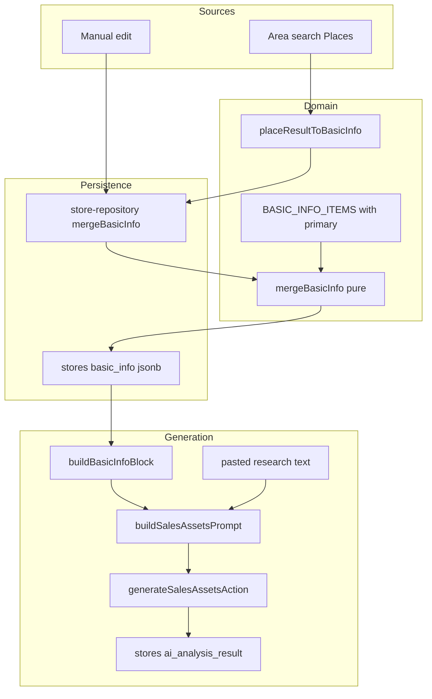
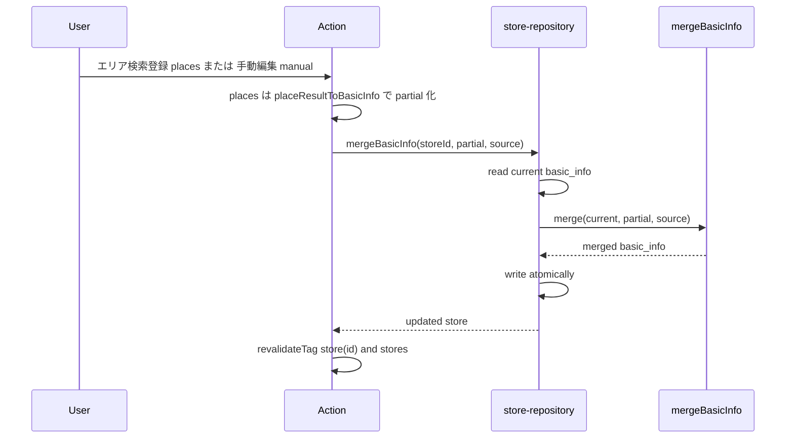
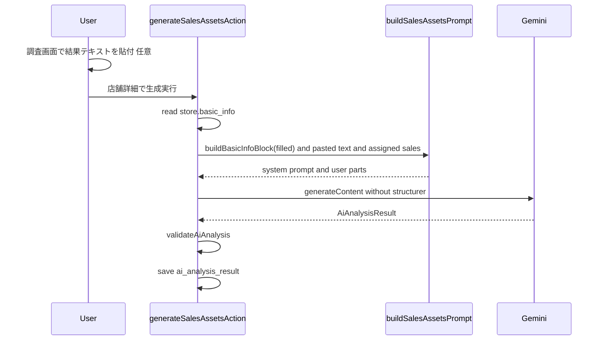
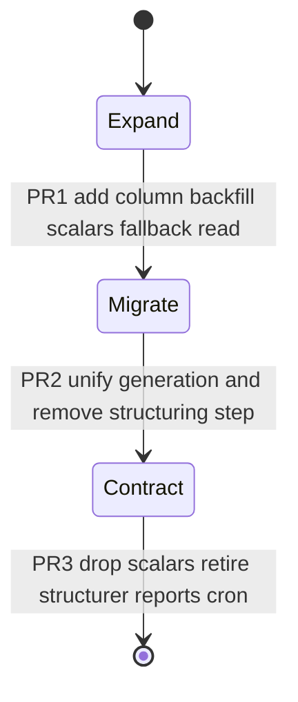

# Technical Design: store-basic-info

> **2026-06-08 改訂(#121 整合)**: Stage 2 構造化を生成経路から撤去。生成入力は `basic_info` + 貼付自由テキスト。D4(AI 構造化充填)を削除し、充填ソースを Places / 手動の 2 系統に縮小。

## Overview

本機能は、fw-sales の各店舗に「8 カテゴリ 51 項目の基本情報(`basic_info`)」を単一の構造化セットとして持たせ、エリア検索・手動入力で段階充填し、**充足済みの基本情報と調査結果の自由形式テキスト**を入力として営業資産(強み・弱み・架電スクリプト等)を生成する設計である。生成は Stage 2 構造化(`structurer`)を経由しない(#121)。

現在 `stores` のフラットなスカラー列に分散している店舗情報を `stores.basic_info`(jsonb) に集約し、営業資産生成の入口を店舗詳細の単一操作に統一する。

**Users**: 営業担当者が、店舗名のみで店舗を登録し、Places / 手動で基本情報を埋め、調査結果テキストを貼り、店舗詳細から営業資産を生成する。

**Impact**: 店舗情報の単一の真実をスカラー列分散から `stores.basic_info` へ移す。AI 分析 2 経路を 1 アクションに統合し、生成から重い Stage 2 構造化を外す(#121 / #77 安定化)。本番直結 DB のため移行は expand-contract で段階実施する。

### Goals
- 店舗ごとに 51 項目の基本情報を単一セットで保持し、取得区分・確信度・出典・取得ソース・未充足を可視化する (1, 2)
- Places / 手動で充填し、手動値の保護と項目別優先ソースで競合を解決する (3, 5, 6)
- 調査結果テキストを構造化せず生成入力に取り込む (4)
- 営業資産生成を店舗詳細の単一操作に集約し、`basic_info` + 貼付テキストを共通入力とする。Stage 2 構造化を呼ばない (7)
- 既存スカラー情報を失わず段階移行する (8)

### Non-Goals
- 貼付テキストの Stage 2 構造化(#121 で撤去)・`research_reports` の生成利用
- `basic_info` への AI 構造化充填(将来・別途)
- 営業資産の出力項目構成の見直し(#113)
- 自動 Deep Research cron の存続(#110)
- 51 項目セット再定義・category 列名 × label 不整合の是正

## Boundary Commitments

### This Spec Owns
- `stores.basic_info`(jsonb) 列、`BasicInfo` / `BasicInfoField` 型、`BASIC_INFO_ITEMS`(51 項目定義 + `primary`)
- マージ規則(`mergeBasicInfo` 純関数: 手動不可侵・項目別 `primary`・空欄補完)とその原子的永続化(`store-repository.mergeBasicInfo`)
- `basic_info` + 貼付テキストを入力とする営業資産生成(`generateSalesAssetsAction`)とプロンプトヘルパ(`buildBasicInfoBlock` / `buildSalesAssetsPrompt`)
- 既存スカラーから `basic_info` への移行(backfill)

### Out of Boundary
- 貼付テキストの Stage 2 構造化(`structurer` / `structureFromPastedMarkdownAction`) — #121 で生成経路から撤去、物理削除は #110
- `research_reports` を生成に用いること
- `AiAnalysisResult` の出力項目構成(#113)
- `basic_info` への AI 構造化充填(将来)
- エリア検索の店舗候補取得そのもの(#108/#117 既存、本 spec は変換層のみ追加)

### Allowed Dependencies
- `repos.store`(Repository 単一窓口)、`store-repository.update` の read-merge-write 原子性
- `buildAnalysisPrompt` の system prompt(役割 + Few-shot)、`AiAnalysisResult` / `validateAiAnalysis`、`createGeminiClient`
- `CACHE_TAGS.store(id) / stores`、`ActionResult` 規約、`DEEP_RESEARCH_ITEMS`(BASIC_INFO_ITEMS の母体)
- 依存方向: `types → lib/domain → lib/places, lib/ai → lib/actions → app`(逆流禁止)

### Revalidation Triggers
- `BasicInfoField` / `BasicInfo` の形状変更 → 充填ソース・プロンプト・UI を再検証
- `AiAnalysisResult` 契約変更(#113 実施時) → `generateSalesAssetsAction` を再検証
- 調査系スカラー列 DROP(PR3) → 旧スカラー参照の全消費者を再検証
- `primary` マッピング変更 → `mergeBasicInfo` の結果が変わるため充填経路を再検証
- 構造化資産(structurer / research_reports)撤去(PR3 / #110) → 旧構造化参照の去就を再検証

## Architecture

### Existing Architecture Analysis
- レイヤード構成 + Repository 単一窓口。依存方向 `app → lib/{queries,actions} → lib/repositories → lib/db`。Mock 実装は存在せず DB 実装一本(steering の Mock 記述は陳腐化)。
- `store-repository.update` は read → spread マージ → `toDbRow` → write の原子性を持つ(`lib/db/store-repository.ts:177-193`)。
- 生成は既に構造化非依存: `generateCallScriptFromMarkdownAction` は貼付 markdown + 基本情報を `buildAnalysisPrompt` に流すのみ(#121 が根拠とする実態)。
- jsonb 列追加前例 `0008`、UPDATE backfill 前例 `0011`、expand-contract 前例 `0004-0005`。最新 idx=15、次は 0016。
- 制約: 自動テスト未導入(typecheck / lint / build + 手動)。本番直結 DB。Drizzle 孤児マイグレ常習。

### Architecture Pattern and Boundary Map



**Key decisions**:
- 充填ソースは Places / 手動の 2 系統。永続化は `store-repository.mergeBasicInfo` の単一合流点に集約し、判定は純関数 `mergeBasicInfo` が担い、原子性は repository の read-merge-write が担保する。
- 生成は `basic_info`(構造化保持) + 貼付テキスト(構造化しない自由形式)を入力にし、**`structurer` を一切経由しない**(#121)。
- 既存パターン(Repository 単一窓口・ActionResult・CACHE_TAGS・update 原子性)を保持。追加ライブラリなし。

### Technology Stack

| Layer | Choice / Version | Role in Feature | Notes |
|-------|------------------|-----------------|-------|
| Frontend | React 19.2 / Next.js 16 Client | basic_info 編集・調査テキスト貼付・生成ボタン | 既存 BasicInfoCard / paste-workbench 改修 |
| Backend | Next.js 16 Server Actions | 充填・マージ・生成 | ActionResult 規約 |
| Data | Supabase Postgres + Drizzle ORM | basic_info jsonb 列 | `jsonb("basic_info").$type<BasicInfo>().default({})` |
| Migration | drizzle-kit | 0016 列追加 + backfill(スカラーのみ) | CI 適用、生成 SQL を必ずレビュー |

## File Structure Plan

### Directory Structure (new files)
```
types/
  basic-info.ts                  # BasicInfoField / BasicInfo / FillSource("places"|"manual")
lib/domain/
  basic-info-items.ts            # BASIC_INFO_ITEMS(51 + primary), カテゴリラベル
  basic-info-merge.ts            # mergeBasicInfo 純関数 (D3)
lib/places/
  to-basic-info.ts               # placeResultToBasicInfo
lib/ai/
  basic-info-prompt.ts           # buildBasicInfoBlock + buildSalesAssetsPrompt (D5, Issue1)
lib/actions/
  sales-assets-actions.ts        # generateSalesAssetsAction (D6, Stage2 非依存)
drizzle/
  0016_add_store_basic_info.sql  # basic_info jsonb 列追加 (PR1)
scripts/
  backfill-basic-info.ts         # 既存スカラー → basic_info (PR1, report 非参照)
```

### Modified Files
- `lib/db/schema.ts` — stores に `basic_info` jsonb 列
- `types/store.ts` — `Store.basic_info: BasicInfo`
- `lib/db/store-repository.ts` — `toDbRow` / `fromDbRow` に basic_info、`mergeBasicInfo` 実装
- `lib/repositories/store-repository.ts` — interface に `mergeBasicInfo(id, incoming, source)`
- `lib/actions/store-actions.ts` — `readNullableBasicInfo`(updateStorePatch は型で自動対応)
- `lib/actions/area-search-actions.ts` — `placeResultToBasicInfo` を充填経路へ統合 (PR1)
- `lib/actions/research-paste-actions.ts` — 構造化 STEP を撤去し `generateSalesAssetsAction` へ統合 / 主経路化 (PR2, #121)
- `app/(main)/research/[storeId]/_components/paste-workbench.tsx` — STEP1/STEP2(構造化・51 項目プレビュー)を撤去し「貼付 → 生成 → 編集 → 保存」の単線へ (PR2, #121)
- `app/(main)/stores/[id]/_components/basic-info-card.tsx` — 51 項目の表示 / 編集、手動を `filled_by=manual` で記録
- `app/(main)/stores/[id]/_components/ai-analysis-detail-section.tsx` — 生成ボタンを `generateSalesAssetsAction` へ接続 (PR2)
- `app/(main)/stores/new/_components/*` — 「AI で分析」導線の撤去 (PR2)
- `drizzle/meta/_journal.json` — 0016 登録

> 依存方向 `types → lib/domain → lib/{places,ai} → lib/actions → app` を厳守。構造化系(`structuredReportToBasicInfo`)は本 spec では新設しない(#121)。

## System Flows

### 充填・マージ(R3 / R5 / R6)


マージ判定: `filled_by==="manual"` かつ source が manual 以外 → 保持。source が項目の `primary` → 上書き。それ以外の自動ソース → 現在値が未充足のときのみ補完。manual は常に上書き。

### 営業資産生成(R4 / R7, Stage2 非依存)


生成は常に実行可能(7.2)。`structurer` / `structureFromPastedMarkdownAction` を呼ばない(7.3)。貼付テキストは構造化せず user part に直投入する(4.2)。

## Requirements Traceability

| Requirement | Summary | Components | Flows |
|-------------|---------|------------|-------|
| 1.1, 1.2, 1.3 | 店舗名のみ必須・未充足保持 | createStoreAction(既存), BasicInfo 既定値 | — |
| 2.1–2.6 | 51 項目保持・可視化 | BasicInfoField, BASIC_INFO_ITEMS, BasicInfoCard | — |
| 3.1, 3.2, 3.3 | エリア検索からの充填 | placeResultToBasicInfo, bulkAddStoresFromPlacesAction, repo.mergeBasicInfo | 充填・マージ |
| 4.1, 4.2, 4.3 | 調査テキストの生成入力化(非構造化) | buildSalesAssetsPrompt, generateSalesAssetsAction | 営業資産生成 |
| 5.1, 5.2, 5.3 | 競合解決(手動不可侵・primary) | mergeBasicInfo, BASIC_INFO_ITEMS.primary | 充填・マージ |
| 6.1, 6.2 | 手動編集と保護 | BasicInfoCard, repo.mergeBasicInfo(manual) | 充填・マージ |
| 7.1–7.5 | 営業資産生成の集約(Stage2 非依存) | generateSalesAssetsAction, buildBasicInfoBlock, buildSalesAssetsPrompt | 営業資産生成 |
| 8.1, 8.2, 8.3 | 移行(スカラーのみ)・構造化非再接続 | 0016 migration, backfill-basic-info | Migration Strategy |

## Components and Interfaces

| Component | Layer | Intent | Req | Key Dependencies | Contracts |
|-----------|-------|--------|-----|------------------|-----------|
| BASIC_INFO_ITEMS | domain | 51 項目定義 + primary | 2, 5 | DEEP_RESEARCH_ITEMS (P0) | State |
| mergeBasicInfo | domain | ソース競合の純粋マージ | 5, 6 | BASIC_INFO_ITEMS (P0) | Service |
| placeResultToBasicInfo | places | Place→部分 basic_info | 3 | PlaceResult (P0) | Service |
| buildBasicInfoBlock | ai | 充足項目のみのプロンプト断片 | 2, 7 | BasicInfo (P0) | Service |
| buildSalesAssetsPrompt | ai | basic_info block + 貼付テキストで生成プロンプト構築 | 4, 7 | buildBasicInfoBlock, buildAnalysisPrompt system 部 (P0) | Service |
| store-repository.mergeBasicInfo | db | 原子的 read-merge-write | 3,5,6 | mergeBasicInfo (P0) | Service, State |
| generateSalesAssetsAction | actions | 営業資産生成の統合入口(Stage2 非依存) | 4, 7 | buildSalesAssetsPrompt, createGeminiClient (P0) | Service |
| BasicInfoCard | ui | 51 項目の表示・編集 | 2, 6 | repo.mergeBasicInfo (P0) | State |

### Domain

#### mergeBasicInfo
| Field | Detail |
|-------|--------|
| Intent | 現在の basic_info に 1 ソース分の部分更新をマージする純関数 |
| Requirements | 5.1, 5.2, 5.3, 6.1, 6.2 |

**Contracts**: Service [x] / State [x]
```typescript
type FillSource = "places" | "manual";

function mergeBasicInfo(
  current: BasicInfo,
  incoming: Partial<BasicInfo>,
  source: FillSource,
  now: string,
): BasicInfo;
```
- Preconditions: `incoming` のキーは `BASIC_INFO_ITEMS` の既知キー。
- Postconditions: 新しい `BasicInfo` を返し入力を変更しない。manual 既存値は source≠manual で不変。
- Invariants: 出力キー集合 ⊇ current のキー集合。

**Implementation Notes**
- Integration: `store-repository.mergeBasicInfo` から呼ばれる。
- Risks: `primary` 定義漏れは `BASIC_INFO_ITEMS` を型で網羅し防止。

#### placeResultToBasicInfo
| Field | Detail |
|-------|--------|
| Intent | PlaceResult を部分 `BasicInfo` に変換する純関数 |
| Requirements | 3.1, 3.2 |

**Contracts**: Service [x]
```typescript
function placeResultToBasicInfo(place: PlaceResult): Partial<BasicInfo>;
```
- PlaceResult の name / formattedAddress / types / business 情報を `primary=places` の項目キーへ写像し `filled_by="places"` を付す。既存 `placeResultToStoreInput` の正規化(normalizeFormattedAddress 等)を流用。

### AI

#### buildBasicInfoBlock / buildSalesAssetsPrompt
| Field | Detail |
|-------|--------|
| Intent | 充足項目の Markdown 化 + 貼付テキストを合わせ生成プロンプトを構築 |
| Requirements | 2.x, 4.1, 4.2, 7.1, 7.3 |

**Contracts**: Service [x]
```typescript
function buildBasicInfoBlock(basicInfo: BasicInfo): string;

interface BuildSalesAssetsInput {
  basicInfoBlock: string;        // buildBasicInfoBlock の出力(充足のみ)
  pastedResearchText: string;    // 自由形式・構造化しない(空可)
  additionalInstructions: string;
  assignedSales: string;
}
function buildSalesAssetsPrompt(input: BuildSalesAssetsInput): {
  systemPrompt: string;          // buildAnalysisPrompt の役割 + Few-shot を共有
  userParts: Part[];             // basic_info block / 貼付テキスト / 追加指示
};
```
- `buildBasicInfoBlock`: value が null/空、または tier=C 未充足の項目を省略。tier=B は確信度・出典を併記。
- `buildSalesAssetsPrompt`: `formValues` 依存を断ち(Issue 1 解決)、basic_info block と貼付テキストを別 user part として投入。貼付テキストは構造化しない(4.2)。

### Persistence

#### store-repository.mergeBasicInfo
**Contracts**: Service [x] / State [x]
```typescript
interface StoreRepository {
  // 既存 list/get/create/update/delete/bulkDelete に追加
  mergeBasicInfo(
    id: string,
    incoming: Partial<BasicInfo>,
    source: FillSource,
  ): Promise<Store>;
}
```
- 実装: 現在値 select → `mergeBasicInfo` 純関数適用 → `toDbRow` で write(既存 update と同じ原子性)。`makeStoreRepo(tx)` のトランザクション版も同 interface を実装。Concurrency は既存同様 last-write-wins(read-merge-write を 1 文脈で実行するため取りこぼしなし)。

### Actions

#### generateSalesAssetsAction
**Contracts**: Service [x]
```typescript
function generateSalesAssetsAction(
  storeId: string,
  pastedResearchText: string,
  additionalInstructions?: string,
): Promise<ActionResult<AiAnalysisResult>>;
```
- `store.basic_info` → `buildBasicInfoBlock`、`pastedResearchText`(任意) と合わせ `buildSalesAssetsPrompt` → `createGeminiClient().generateAnalysis` → `validateAiAnalysis` → `ai_analysis_result` 保存 + revalidate。
- **`structurer` / `structureFromPastedMarkdownAction` を呼ばない**(7.3)。既存 `analyzeStoreAction` / `generateCallScriptFromMarkdownAction` を本アクションへ統合(D6 / #121)。出力契約は `AiAnalysisResult` 据置(#113)。

### UI

#### BasicInfoCard (summary-only + note)
- 51 項目を 8 カテゴリ見出しで表示。tier バッジ・確信度・出典・取得ソース・未充足を表示(2.2–2.6)。
- 手動編集は `repo.mergeBasicInfo(source="manual")` 経由で `filled_by="manual"` を記録(6.1)。
- **移行 UI(Issue 3)**: PR1 では read-only の fallback 表示に留め、編集の basic_info 切替は PR2 に集約する(スカラーと basic_info の二重書き込みを防止)。

## Data Models

### Logical Data Model
```typescript
type FillSource = "places" | "manual";

interface BasicInfoField {
  value: string | null;
  tier: "A" | "B" | "C";
  confidence?: number;        // 0-100, tier=B 必須
  source_urls?: string[];     // tier=B 必須
  source_quote?: string;      // tier=B 必須
  hearing_question?: string;  // tier=C 必須
  filled_by: FillSource | null;
  updated_at: string;         // ISO date
}
type BasicInfo = Record<string, BasicInfoField>; // key ∈ BASIC_INFO_ITEMS

interface BasicInfoItemDef {
  key: string;
  label: string;
  category: CategoryKey;
  default_tier: "A" | "B" | "C";
  primary: FillSource;        // 競合時の優先ソース(places または manual)
}
```

**primary マッピング方針**(`BASIC_INFO_ITEMS` が単一の真実):

| ソース優先 | 代表項目 |
|-----------|---------|
| places | store_name, address, cuisine_genre, business_hours_holidays, official_site, location_feature, nearest_station ほか Places 直結可能な A 項目(約 12) |
| manual | 上記以外の全項目(owner_* / competitor_* / market_* 等)。AI 構造化充填が無いため、Places 非対応項目は手動が唯一の充填手段 |

> 構造化撤去(#121)により `primary=ai` は廃止。Places で埋まらない項目は手動入力または未充足のまま、生成時は貼付テキストが文脈を補う。

### Physical Data Model
- `stores.basic_info jsonb NOT NULL DEFAULT '{}'::jsonb`(Drizzle: `jsonb("basic_info").$type<BasicInfo>().default({})`)。
- GIN インデックス不要(検索は store id のみ)。`fromDbRow` で Zod 検証、破損時は空オブジェクトにフェイルセーフ。

## Error Handling

- 生成失敗: 既存 `AiClientError` 正規化(`lib/ai/client.ts`)を流用し `ActionResult.failure` に変換(API キー漏洩防止)。
- 永続化: `mergeBasicInfo` は read-merge-write を 1 文脈で実行。Zod 違反は `fromDbRow` でログ + 空フォールバック。
- backfill 失敗: トランザクション単位、件数ログ。本番直結のため dry-run → 適用の 2 段。

## Testing Strategy

> 自動テストフレームワーク未導入(typecheck / lint / build + 手動)。純関数中心のため `mergeBasicInfo` 等を機に vitest 導入を別途検討。

### Unit (純関数)
- `mergeBasicInfo`: 5.1 手動値が自動ソースで不変 / 5.2 primary 上書き / 5.3 非 primary は空欄のみ補完 / 6.2 manual 保護
- `placeResultToBasicInfo`: 3.1 取得可能項目の充填 / 3.2 filled_by=places
- `buildBasicInfoBlock` / `buildSalesAssetsPrompt`: 2.x 未充足省略 / 4.2 貼付テキストを構造化せず投入 / 7.3 structurer 非呼出

### Integration
- `store-repository.mergeBasicInfo`: read-merge-write の原子性、Zod 往復
- `bulkAddStoresFromPlacesAction`: エリア検索登録で basic_info が places 充填される(3.1)
- `generateSalesAssetsAction`: basic_info + 貼付テキストで生成し structurer を呼ばない(7.1, 7.3)
- backfill-basic-info: 既存スカラー → basic_info(8.1)

### E2E (手動)
- クリティカルパス: 店舗名のみ登録(1.1) → エリア検索充填(3.1) → 手動編集の保護(5.1/6.2) → 調査テキスト貼付(4.1) → 営業資産生成(7.1, Stage2 非経由 7.3)

## Migration Strategy



- **PR1 (expand)**: `0016_add_store_basic_info.sql`(jsonb 列 DEFAULT `'{}'`)、`scripts/backfill-basic-info.ts`(既存スカラーのみ → basic_info、`research_reports` は参照しない)、書き込みは `mergeBasicInfo` 経由、読み取りは basic_info 優先 + スカラー fallback。BasicInfoCard は read-only。既存挙動不変。
- **PR2 (migrate)**: `generateSalesAssetsAction`(basic_info + 貼付テキスト、Stage2 非依存)に生成統合、ワークベンチの構造化 STEP(STEP1/2)を撤去し単線化、BasicInfoCard を編集可能に切替、`/stores/new`「AI で分析」撤去。
- **PR3 (contract)**: 調査系スカラー列 DROP、`structurer` / `structureFromPastedMarkdownAction` / `research_reports` / 死蔵 cron の撤去(#110 連動)、「51」表記整合・`TOTAL_ITEM_COUNT` 動的化。
- ロールバック: 各 PR は独立デプロイ可。migrate 前 backup、生成 SQL を必ずレビュー(孤児マイグレ回避)。

## Open Questions / Risks
- 構造化資産(`structurer` / `research_reports` / `DeepResearchReportView`)の即時削除 or 死蔵残置の最終判断(#110 連動)。本 spec は生成経路からの撤去まで、物理削除は PR3 で #110 と調整。
- 51 項目の充足率低下: AI 構造化充填が無く Places/手動のみのため `primary=manual` 項目は未充足が常態。生成は貼付テキストで文脈を補完する設計で許容(#121 の受容範囲)。
- backfill の `address` 逆分解精度(既存スカラーは分解済みのため結合写像)。
