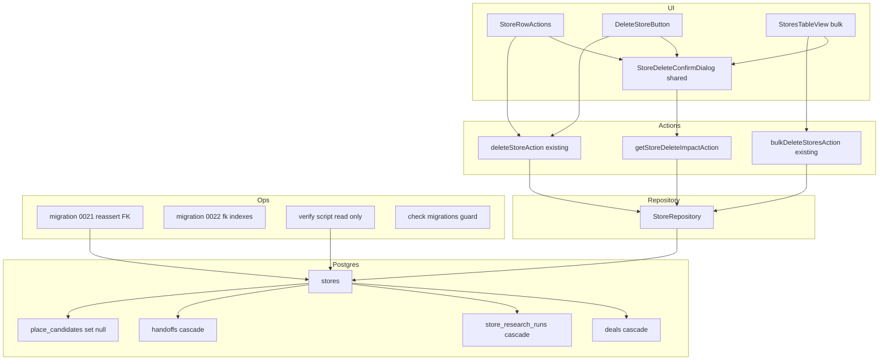
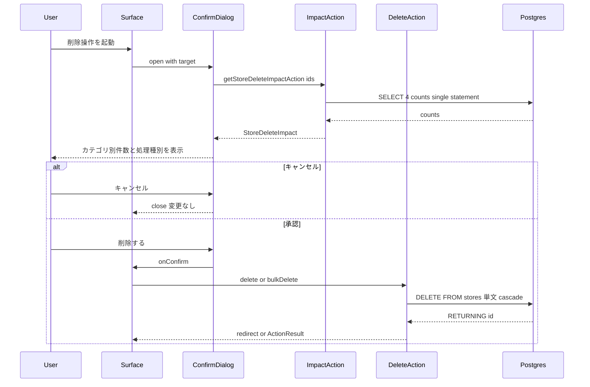
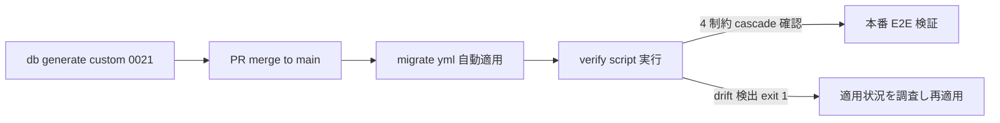
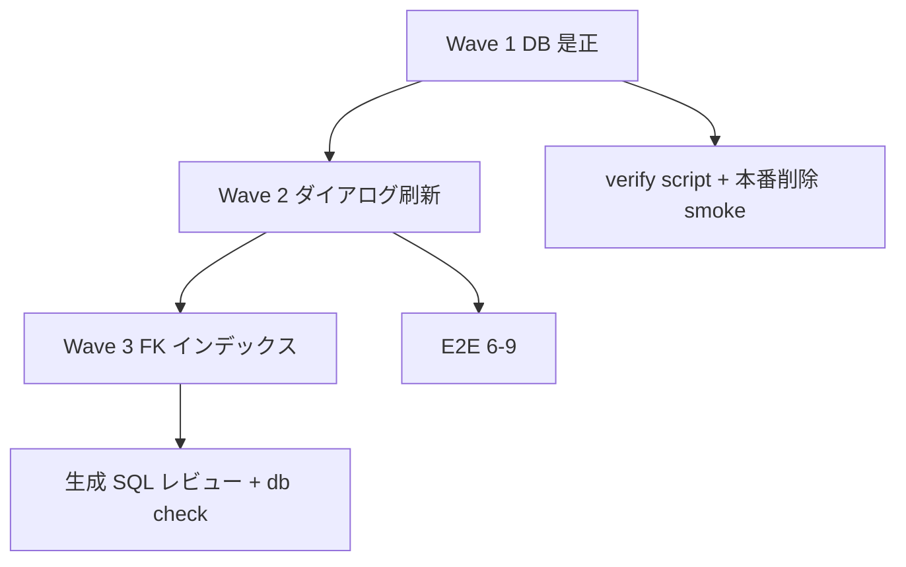

# Design Document: store-cascade-delete

## Overview

**Purpose**: 本機能は、紐づけデータ(商談・調査・引き継ぎ・場所候補)を持つ店舗の削除を本番を含む全環境で確実に成立させ、削除前の確認ダイアログに影響範囲を実データ(カテゴリ別件数+処理種別)で提示する。

**Users**: 営業ユーザーは店舗一覧・店舗詳細・一括選択の 3 経路から、影響範囲を理解した上で店舗を削除する。運用者は削除ポリシーが DB 実態と一致していることを検証できる。

**Impact**: 現システムからの変更は 2 点。(1) 本番 DB の FK 制約ドリフト(0015 未適用、`ON DELETE` 句なし)を新規 custom migration `0021` で是正し、水位線ドリフトの再発防止と検証手段を追加する。(2) 3 経路の削除確認ダイアログを共有コンポーネントに統合し、固定文言(廃止済み Deep Research 文言を含む)を実データ駆動の影響表示に置換する。認可モデル・削除 API の外形(`deleteStoreAction` / `bulkDeleteStoresAction` のシグネチャ)は変更しない。

### Goals
- 紐づけデータを持つ店舗の削除が唯一の稼働 DB(本番 Supabase)で成功する状態を migration + 検証スクリプトで保証する(Req 1, 5)
- 削除確認ダイアログを 1 実装に統合し、カテゴリ別実件数と処理種別(削除/紐付け解除)を提示する(Req 2, 3)
- 削除失敗時の UI 文言から開発者向け表現を排除し、診断情報は構造化ログに分離維持する(Req 4)
- migration 水位線スキップ(journal `when` 逆行)を静的チェックで再発防止する(Req 5)

### Non-Goals
- 削除の undo・ソフト削除・ゴミ箱(要件で除外)
- 認可モデルの変更(per-action auth / RLS — 既存のログイン認証を前提。要件で除外)
- 紐づけデータ単体の削除 UI(要件で除外)
- 恒久的な DB ドリフト検知 CI(DATABASE_URL 依存の常設ジョブは作らない。one-shot 検証スクリプト+静的チェックまで)
- `deals` / `research` 等、stores 起点以外の削除ポリシー変更

## Boundary Commitments

### This Spec Owns
- 店舗削除フローの 3 経路(一覧行・詳細・一括)の確認 UI と、その影響表示の意味論
- 削除影響カウントの読み取り契約 `StoreRepository.getDeleteImpact` と `getStoreDeleteImpactAction`
- stores を親とする子データの削除ポリシー(deals/store_research_runs/handoffs = cascade、place_candidates.matched_store_id = set null)の**宣言と DB 実態の一致**
- migration `0021`(制約再宣言)・`0022`(FK 列インデックス)と、journal `when` 単調性の静的チェック
- SQLSTATE 23503 の UI 文言

### Out of Boundary
- 削除実行 action の外形・キャッシュ invalidate 戦略(既存実装を維持。`invalidateAllStoreScopes` 等は変更しない)
- 認証・認可(middleware ゲートを前提として利用するのみ)
- stores 以外を親とする FK ポリシー、他エンティティの削除 UI
- Supabase 運用(keepalive・pause 予防)・migrate.yml 自体の変更

### Allowed Dependencies
- `repos`(Repository 集約 singleton)— データアクセスの唯一の窓口
- `ActionResult` / `success` / `failure`(`lib/actions/_helpers.ts`)
- `Modal` / `Button` / `toast`(`components/ui/*`)
- `parsePostgresError` / `formatUserMessage`(`lib/db/postgres-error.ts`)
- drizzle-kit migrator + `.github/workflows/migrate.yml`(migration 適用機構。変更せず利用)
- 依存方向: `types` → `lib/db(schema)` → `lib/repositories` → `lib/actions` → `app/**`。逆方向 import 禁止(structure.md 準拠)。新規 CACHE_TAGS は追加しない(影響カウントは非キャッシュ)

### Revalidation Triggers
- stores を参照する新テーブルの追加(→ `getDeleteImpact` の集計対象・ダイアログのカテゴリ定義・FK ポリシー宣言の 3 点を同時更新する義務)
- `ActionResult` の形状変更、`Modal` compound API の変更
- migration 適用機構(watermark 方式・migrate.yml のトリガ条件)の変更
- per-action 認可の導入(削除 action に認可層が入る場合、影響カウント action にも同一ゲートが必要)

## Architecture

### Existing Architecture Analysis
- 削除系は「Client(確認 Modal)→ Server Action → Repository → 単発 DML」の既存構造を持ち、原子性は PostgreSQL の単文 auto-commit + FK cascade に委譲している(`lib/db/store-repository.ts:223-240` のコメントが規範)。**明示 transaction wrap は Transaction Pooler(pgbouncer)非互換のため禁止**(PR #144 で撤回済み)。本設計はこの構造を変えず、読み取り(影響カウント)と表示だけを追加する。
- 技術的負債への対応: 本番 FK ドリフト(research.md §3 で実測確定)を migration で是正し、その温床だった「journal `when` 逆行を検出できない check スクリプト」に静的ガードを追加する。
- 読み取り系 Server Action(client からの on-demand fetch)は `area-search-actions.ts` に確立済みパターンがあり、これを踏襲する。

### Architecture Pattern & Boundary Map



**Architecture Integration**:
- Selected pattern: 既存レイヤード構成(Repository パターン + Server Actions + 共有 Client ダイアログ)の拡張。新レイヤー・新依存ライブラリなし
- Domain boundaries: 削除の**実行**は既存 action が、**影響の可視化**は新設の読み取り契約が担う。ダイアログは表示+取得のみで削除ロジックを持たない(呼び出し側が `onConfirm` で実行)
- Existing patterns preserved: `ActionResult` 統一戻り値 / 単発 DML 原子性 / PostgresError 二系統設計 / Modal compound
- New components rationale: 共有ダイアログ(3 箇所の文言重複と乖離の解消)、`getDeleteImpact`(件数の単一契約)、0021(ドリフト是正)、検証スクリプト(Req 5.2 の反復可能な検証)
- Steering compliance: 外部ライブラリ追加ゼロ、`types/` 集約、`server-only` / `"use server"` / `"use client"` 境界宣言、kebab-case 命名

### Technology Stack

| Layer | Choice / Version | Role in Feature | Notes |
|-------|------------------|-----------------|-------|
| Frontend | React 19.2.4 Client Component | 共有削除確認ダイアログ | 既存 `Modal` compound を利用。新規プリミティブなし |
| Backend | Next.js 16.2.4 Server Actions | 影響カウント読み取り action | `'use cache'` は使わない(常に fresh) |
| Data | Supabase Postgres + drizzle-orm ^0.45.2 / postgres ^3.4.9 | 影響カウント SQL・FK cascade | `prepare: false` 前提(Pooler 互換) |
| Migration | drizzle-kit ^0.31.10 | `generate --custom`(0021)/ `generate`(0022) | `--custom` が journal `when` を生成時刻で刻み、水位線を正しく越える |
| Infra | GitHub Actions `migrate.yml`(既存・無変更) | 0021/0022 の本番適用 | main push × `drizzle/**` 変更で発火 |

## File Structure Plan

### New Files

```
drizzle/
├── 0021_reassert_store_cascade_fks.sql   # custom migration: FK 4 本の DROP IF EXISTS + ADD CASCADE
└── 0022_add_child_fk_indexes.sql          # 生成 migration: 子 FK 列 5 本のインデックス
app/(main)/stores/_components/
└── store-delete-confirm-dialog.tsx        # 共有削除確認ダイアログ (影響 fetch + 表示 + 承認/キャンセル)
scripts/
└── verify-store-cascade-fks.mjs           # 読み取り専用: pg_constraint の ON DELETE 実態 assert (exit 1 on drift)
```

- `drizzle/meta/_journal.json` — 0021/0022 のエントリは **drizzle-kit が生成**(手書き編集しない)
- `drizzle/meta/0022_snapshot.json` — 0022 生成時に drizzle-kit が出力

### Modified Files
- `types/store.ts` — `StoreDeleteImpact` 型を追加(削除影響カウントの単一の真実)
- `lib/repositories/store-repository.ts` — interface に `getDeleteImpact(ids)` を追加
- `lib/db/store-repository.ts` — `getDeleteImpact` 実装(単一 SELECT・スカラーサブクエリ)
- `lib/db/schema.ts` — 子 FK 列 5 本に `index()` 宣言を追加(0022 の生成元)
- `lib/actions/store-actions.ts` — `getStoreDeleteImpactAction` を追加(読み取り系。revalidate なし)
- `lib/db/postgres-error.ts` — 23503 の UI 文言から開発者向け文を除去
- `app/(main)/stores/_components/store-row-actions.tsx` — 内蔵 Modal を共有ダイアログに置換
- `app/(main)/stores/_components/stores-table-view.tsx` — 一括削除 Modal を共有ダイアログに置換
- `app/(main)/stores/[id]/_components/delete-store-button.tsx` — 共有ダイアログに置換、`dealCount` prop 廃止
- `app/(main)/stores/[id]/_components/store-detail-tabs.tsx` — `dealCount` prop の受け渡しを除去
- `app/(main)/stores/[id]/page.tsx` — `dealCount` 算出のための `listDealsByStoreCached` 呼び出しを除去
- `scripts/check-drizzle-migrations.sh` — Check 5(journal `when` の idx 順単調増加)を追加
- `package.json` — `db:verify-fks` スクリプトを追加(検証スクリプトの実行手段)

## System Flows

### 影響表示つき削除フロー(3 経路共通)



- 影響 fetch は open のたびに実行し、キャッシュしない(Req 3.5)。取得中も承認ボタンは有効のまま(読み取りクエリの失敗・遅延が削除可否を左右してはならない — Req 1.2 との整合)。
- 表示件数は open 時点のスナップショットであり、確定までの間の増減は反映しない(単一運用ユーザー規模で許容。ダイアログ再表示で再取得)。
- 削除実行は既存 action をそのまま呼ぶ。成功後の遷移(単体=redirect / 一括=refresh + toast)は現行維持(Req 4.1)。

### Migration 適用・検証フロー



- 0021 の journal `when` は生成時刻(現水位線 1781386255948 より必ず新しい)→ 既存 migrator が確実に適用する。
- 検証は committed スクリプトで反復可能(Req 5.2)。手動実行(`DATABASE_URL` は環境から供給)。

## Requirements Traceability

| Requirement | Summary | Components | Interfaces / Flows |
|-------------|---------|------------|--------------------|
| 1.1 | 承認後に店舗+連鎖処理完了 | migration 0021, 既存 delete actions | 単文 DELETE + FK cascade / set null |
| 1.2 | 紐づけ存在のみでブロックしない | migration 0021 | FK を NO ACTION → CASCADE に是正 |
| 1.3 | 孤児レコードゼロ | migration 0021, Data Models | DB 層 cascade / set null に委譲 |
| 1.4 | 部分削除を残さない | 既存 repository(単発 DML) | 単文 auto-commit 原子性(変更なし・維持を明文化) |
| 1.5 | 3 経路同一ポリシー | 既存 actions + 共有ダイアログ | 全経路が同一 repos 経由(現行維持) |
| 2.1 | 即時実行せずダイアログ | StoreDeleteConfirmDialog | 3 surface が dialog 経由でのみ onConfirm |
| 2.2 | 承認で実行 | StoreDeleteConfirmDialog | `onConfirm` コールバック契約 |
| 2.3 | キャンセルで無変更 | StoreDeleteConfirmDialog | close で何も呼ばない |
| 2.4 | 対象店舗名の提示 | StoreDeleteConfirmDialog | `target.kind = "single"` の storeName 表示 |
| 2.5 | 一括の件数提示 | StoreDeleteConfirmDialog | `target.kind = "bulk"` の storeIds.length 表示 |
| 3.1 | カテゴリ別実件数 | getDeleteImpact, ImpactAction, Dialog | `StoreDeleteImpact` 4 カテゴリ (#110 で research 撤去 / #229 で store_research_runs 追加) |
| 3.2 | 処理種別の明示 | Dialog(カテゴリ定義) | `effect: "delete" \| "unlink"` の表示 |
| 3.3 | 0 件カテゴリ非表示 | Dialog | count === 0 を描画スキップ |
| 3.4 | 全 0 件時の文言 | Dialog | 「紐づけデータなし」分岐 |
| 3.5 | 固定文言でなく実データ | ImpactAction(非キャッシュ) | open 毎 fetch |
| 4.1 | 成功フィードバック | 既存 surface(redirect / toast) | 現行維持 |
| 4.2 | 内部スキーマ情報の非露出 | postgres-error 23503 文言修正 | UI 文言から ON DELETE 言及を除去 |
| 4.3 | 一括の成功/失敗件数 | 既存 bulk result(deletedCount/requestedCount) | 現行維持 |
| 4.4 | 診断ログの分離 | 既存構造化 console.error | 現行維持 + ImpactAction にも同型ログ |
| 5.1 | 全環境で削除成功保証 | migration 0021 + migrate.yml | 唯一の稼働 DB に CI 適用 |
| 5.2 | 運用者が検証可能 | verify-store-cascade-fks.mjs | 読み取り専用 assert・exit code |
| 5.3 | 紐づけ理由の失敗ゼロ | migration 0021 + 0022 | cascade 化 + インデックスで安定 |
| 5.4 | ドリフト環境の整合 | migration 0021, check-migrations Check 5 | 水位線越え適用 + `when` 単調性ガード |

## Components and Interfaces

| Component | Domain/Layer | Intent | Req Coverage | Key Dependencies | Contracts |
|-----------|--------------|--------|--------------|------------------|-----------|
| migration 0021 | Data / DDL | FK 4 本を CASCADE に再宣言 | 1.1-1.3, 5.1, 5.3, 5.4 | drizzle-kit --custom (P0), migrate.yml (P0) | Batch |
| migration 0022 | Data / DDL | 子 FK 列 5 本にインデックス | 5.3 | schema.ts index() (P0) | Batch |
| StoreRepository.getDeleteImpact | Repository | 影響件数の単一契約 | 3.1, 3.5 | drizzle sql (P0) | Service |
| getStoreDeleteImpactAction | Action | client からの読み取り窓口 | 3.1, 3.5, 4.4 | repos (P0), ActionResult (P0) | Service |
| StoreDeleteConfirmDialog | UI shared | 確認+影響表示の単一実装 | 2.1-2.5, 3.1-3.4 | Modal (P0), ImpactAction (P0) | State |
| verify-store-cascade-fks.mjs | Ops | FK 実態の反復可能検証 | 5.2 | postgres pkg (P0) | Batch |
| check-migrations Check 5 | Ops | journal when 単調性ガード | 5.4 | jq (P0) | Batch |
| postgres-error 23503 文言 | Error | 開発者向け文の除去 | 4.2 | — | — |
| 3 surface 改修 | UI | 共有ダイアログへの置換 | 1.5, 2.1, 4.1 | Dialog (P0), 既存 actions (P0) | — |

### Data / DDL

#### migration 0021_reassert_store_cascade_fks

| Field | Detail |
|-------|--------|
| Intent | 本番で NO ACTION のまま残存する FK 4 本を `ON DELETE CASCADE` に是正する冪等 DDL |
| Requirements | 1.1, 1.2, 1.3, 5.1, 5.3, 5.4 |

**Responsibilities & Constraints**
- `pnpm db:generate --custom --name=reassert_store_cascade_fks` で生成した空 SQL に DDL を記述する。journal エントリ(idx 21, `when` = 生成時刻)は **drizzle-kit が書く**。`_journal.json` の手書き編集は禁止
- DDL は制約 1 本につき **`ALTER TABLE ... DROP CONSTRAINT IF EXISTS ..., ADD CONSTRAINT ...(同名・CASCADE)` の複数サブコマンドを束ねた 1 文** × 4。drizzle-kit migrate は statement 単位で適用するため、DROP と ADD を別文に分けると文間失敗で「制約が存在しない窓」が生じ得る — 1 文に束ねることで各制約の変更が statement 原子性で守られる。既に CASCADE の DB に流しても同一結果に収束する(冪等)。対象: `deals_store_id_stores_id_fk` / `research_store_id_stores_id_fk` / `handoffs_store_id_stores_id_fk` / `handoffs_deal_id_deals_id_fk`。`place_candidates` は本番適用済みのため触れない
- `schema.ts` は既に cascade 宣言済み・snapshot 0015 系譜にも記録済みのため、本 migration による将来の generate 差分は発生しない

**Dependencies**
- Inbound: migrate.yml — main merge 時の自動適用 (P0)
- Outbound: 本番 Postgres — DDL 適用 (P0)

**Contracts**: Batch [x]

##### Batch / Job Contract
- Trigger: main への merge(`drizzle/**` 変更)で migrate.yml が `pnpm db:migrate` を実行
- Input / validation: PR 段階で `check-migrations.yml`(Check 1-5)が journal 整合を検証
- Output / destination: 本番 DB の pg_constraint。`ADD CONSTRAINT` は既存子行を検証する(NO ACTION が常時整合を強制してきたため孤児は存在せず、検証は成功する)
- Idempotency & recovery: 各文が DROP IF EXISTS + ADD を内包し単独で冪等かつ原子的。文間で失敗しても完了済み制約は完全な CASCADE 状態、未達制約は従来の NO ACTION 状態に留まり、「制約なし」の中間状態は生じない。失敗時は workflow red → SQL 修正して再 merge(watermark 未更新のため再適用される)

**Implementation Notes**
- Integration: 適用直後に `scripts/verify-store-cascade-fks.mjs` で確認(Migration Strategy 参照)
- Risks: DDL は各子テーブルに短時間の排他ロックを取るが、テーブル規模(社内ツール)から影響は無視できる

#### migration 0022_add_child_fk_indexes(summary-only)

- `lib/db/schema.ts` に `index()` を 5 本追加(`deals.store_id` / `research.store_id` / `handoffs.store_id` / `handoffs.deal_id` / `place_candidates.matched_store_id`)し、`pnpm db:generate --name=add_child_fk_indexes` で生成する
- 目的: cascade 削除(親 1 行ごとに子を走査)と影響カウント SELECT の seq scan 回避(supabase-postgres-best-practices: FK 列インデックス)。現規模では性能余裕があるため 0021 とは独立した migration とし、単独で取り消せる粒度を保つ
- **Validation**: 生成 SQL が `CREATE INDEX` のみで構成されることを必ず目視レビューする(過去に generate が無関係差分を混入した事例あり — research.md 参照)

### Repository

#### StoreRepository.getDeleteImpact

| Field | Detail |
|-------|--------|
| Intent | 指定店舗群に紐づく子データのカテゴリ別件数を 1 往復で返す読み取り契約 |
| Requirements | 3.1, 3.5 |

**Responsibilities & Constraints**
- 単体・一括を `ids: readonly string[]` で一般化(単体は要素 1 の配列)
- 4 カテゴリを**単一 SELECT のスカラーサブクエリ**で取得する(1 往復・同一スナップショットの件数)
- `handoffs` は `store_id` 基準で数える(`deal_id` 経由の間接連鎖は同一店舗前提のデータモデルであり、二重計上を避ける)
- 読み取り専用。トランザクション不要。`'use cache'` の対象にしない

**Dependencies**
- Inbound: getStoreDeleteImpactAction (P0)
- Outbound: drizzle `sql` テンプレート + `inArray` (P0)

**Contracts**: Service [x]

##### Service Interface
```typescript
// types/store.ts に追加
/** 店舗削除時に影響を受ける紐づけデータのカテゴリ別件数。 */
export interface StoreDeleteImpact {
  /** 削除される商談件数 */
  deals: number;
  /** 削除される AI 店舗調査 run 件数 (#229) */
  store_research_runs: number;
  /** 削除される引き継ぎ件数 */
  handoffs: number;
  /** 紐付け解除される場所候補件数 */
  place_candidates: number;
}

// lib/repositories/store-repository.ts の StoreRepository に追加
interface StoreRepository {
  /**
   * 指定 ID 群の店舗に紐づく子データのカテゴリ別件数を返す。
   * ids が空配列のときは全カテゴリ 0 を返す。
   */
  getDeleteImpact(ids: readonly string[]): Promise<StoreDeleteImpact>;
}
```
- Preconditions: なし(空配列・存在しない ID を許容)
- Postconditions: 各件数は呼び出し時点の実データに基づく非負整数。存在しない ID は 0 件として扱われる
- Invariants: 読み取りのみ。データ・キャッシュの状態を変更しない

### Action

#### getStoreDeleteImpactAction

| Field | Detail |
|-------|--------|
| Intent | 確認ダイアログが open 時に呼ぶ読み取り系 Server Action |
| Requirements | 3.1, 3.5, 4.4 |

**Responsibilities & Constraints**
- `lib/actions/store-actions.ts` に追加(`"use server"` ファイル既存)。`revalidateTag` は呼ばない(読み取り)
- 入力検証: 空配列・非文字列・空白 ID を除去し、残 0 件なら `failure`(bulkDeleteStoresAction と同一の正規化規約)
- 失敗時は `parsePostgresError` + 構造化 `console.error`(`[stores.deleteImpact] failed`)で診断情報をログに残し、UI へは汎用文言のみ返す(PostgresError 二系統設計に準拠)

**Dependencies**
- Inbound: StoreDeleteConfirmDialog (P0)
- Outbound: `repos.store.getDeleteImpact` (P0), `_helpers.ActionResult` (P0)

**Contracts**: Service [x]

##### Service Interface
```typescript
export async function getStoreDeleteImpactAction(
  ids: readonly string[],
): Promise<ActionResult<StoreDeleteImpact>>;
```
- Preconditions: 呼び出し元は認証済み経路(middleware ゲート配下)に限られる
- Postconditions: `ok: true` のとき `data` は呼び出し時点の実件数。`ok: false` のとき UI 表示可能な汎用エラー文言
- Invariants: キャッシュ・DB を変更しない

### UI

#### StoreDeleteConfirmDialog

| Field | Detail |
|-------|--------|
| Intent | 3 経路共通の削除確認ダイアログ。影響 fetch・カテゴリ表示・承認/キャンセルの単一実装 |
| Requirements | 2.1, 2.2, 2.3, 2.4, 2.5, 3.1, 3.2, 3.3, 3.4 |

**Responsibilities & Constraints**
- `"use client"`。配置は `app/(main)/stores/_components/`(一覧系と詳細系の双方から `@/app/(main)/stores/_components/...` で import。既存 cross-import 前例あり)
- **削除ロジックを持たない**。承認は `onConfirm` で呼び出し元に委譲(単体=`deleteStoreAction`+redirect / 一括=`bulkDeleteStoresAction`+refresh という後続差分を呼び出し元に閉じる)
- open になるたび `getStoreDeleteImpactAction` を 1 回呼ぶ(`useEffect` + `useTransition`)。close で結果を破棄
- 表示規則: (a) 件数 > 0 のカテゴリのみ「ラベル・件数・処理種別」を表示、(b) 全カテゴリ 0 件なら「紐づけデータはありません」、(c) 取得中はローディング表示、(d) 取得失敗時は件数を偽装せず「件数を取得できませんでした。関連データがある場合は同時に削除されます」を表示。**いずれの状態でも承認ボタンは有効**(読み取り失敗が削除を妨げない)
- 影響リスト領域に `aria-live="polite"` を付与(非同期件数の読み上げ)。既存 Modal の focus trap / Escape / `aria-modal` をそのまま利用
- 破壊的操作の文言・ボタン(`variant="danger"`、「この操作は取り消せません。」)は現行 3 実装の規約を継承

**Dependencies**
- Inbound: StoreRowActions / DeleteStoreButton / StoresTableView (P0)
- Outbound: getStoreDeleteImpactAction (P0), Modal / ModalContent / ModalFooter / Button (P0)

**Contracts**: State [x]

##### State Management
```typescript
/** 削除対象。単体は店舗名の表示、一括は件数の表示に用いる。 */
export type StoreDeleteTarget =
  | { kind: "single"; storeId: string; storeName: string }
  | { kind: "bulk"; storeIds: readonly string[] };

export interface StoreDeleteConfirmDialogProps {
  open: boolean;
  onOpenChange: (open: boolean) => void;
  target: StoreDeleteTarget;
  /** 承認時に呼ばれる。削除 action の実行と後続遷移は呼び出し元の責務。 */
  onConfirm: () => void;
  /** 削除 action 実行中。承認/キャンセルを disabled にする。 */
  pending: boolean;
}

/** カテゴリ表示定義(コンポーネント内の単一の真実)。 */
type ImpactEffect = "delete" | "unlink";
interface ImpactCategoryDef {
  key: keyof StoreDeleteImpact;
  label: string; // 商談 / 調査 / 引き継ぎ / 場所候補
  effect: ImpactEffect; // delete=同時に削除 / unlink=紐付け解除
}
```
- State model: `impact: StoreDeleteImpact | null` / `impactError: boolean` / `loading` の 3 状態。open 遷移で再取得
- Persistence & consistency: なし(表示専用の一時状態)
- Concurrency strategy: open 中の再 fetch はしない。連続 open で前回結果を持ち越さない

**Implementation Notes**
- Integration: 3 surface は Modal の open 状態と `useTransition` の pending を現行どおり保持し、本ダイアログに接続する。`delete-store-button.tsx` の `dealCount` prop、`store-detail-tabs.tsx` の中継、`[id]/page.tsx` の `listDealsByStoreCached` による件数算出は**削除**(ダイアログ fetch が上位互換・キャッシュ由来の stale 件数も解消)
- Validation: 3 経路すべてで「固定文言(Deep Research 言及)が残っていないこと」を目視確認
- Risks: 影響 fetch の遅延はダイアログ表示をブロックしない(ローディング表示で吸収)

### Error / Ops(summary-only)

- **postgres-error.ts 23503 文言**(4.2): `"関連レコードに紐づいているため削除できませんでした。スキーマの ON DELETE 設定を確認してください。"` → `"関連データに紐づいているため削除できませんでした。解消しない場合は管理者に連絡してください。"` に変更。constraint / table 名の非露出は現行維持。この formatter は全エンティティ共通のため、文言は店舗固有にしない
- **scripts/verify-store-cascade-fks.mjs**(5.2): keepalive と同一の接続様式(`postgres` pkg, `prepare:false, max:1`, `DATABASE_URL` は環境変数から)。`pg_constraint` を SELECT し、4 制約の `confdeltype = 'c'` と `place_candidates` の `'n'` を assert。不一致は一覧を出力し exit 1。書き込みゼロ
- **check-drizzle-migrations.sh Check 5**(5.4): journal `entries` の `when` が idx 順に**狭義単調増加**であることを jq で検証。逆行を検出したら「watermark スキップにより適用されない migration が生じる」旨を出力し exit 1。既存 journal は単調のため回帰なし(0009-0011 の同値+1ms 連番も昇順を満たす)

## Data Models

### Physical Data Model

**FK ポリシー(現況の宣言 = DB 実態)**:

> 初出は 0021 適用後の 5 本。その後 #110 (PR #228) で `research` を DROP し、
> #180 で `store_research_runs` が加わった。本表は `pnpm db:verify-fks` の
> `EXPECTED` および `DELETE_IMPACT_CATEGORIES` と同じ集合を指す (#229)。

| 子テーブル.列 | 制約名 | ON DELETE | 意味 |
|---|---|---|---|
| deals.store_id | deals_store_id_stores_id_fk | CASCADE | 店舗削除で商談を削除 |
| store_research_runs.store_id | store_research_runs_store_id_stores_id_fk | CASCADE | 店舗削除で AI 調査 run を削除 |
| handoffs.store_id | handoffs_store_id_stores_id_fk | CASCADE | 店舗削除で引き継ぎを削除 |
| handoffs.deal_id | handoffs_deal_id_deals_id_fk | CASCADE | 商談削除に引き継ぎが追従 |
| place_candidates.matched_store_id | place_candidates_matched_store_id_stores_id_fk | SET NULL | 店舗削除で候補は未マッチに戻る(候補行は残す) |

**0021 DDL(契約)** — 制約 1 本 = 1 文(DROP + ADD を同一 ALTER TABLE に束ね statement 原子性を確保):
```sql
ALTER TABLE "deals"
  DROP CONSTRAINT IF EXISTS "deals_store_id_stores_id_fk",
  ADD CONSTRAINT "deals_store_id_stores_id_fk"
    FOREIGN KEY ("store_id") REFERENCES "public"."stores"("id") ON DELETE cascade ON UPDATE no action;
-- research.store_id / handoffs.store_id / handoffs.deal_id も同形 (計 4 文)
```

**インデックス(0022)**: 上記 5 列に btree インデックスを追加。命名は drizzle-kit 生成規約に従う。

**Consistency & Integrity**:
- 削除の原子性は「単発 DML(`DELETE FROM stores WHERE id = $1` / `WHERE id IN (...)`)の暗黙トランザクション + FK cascade」で担保する(1.4)。**明示 `transaction()` wrap の再導入は禁止**(Transaction Pooler 非互換 / PR #144 の回帰)
- 影響カウントは削除と別トランザクションの読み取りであり、表示と実削除件数の間に TOCTOU 差が生じ得る(許容・System Flows 参照)
- `basic_info`(stores の jsonb 列)は行削除で消える。子テーブルではないためカウント対象外

### Data Contracts & Integration
- `getStoreDeleteImpactAction` の入出力は `ActionResult<StoreDeleteImpact>`(JSON シリアライズ可能なプレーン object)。イベント・外部 API なし

## Error Handling

### Error Strategy
既存の PostgresError 二系統設計(UI 汎用文言 / 構造化ログ)を影響カウント action にも適用し、削除経路の系統は変更しない。

### Error Categories and Responses
- **影響カウント取得失敗**(System): ダイアログは件数なしの警告文言で degrade し、承認は妨げない。`console.error("[stores.deleteImpact] failed", {...})` に SQLSTATE / detail を記録(4.4)
- **削除時 23503**(System — 0021 適用後は想定外): 新文言(4.2)+ 既存構造化ログ。発生自体が Req 5 の回帰シグナルであり、verify スクリプトの再実行で診断する
- **削除タイムアウト 57014 / 接続断 08xxx**: 既存文言・既存ハンドリングを維持
- **一括の部分結果**(Business): `deletedCount < requestedCount` の toast.warn 表示を維持(4.3)

### Monitoring
- Vercel logs 上の `[stores.delete]` / `[stores.bulkDelete]` / `[stores.deleteImpact]` の構造化ログで追跡(4.4)。新規監視基盤は導入しない

## Testing Strategy

自動テストフレームワーク未導入(tech.md)のため、静的検証 + スクリプト検証 + ブラウザ E2E で構成する。**注意: `.env.local` は本番 Supabase 直結のため、E2E は使い捨てのテスト店舗データのみで行い、既存データに触れない。**

### Static / Build
1. `pnpm typecheck` / `pnpm lint` / `pnpm build` — `StoreDeleteImpact` 型伝播、`dealCount` prop 除去後の整合(全 ACs の前提)
2. `pnpm db:check` — Check 1-5 通過(0021/0022 の journal 整合 + `when` 単調性)(5.4)

### Migration / Ops 検証
3. 0021 生成 SQL のレビュー: DROP IF EXISTS + ADD CASCADE ×4 対のみで構成(1.1-1.3)
4. 0022 生成 SQL のレビュー: `CREATE INDEX` のみで構成(混入差分ゼロ)(5.3)
5. merge 後: migrate.yml green → `node scripts/verify-store-cascade-fks.mjs` が exit 0(4 制約 cascade + place_candidates set null)(5.1, 5.2, 5.4)

### E2E(本番反映後・テスト店舗で実施)
6. テスト店舗を作成し、商談 1・調査 1・引き継ぎ 1 を紐づけ、エリア検索で場所候補 1 をマッチ → 一覧行から削除: ダイアログに「商談 1 件 削除 / 調査 1 件 削除 / 引き継ぎ 1 件 削除 / 場所候補 1 件 紐付け解除」が実数表示され(3.1, 3.2)、承認で削除成功・各一覧から消滅・候補が未マッチに戻る(1.1, 1.3, 2.2)
7. 紐づけゼロのテスト店舗 → 詳細画面から削除: 「紐づけデータはありません」表示(3.3, 3.4)、キャンセルで無変更(2.3)、再度開いて承認で削除・`/stores` へ遷移(2.4, 4.1)
8. テスト店舗 2 件を選択 → 一括削除: 件数と合算影響が表示され(2.5, 3.1)、成功 toast の件数一致(4.3)。3 経路が同一ダイアログ・同一結果であること(1.5)
9. 固定文言の残骸ゼロ確認: 3 経路のダイアログに「Deep Research」文言が出ないこと(3.5)

## Migration Strategy



- **Wave 1**(0021 + verify script + Check 5): 本番ブロックの即時解消。ユーザー可視の最重要効果を最小 diff で先行。PR 単位を小さく保つ(並行ブランチ運用の衝突回避)
- **Wave 2**(型 + repository + action + 共有ダイアログ + 3 surface + 23503 文言 + dealCount 経路除去): UI 刷新一式
- **Wave 3**(schema.ts index + 0022): 独立適用・独立取り消し可能
- **Rollback**: Wave 1 は「CASCADE → 旧挙動に戻す」逆 migration(ADD ... ON DELETE no action)で復元可能だが、cascade で削除されたデータは戻らない(削除は要件上 不可逆)。Wave 2/3 は通常の revert で戻る
- 検証チェックポイント: 各 Wave の Testing Strategy 該当項目が green であること

## Security Considerations
- 認可は既存 middleware 認証ゲートに委譲(要件で境界外)。`getStoreDeleteImpactAction` は読み取り専用だが、削除 action と同じ認証境界の内側でのみ呼ばれる
- UI 文言に constraint / table 名等の内部スキーマ情報を出さない方針を影響カウント経路にも適用(4.2)
- verify スクリプトは `DATABASE_URL` を環境変数からのみ受け取り、値をログに出力しない

## Performance & Scalability
- 影響カウントは単一 SELECT(スカラーサブクエリ ×4)で 1 往復。ダイアログ open 時のみ実行され、一覧描画コストに影響しない(N+1 なし)
- 0022 のインデックスにより、データ増加後も cascade 削除・件数カウントの子テーブル seq scan を回避する
