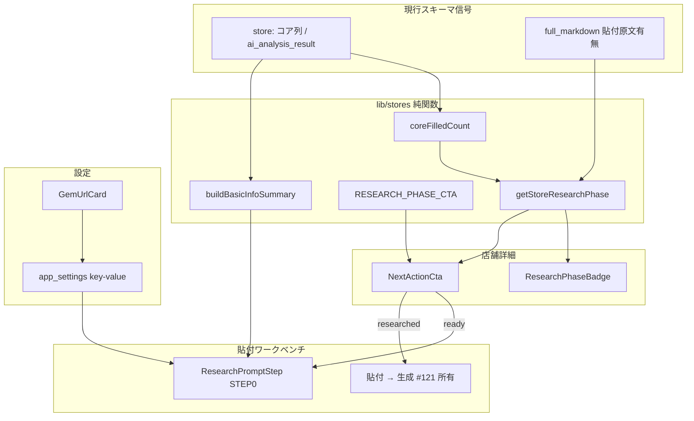
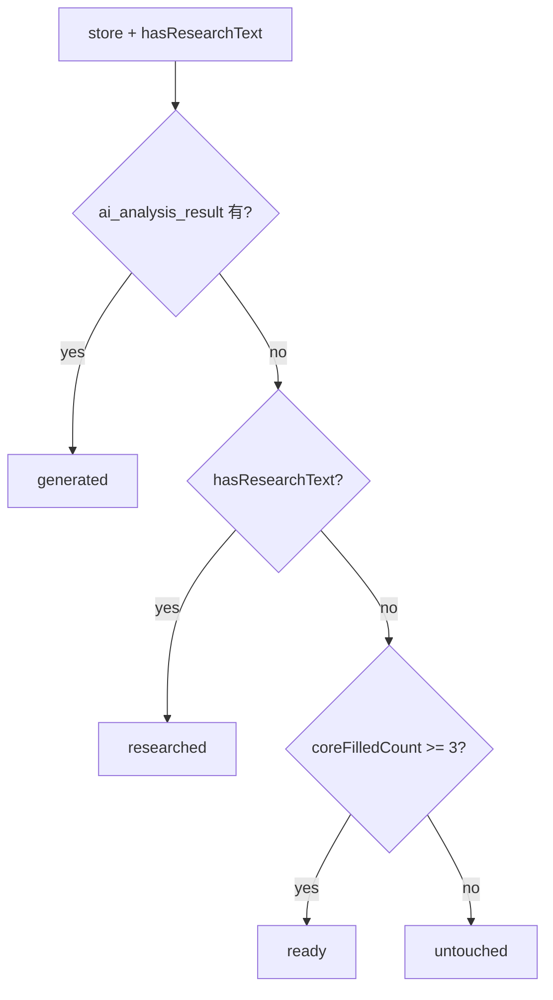
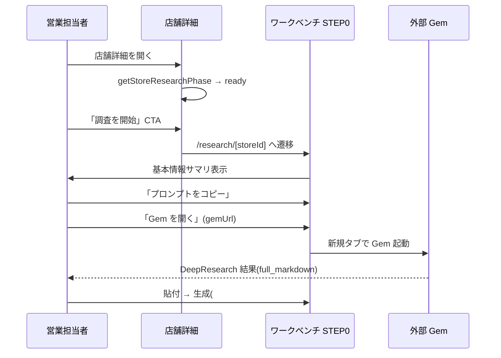

# Technical Design: store-flow-guidance

調査日: 2026-06-08 / 対象: requirements.md R1–R8 / 前提: #121 を真実とし #121 後(Stage2 構造化撤去・ワークベンチ単線化)を設計前提に置く(grill D1–D12 / memory `store_flow_guidance_issue`)。

> **Re-baseline 実装反映 (2026-06-13)**: store-basic-info が #114/#121 を完遂したため、本 design の暫定箇所を現 main へ確定させた。**実装済みの確定仕様**(PR1):
> - 状態は **3 状態**(`untouched` / `ready` / `generated`)。本文の 4 状態フロー図・`researched` / `hasResearchText` 記述は**廃止**(貼付テキストが永続化されず検出不能)。`getStoreResearchPhase(store)` は引数 1 つ(`Pick<Store,"ai_analysis_result"|"basic_info">`)で、I/O を取らない純関数に確定。
> - 充足判定は `basic_info` の `filled_by!==null` + value 非空白(`isBasicInfoFieldFilled`)。コアキー = `CORE_BASIC_INFO_KEYS`(primary="places" の 6 項目、`store_name` 除く)。本文の `coreFilledCount`(スカラー "" / 0 判定)は `basic_info` 版へ置換。
> - 配置: `lib/domain/store-research-phase.ts`(`lib/stores/*` ではない)。バッジ=`ResearchPhaseBadge`、CTA=`NextActionCta`(`buttonVariants`+`Link`、Button は asChild 非対応)。`store-title-section.tsx` に `phase` prop で結線。
> - 死蔵 CTA 抑止 / 生成集約は store-basic-info 完了済のため**本 spec 対象外(既達)**。
> - STEP0 のプロンプト(PR2)は新規 `buildBasicInfoSummary` ではなく既存 `buildBasicInfoBlock` を再利用。Gem URL の `app_settings` 設計は維持。

## Overview

店舗追加後の営業担当者を「追加 → DeepResearch(外部 Gem) → 架電生成」の標準フローに沿って迷わず誘導する。各店舗の**調査フェーズ**(4 状態)を現行スキーマから純関数で導出し、店舗詳細に状態バッジと「今やるべき唯一のアクション」を単一 CTA として提示する。調査開始 CTA は貼付ワークベンチの STEP0(基本情報サマリのコピー + Gem 起動)へ繋がる。Gem URL は設定画面でノーコード管理する。

本 spec は導線・状態提示の UX 層を所有し、生成経路の単線化(#121)・データモデル(#114)・架電出力契約(#113)には踏み込まない。

### Goals
- 調査フェーズを現行スキーマから単一純関数 `getStoreResearchPhase` で導出する(#114 非依存、#121 で信号差替え可能)。
- 店舗詳細に状態バッジ + 状態別単一 CTA を提示し、次の一手の迷いを消す。
- 貼付ワークベンチに STEP0(調査プロンプト=基本情報サマリの生成・コピー + Gem 起動)を非破壊で前置する。
- Gem URL を設定画面で保存・変更できるようにする。

### Non-Goals
- 生成経路の単線化・Stage2 構造化撤去(#121 が所有、本 spec は #121 後を前提に乗るのみ)。
- `basic_info`(jsonb) 化・複数ソース充填・競合解決・生成集約(#114)。
- `AiAnalysisResult` の出力項目構成(#113)。
- 食べログ URL 等からの新規登録機能(別 Issue)。
- 店舗一覧の状態列・グローバル滞留通知・追加直後の即誘導(将来拡張)。
- `deep-research-enqueue-button` / `research_reports` / `structurer` / `DeepResearchReportView` の物理削除(#110 / #121)。

## Boundary Commitments

### This Spec Owns
- 調査フェーズ型 `ResearchPhase`(`untouched` / `ready` / `researched` / `generated`)と純関数 `getStoreResearchPhase` / `coreFilledCount`。
- 状態別の次アクション定義 `RESEARCH_PHASE_CTA`(ラベル・遷移先・主従)。
- 店舗詳細の状態バッジ(`ResearchPhaseBadge`)と単一 CTA(`NextActionCta`)。
- 調査プロンプト(基本情報サマリ)生成の純関数 `buildBasicInfoSummary` と STEP0 UI(`ResearchPromptStep`)。
- Gem URL の永続化(`app_settings` key-value テーブル + accessor)と設定 UI(`GemUrlCard`)。

### Out of Boundary
- 貼付テキストの生成入力化・`generateCallScriptFromMarkdownAction` の主経路化(#121)。
- Stage2 構造化(`structurer` / `structureFromPastedMarkdownAction` / STEP1・STEP2)— #121 で撤去、物理削除は #110。
- `ai_analysis_result` の生成ロジック・出力契約(#113 / #121)。
- エリア検索の店舗候補取得・基本情報充填そのもの(#108/#117 既存)。

### Allowed Dependencies
- `getStoreCached`(store)、`getDeepResearchReport`(貼付原文 `full_markdown` の有無 = 調査済み信号)。
- `repos`(Repository 単一窓口)、`ActionResult` 規約、`CACHE_TAGS`、`createGeminiClient` 非依存(本 spec は生成しない)。
- 既存 `onCopy`(clipboard)・`store-title-section` / `paste-workbench` / `settings` の各コンポーネント。
- 依存方向: `types → lib/stores(domain) → lib/queries, lib/actions → app`(逆流禁止)。

### Revalidation Triggers
- **#121 着地**: 貼付原文の保存先が `research_reports.full_markdown` から変わる → `hasResearchText` query を差し替え、`getStoreResearchPhase` 本体は不変であることを再検証(D12 の核)。
- **#114 着地**: コア充足判定が `basic_info` 参照へ移る → `coreFilledCount` の入力源を再検証。
- `ResearchPhase` の状態追加/削除 → バッジ・CTA・遷移先の全分岐を再検証。
- `AiAnalysisResult` 契約変更(#113) → `generated` 判定(`ai_analysis_result` 有無)に影響しないことを確認。
- `deep-research-enqueue-button` / `DeepResearchReportView` の物理削除(#110/#121) → 表示抑止分岐の去就を再検証。

## Architecture

### Existing Architecture Analysis
- レイヤード構成 + Repository 単一窓口。依存方向 `app → lib/{queries,actions} → lib/repositories → lib/db`。自動テスト未導入(typecheck / lint / build + 手動 E2E)。本番直結 DB。Drizzle 孤児マイグレ常習。最新 idx=15、次は 0016。
- `app/(main)/stores/[id]/page.tsx` は既に `getStoreCached(id)` と `getDeepResearchReport(store.id)` を取得済み。**状態導出に必要な信号(`store.ai_analysis_result` / 貼付原文有無 / コア列)は追加 query なしで揃っている**。
- 店舗詳細には死蔵 cron の `deep-research-section` + `deep-research-enqueue-button`(「Deep Research を実行」)が残存し、新 CTA と意味が競合する。`research-status-badge` は cron ジョブ状態用で 4 フェーズと意味が異なり流用不可。
- 設定の永続化前例は `aiPromptTemplates`(`lib/db/schema.ts:394` + `prompt-template-repository`)のみ。**汎用 key-value 設定テーブルは存在しない**。
- 生成は既に構造化非依存(`generateCallScriptFromMarkdownAction`)で、#121 後のワークベンチは `STEP0 → 貼付 → 生成 → 編集 → 保存` の単線。

### Architecture Pattern and Boundary Map



**Key decisions**:
- 状態導出は純関数 `getStoreResearchPhase(store, hasResearchText)` に集約。`hasResearchText` だけを query 境界とし、#121 で保存先が変わっても query 1 本の差替えで吸収(D12)。
- CTA の主導線は店舗詳細の `NextActionCta` に一本化。死蔵 `deep-research-enqueue-button` は表示抑止して二重提示を防ぐ(物理削除は #110/#121)。
- STEP0 は既存 `paste-workbench` に Card を前置するのみ(非破壊)。`buildBasicInfoSummary` は将来 #114 の `buildBasicInfoBlock` に吸収される署名に寄せる。
- Gem URL は `app_settings` key-value テーブルで DB 保存。NEXT_PUBLIC の build 時埋め込み地雷を回避しつつノーコード差替えを実現。追加ライブラリなし。

### Technology Stack

| Layer | Choice / Version | Role in Feature | Notes |
|-------|------------------|-----------------|-------|
| Frontend | React 19.2 / Next.js 16 Client | 状態バッジ・単一 CTA・STEP0・Gem URL 設定 | 既存 store-title-section / paste-workbench / settings 改修 |
| Backend | Next.js 16 Server Actions | Gem URL の保存 | ActionResult 規約 |
| Domain | TypeScript 純関数 | 状態導出・充足率・サマリ生成 | テスト容易・副作用なし |
| Data | Supabase Postgres + Drizzle ORM | `app_settings`(key/value) | `0016` 新規テーブル、CI 適用・生成 SQL 必ずレビュー |

## File Structure Plan

### Directory Structure (new files)
```
lib/stores/
  research-phase.ts          # ResearchPhase, coreFilledCount, getStoreResearchPhase, RESEARCH_PHASE_CTA
  basic-info-summary.ts      # buildBasicInfoSummary(store): string
lib/db/
  app-settings-repository.ts # Drizzle 実装(get/set by key)
lib/repositories/
  app-settings-repository.ts # interface + repos への登録
lib/queries/
  app-settings.ts            # getGemUrlCached(): Promise<string | null>
lib/actions/
  app-settings-actions.ts    # setGemUrlAction(url): ActionResult
drizzle/
  0016_app_settings.sql      # app_settings テーブル
app/(main)/stores/[id]/_components/
  research-phase-badge.tsx   # ResearchPhaseBadge
  next-action-cta.tsx        # NextActionCta(単一 CTA)
app/(main)/research/[storeId]/_components/
  research-prompt-step.tsx   # ResearchPromptStep(STEP0)
app/(main)/settings/_components/
  gem-url-card.tsx           # GemUrlCard
```

### Modified Files
| File | Change |
|------|--------|
| `app/(main)/stores/[id]/page.tsx` | `getStoreResearchPhase` 算出(貼付原文有無を `deepResearchReport?.full_markdown` から)→ `StoreTitleSection` へ phase 受け渡し |
| `app/(main)/stores/[id]/_components/store-title-section.tsx` | `ResearchPhaseBadge` + `NextActionCta` をマウント |
| `app/(main)/stores/[id]/_components/deep-research-section.tsx` | `deep-research-enqueue-button` の表示抑止(新 CTA 存在時)。レポート閲覧は #121/#110 まで残置 |
| `app/(main)/research/[storeId]/page.tsx` | `getGemUrlCached()` 取得 → `PasteWorkbench` へ `gemUrl` / `promptSummary` を受け渡し |
| `app/(main)/research/[storeId]/_components/paste-workbench.tsx` | 先頭に `ResearchPromptStep`(STEP0)をマウント(既存 STEP 非破壊) |
| `app/(main)/settings/page.tsx` | `GemUrlCard` をマウント |
| `lib/repositories/index.ts` | `repos.appSettings` 登録 |
| `lib/db/schema.ts` | `appSettings` pgTable 追加 |

## System Flows

### 状態導出(R1 / R3 / R4)

- `hasResearchText` = 貼付原文(現状 `getDeepResearchReport(storeId)?.full_markdown` が非空)。#121 後はこの query のみ差替え。
- `coreFilledCount` = `[address!=="", genre!=="", phone!=="", business_hours!=="", review_count>0]` の true 数。

### 調査開始導線(R2 / R5 / R6)


## Requirements Traceability

| Requirement | Summary | Components | Flows |
|-------------|---------|------------|-------|
| 1.1–1.5 | 調査フェーズの導出・可視化 | getStoreResearchPhase, ResearchPhaseBadge | 状態導出 |
| 2.1–2.5 | 状態別の単一 CTA | RESEARCH_PHASE_CTA, NextActionCta | 状態導出 / 調査開始導線 |
| 3.1, 3.2, 3.3 | 現行スキーマ導出(#114 非依存) | getStoreResearchPhase, getDeepResearchReport(query 境界) | 状態導出 |
| 4.1–4.5 | 充足率判定(sentinel "" / 0) | coreFilledCount | 状態導出 |
| 5.1–5.5 | STEP0 / プロンプト / Gem | ResearchPromptStep, buildBasicInfoSummary, getGemUrlCached | 調査開始導線 |
| 6.1, 6.2 | ワークベンチ連続完了(非破壊) | ResearchPromptStep(前置), paste-workbench | 調査開始導線 |
| 7.1, 7.2 | 経路非依存の互換 | getStoreResearchPhase(経路に依らない信号) | 状態導出 |
| 8.1, 8.2, 8.3 | Gem URL 設定管理 | GemUrlCard, setGemUrlAction, app_settings | — |

## Components and Interfaces

| Component | Layer | Intent | Req | Key Dependencies | Contracts |
|-----------|-------|--------|-----|------------------|-----------|
| getStoreResearchPhase | domain | 4 状態の純粋導出 | 1,3,4,7 | Store, coreFilledCount (P0) | Service, State |
| coreFilledCount | domain | コア 5 項目の充足数(sentinel 判定) | 4 | Store (P0) | Service |
| RESEARCH_PHASE_CTA | domain | 状態→次アクション定義 | 2 | ResearchPhase (P0) | State |
| buildBasicInfoSummary | domain | 調査プロンプト(基本情報サマリ)生成 | 5 | Store (P0) | Service |
| ResearchPhaseBadge | ui | 状態バッジ表示 | 1 | ResearchPhase (P0) | State |
| NextActionCta | ui | 状態別単一 CTA | 2 | RESEARCH_PHASE_CTA (P0) | State |
| ResearchPromptStep | ui | STEP0(コピー + Gem 起動) | 5,6 | buildBasicInfoSummary, gemUrl, onCopy (P0) | State |
| GemUrlCard | ui | Gem URL の表示・編集 | 8 | setGemUrlAction (P0) | State |
| getGemUrlCached | queries | Gem URL 読取 | 5,8 | repos.appSettings (P0) | Service |
| setGemUrlAction | actions | Gem URL 保存 | 8 | repos.appSettings (P0) | Service |
| app-settings-repository | db | key-value 永続化 | 8 | app_settings (P0) | Service, State |

### Domain

#### getStoreResearchPhase
| Field | Detail |
|-------|--------|
| Intent | store と「貼付原文の有無」から調査フェーズを導出する純関数 |
| Requirements | 1.1, 1.4, 1.5, 3.1, 3.3, 4.3, 4.4, 7.1 |

**Contracts**: Service [x] / State [x]
```typescript
type ResearchPhase = "untouched" | "ready" | "researched" | "generated";

function getStoreResearchPhase(
  store: Pick<Store, "address" | "genre" | "phone" | "business_hours" | "review_count" | "ai_analysis_result">,
  hasResearchText: boolean,
): ResearchPhase;
```
- Preconditions: `hasResearchText` は呼出側(server)が query で算出して渡す(純関数を I/O から隔離)。
- Postconditions: 優先順 `generated > researched > ready > untouched` で 1 状態を返す。
- Invariants: `ai_analysis_result` が非 null/非空なら必ず `generated`。
- **#121 隔離**: 信号 `hasResearchText` の出所(現状 `full_markdown` 有無)を変えても本関数は不変。

#### coreFilledCount
```typescript
function coreFilledCount(
  store: Pick<Store, "address" | "genre" | "phone" | "business_hours" | "review_count">,
): number; // 0..5
```
- `address/genre/phone/business_hours` は `!== ""`、`review_count` は `> 0` を充足とする(NOT NULL default "" / 0 のため NULL 判定不可)。

#### RESEARCH_PHASE_CTA
```typescript
interface PhaseCta {
  label: string;
  href: (storeId: string) => string;
  variant: "primary" | "secondary";
}
const RESEARCH_PHASE_CTA: Record<ResearchPhase, PhaseCta>;
// untouched  → 「基本情報を補う」 /stores/[id]/edit
// ready      → 「調査を開始」     /research/[storeId]#step0
// researched → 「営業資産を生成」 /research/[storeId]#generate
// generated  → 「結果を確認 / 再生成」/stores/[id]?tab=ai
```

#### buildBasicInfoSummary
```typescript
function buildBasicInfoSummary(
  store: Pick<Store, "name" | "prefecture" | "city" | "address" | "genre" | "phone" | "site_url" | "instagram_url">,
): string; // Markdown
```
- 充足済み項目のみを Markdown 整形(空文字項目は出さない)。51 項目指示・出典規則は**含めない**(Gem が保持、D6)。
- 既存 `lib/ai/deep-research/prompt.ts` の Stage1 は流用しない。将来 #114 `buildBasicInfoBlock` に吸収される署名に寄せる。

### Persistence

#### app-settings-repository
**Contracts**: Service [x] / State [x]
```typescript
interface AppSettingsRepository {
  get(key: string): Promise<string | null>;
  set(key: string, value: string): Promise<void>; // upsert
}
// 予約キー: "deep_research_gem_url"
```
- upsert は `onConflictDoUpdate`。`repos.appSettings` に登録。

### Actions / Queries
- `getGemUrlCached(): Promise<string | null>` … `'use cache'` + `CACHE_TAGS.appSettings`(新設タグ)。
- `setGemUrlAction(url: string): ActionResult` … 認証必須、URL 形式の最小検証(http/https)、保存後 `revalidateTag`。

### UI
- `ResearchPhaseBadge` … 4 状態のラベル/配色(`research-status-badge` とは別物)。
- `NextActionCta` … `RESEARCH_PHASE_CTA[phase]` を Link ボタンで描画。`store-title-section` に配置。
- `ResearchPromptStep` … サマリ表示 + 「プロンプトをコピー」(既存 `onCopy`) + 「Gem を開く」(`gemUrl` を新規タブ)。`gemUrl` 未設定時は注記し他操作を妨げない(R8.3)。
- `GemUrlCard` … 入力 + 保存(`setGemUrlAction`)。`settings/page.tsx` にマウント。

## Data Models

### Logical Data Model
- `AppSetting { key: string (PK), value: string, updated_at: string }`。汎用 key-value。本 spec では `deep_research_gem_url` のみ使用。

### Physical Data Model
```sql
CREATE TABLE app_settings (
  key text PRIMARY KEY,
  value text NOT NULL,
  updated_at text NOT NULL
);
```
- Drizzle: `pgTable("app_settings", { key: text("key").primaryKey(), value: text("value").notNull(), updated_at: text("updated_at").notNull() })`。
- 既存テーブルへ列追加せず独立テーブル → 孤児マイグレ/本番破壊リスク最小。生成 SQL は純粋差分であることを必ずレビュー。

## Error Handling
- Gem URL 未設定: STEP0 は「Gem URL が未設定です(設定画面で登録)」を表示し、コピー等は継続可能(R8.3)。
- 状態導出: 純関数のため例外なし。query(`hasResearchText`)失敗時は安全側で `false`(= ready/untouched 側)に倒す。
- `setGemUrlAction`: 不正 URL は `ActionResult` の失敗で返し、既存値を変更しない。

## Testing Strategy
### Unit (純関数)
- `getStoreResearchPhase`: 4 状態の境界(ai 有/無 × 貼付有/無 × コア 3 前後)。
- `coreFilledCount`: 空文字・`review_count=0` を未充足とする境界。
- `buildBasicInfoSummary`: 空文字項目を出さない / 充足項目のみ Markdown 化。
- `RESEARCH_PHASE_CTA`: 全状態に遷移先が定義されていること(網羅性)。

### Integration
- `app-settings-repository` の get/set(upsert)往復。`getGemUrlCached` の revalidate。

### E2E (手動)
- 未調査→基本情報補完→調査可へ昇格→STEP0 でコピー & Gem 起動→貼付生成→生成済 で確認/再生成、を一気通貫。
- 手動登録店舗が「未調査」から開始し充足で「調査可」へ昇格すること(R7)。

## Open Questions / Risks
- **#121 未着地**: 貼付原文の保存先が確定していない。本設計は `getDeepResearchReport(...).full_markdown` を暫定信号とし、`hasResearchText` query を単一差替え点に隔離(D12)。#121 着地時に query を更新し本関数の不変を確認する。
- **`researched` 状態の存続**: #121 が「貼付=生成」をより密結合にした場合、`researched`(貼付済・未生成)が短命/消滅しうる。その際は 3 状態へ縮退する分岐を `getStoreResearchPhase` 内で吸収(状態集合の変更は本関数とバッジ/CTA のみ影響)。
- **死蔵 CTA 抑止の方式**: feature-flag か単純非表示か。最小衝突のため `deep-research-section` での条件レンダリング(新 CTA 常在のため恒久非表示)を推奨。物理削除は #110/#121。
- **Gem URL の認可**: 全社共通 1 本想定。ユーザー別/組織別が必要になれば `app_settings` のキー設計を拡張。
- **`CACHE_TAGS.appSettings` 新設**: 既存 `lib/cache.ts` のタグ規約に追従。
