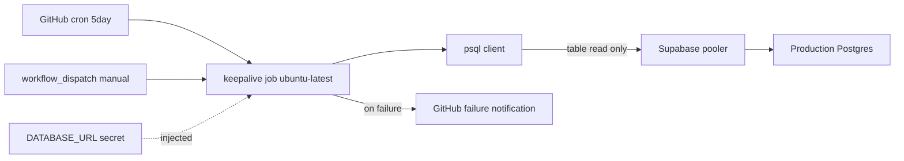
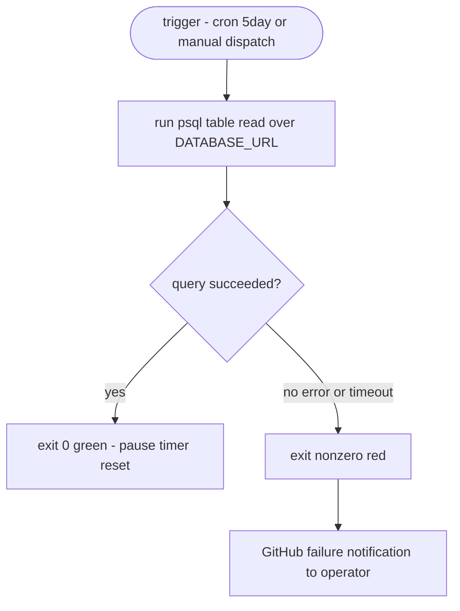

# Design Document — supabase-keepalive-cron

## Overview

**Purpose**: Supabase Free Tier の「7 日連続 user database activity 無しで自動 pause」を発火させないため、外部 CI（GitHub Actions）から定期的に本番 Supabase へ実 DB クエリを送り、pause タイマーを継続的にリセットする。

**Users**: 本プロダクトの運用者（開発者本人）。本番 `https://fw-sales.vercel.app/` を、無操作期間が続いてもいつでも応答可能な状態に保つ。

**Impact**: 2026-06-21 に発生した「7 日 pause → `504 MIDDLEWARE_INVOCATION_TIMEOUT`」の根本原因（無アクティビティ）を、アプリ実行経路に一切手を加えずに CI 側で解消する。PR #146 の fail-fast 防御（被害最小化）とは独立し、本設計は pause の **発生予防** のみを担う。

### Goals
- 5 日周期の自動実行で、7 日 pause タイマーに常に 1〜2 日の余裕を確保する。
- 実行ごとに **確実な user database activity** を生成し、pause タイマーをリセットする。
- 失敗を fail-loud に検知し運用者へ通知する。
- 本番アプリのリクエスト経路・スキーマ・データに一切変更を加えない。

### Non-Goals
- Edge Middleware の fail-fast 防御（PR #146 で実装済み・本設計では不変更）。
- Supabase 有料プラン移行（pause 根本解だがコストのため不採用）。
- Vercel Cron での実装（middleware fetch loop リスク回避のため外部 CI で完結）。
- RLS/anon 公開範囲の見直し、スキーマ追加、専用 keep-alive テーブルの新設。

## Boundary Commitments

### This Spec Owns
- 新規ワークフローファイル `.github/workflows/supabase-keepalive.yml` の全責務。
- 定期スケジュール起動・手動起動・DB activity 生成・成否判定・ログ出力・失敗通知の挙動。
- 本ワークフローが参照する secret（接続情報）の **利用契約**（登録は運用者の作業）。

### Out of Boundary
- アプリケーションコード（`app/`, `lib/`, `middleware.ts` 等）への変更。
- データベーススキーマ・migration・RLS policy の変更。
- 既存 `migrate.yml` / `ci.yml` / `check-migrations.yml` の挙動変更。
- Supabase 復旧（restore/resume）の自動化。pause してしまった後の復帰は運用者手動のまま。

### Allowed Dependencies
- GitHub Actions 実行基盤（スケジューラ・secret 機構・標準失敗通知）。
- 既存 GitHub Actions secret `DATABASE_URL`（本番 Supabase pooler 接続文字列、`migrate.yml` で稼働実績）。
- `ubuntu-latest` ランナーにプリインストールされた `psql`(postgresql-client)。
- 制約: 本ワークフローは **読み取り専用クエリのみ**。スキーマ・データへの書き込みを行ってはならない。

### Revalidation Triggers
- `DATABASE_URL` の意味/接続先（pooler のホスト・ポート・認証方式）が変わったとき。
- Supabase の pause 判定仕様（"user database activity" の定義）が変わったとき → keep-alive クエリの妥当性を再検証。
- Supabase プランが Free から変わり pause 自体が消滅したとき → 本ワークフローの存続要否を再判断。
- keep-alive 対象テーブル（`app_settings`）が drop/rename されたとき → クエリ対象を見直す（fail-loud で検知される）。

### Operational Risks (GitHub Actions 固有)
- **GitHub の scheduled workflow 自動無効化**: GitHub はリポジトリが 60 日間無活動だと scheduled workflow を自動 disable する。本 keep-alive cron が静かに止まると、気づかぬうちに 7 日 pause が再発する（watcher を誰が watch するか問題）。本リポは活発に開発されており通常は問題にならないが、開発が長期停止する局面では運用者が `workflow_dispatch` で手動 keep-warm するか、Actions の有効状態を確認する必要がある。
- **cron 実行遅延（drift）**: GitHub の scheduled トリガは混雑時に最大数時間遅延・稀にスキップされ得る。5 日周期は 7 日 pause に対し 1〜2 日の余裕を持つため通常の遅延は吸収できるが、連続スキップ時はバッファを侵食する。これが 5 日周期（より短い間隔ではない）を選ぶ根拠でもある。
- **失敗通知の到達先**: scheduled workflow 失敗の email 通知は、原則として該当ワークフローファイルを最後に変更したユーザーへ飛ぶ（Req 4.2）。運用者は自身が通知対象に含まれることを確認すること。

## Architecture

### Existing Architecture Analysis
本リポは GitHub Actions 上に 3 ワークフロー（`ci.yml`, `check-migrations.yml`, `migrate.yml`）を持つ。`migrate.yml` は `main` push 時に `DATABASE_URL` secret を用いて本番 pooler へ drizzle migration を適用する。本設計はこの **既存パターン（GitHub Actions + `DATABASE_URL` + `timeout-minutes` + 日本語ヘッダコメント）を踏襲** し、新規ワークフローを 1 本追加するのみ。アプリ実行経路には触れない。

### Architecture Pattern & Boundary Map



**Architecture Integration**:
- Selected pattern: 単一ジョブの scheduled batch（外部 CI からの health/keep-alive ping）。新規コンポーネント無し、ワークフローファイル 1 本。
- Domain/feature boundaries: keep-alive は CI 層に閉じ、アプリ層・DB スキーマ層と疎結合。生成する副作用は「読み取りクエリ 1 本」のみ。
- Existing patterns preserved: `migrate.yml` の secret 注入・timeout・日本語ヘッダコメント・`runs-on: ubuntu-latest`。
- New components rationale: pause 予防はアプリ稼働と無関係に「無操作期間中も」動く必要があり、アプリ/Vercel 経路の外（GitHub Actions）に置くのが正しい（Non-Goals 参照）。
- Steering compliance: 外部ライブラリ追加なし、本番経路無変更、最小実装。

### Technology Stack

| Layer | Choice / Version | Role in Feature | Notes |
|-------|------------------|-----------------|-------|
| Infrastructure / Runtime | GitHub Actions, `ubuntu-latest` | スケジューラ + 実行環境 | 既存 3 ワークフローと同基盤 |
| Data / Storage | Supabase Postgres（本番, pooler 経由） | keep-alive クエリの対象 | `DATABASE_URL` secret 経由 |
| CLI | `psql`(postgresql-client, ランナー同梱) | `select 1` 実行手段 | 追加 install 不要 |

> 設計判断の根拠（pause 定義・代替案比較）は `research.md` 参照。要点: pause タイマーは **実 DB クエリ**でのみリセットされ、auth/REST health ping では不十分。ゆえに Issue #147 の literal 提案（`/auth/v1/health` curl）から意図的に逸脱し、`DATABASE_URL` 経由 `select 1` を採用。

## File Structure Plan

### Created Files
```
.github/
└── workflows/
    └── supabase-keepalive.yml   # 新規: 5日周期 cron + 手動実行で psql select 1 を本番に投げる keep-alive
```

`supabase-keepalive.yml` の単一責務: スケジュール/手動トリガで起動し、`DATABASE_URL` 経由の読み取り専用クエリを 1 本実行し、成否を green/red で報告する。

### Modified Files
- なし（アプリコード・スキーマ・既存ワークフローいずれも不変更）。

## Components and Interfaces

| Component | Domain/Layer | Intent | Req Coverage | Key Dependencies (P0/P1) | Contracts |
|-----------|--------------|--------|--------------|--------------------------|-----------|
| Keep-Alive Workflow | CI / Infra | 定期 + 手動で本番に keep-alive DB クエリを実行し成否報告 | 1, 2, 3, 4, 5, 6, 7 | GitHub Actions scheduler (P0), `DATABASE_URL` secret (P0), psql (P0), Supabase pooler (P0) | Batch |

### CI / Infra

#### Keep-Alive Workflow (`supabase-keepalive.yml`)

| Field | Detail |
|-------|--------|
| Intent | 5 日周期の自動 + 手動トリガで本番 Supabase に読み取り専用 keep-alive クエリを実行し、pause タイマーをリセットする |
| Requirements | 1.1, 1.2, 1.3, 1.4, 2.1, 2.2, 2.3, 3.1, 3.2, 3.3, 3.4, 4.1, 4.2, 4.3, 4.4, 5.1, 5.2, 5.3, 5.4, 6.1, 6.2, 6.3, 6.4, 7.1, 7.4 |

**Responsibilities & Constraints**
- 2 つのトリガを受理: `schedule`(cron 5 日周期) と `workflow_dispatch`(手動)。両者は同一ジョブを実行する（2.2）。
- ジョブは `DATABASE_URL` を環境変数として受け取り、`psql` で **単一の読み取り専用クエリ** を実行する（3.1, 3.4）。
- クエリ成功時は exit 0 = green、失敗（接続不可・認証失敗・タイムアウト・非ゼロ exit）時は exit 非ゼロ = red（3.3, 4.1）。
- 実行に上限時間（`timeout-minutes`）を設け、無応答時の無限ハングを防ぐ（6.1）。
- secret を平文 echo せず、psql には環境変数経由でのみ渡す（5.4）。
- 本番アプリの実行経路に何も追加しない（6.2 — ファイルは `.github/` 配下のみ）。

**Dependencies**
- Inbound: GitHub Actions scheduler / 運用者の手動操作 — トリガ (P0)
- Outbound: Supabase 本番 pooler — keep-alive クエリ送信先 (P0)
- External: `DATABASE_URL` secret (P0), `psql`(ランナー同梱) (P0)

**Contracts**: Batch / Job Contract

##### Batch / Job Contract
- **Trigger**:
  - `schedule: cron: '0 9 */5 * *'`（5 日周期 / 18:00 JST 相当, 7 日 pause に対し 1〜2 日の余裕 — 1.1）
  - `workflow_dispatch`（手動実行 — 2.1）
- **Input / validation**:
  - `DATABASE_URL`（secret）。未設定/空なら psql 接続が失敗し red 終了（5.3）。
  - 追加入力パラメータなし。
- **Action / output**:
  - 実行コマンド（概念）: `psql "$DATABASE_URL" -v ON_ERROR_STOP=1 -c "select count(*) from app_settings;"`
  - **テーブル読取**を採用（`select 1` 単体ではなく実テーブルにアクセス）し、Supabase の "user database activity" 計上を確実化（OQ1 を設計段階で解消）。`app_settings` は `DATABASE_URL`（直結・フル権限）で読むため RLS に非依存。`count(*)` は **内容非依存で常に 1 行返す**ため、`app_settings` が空（手動シードの KV ストア）でも判定が安定する（実装時の探索で空であることを確認、`limit 1` だと 0 行返却になるため `count(*)` を採用）。対象テーブルが drop/rename された場合は psql エラー → red で fail-loud（4.1）。
  - ログに実行結果（成功可否・所要時間相当の step ログ）を残す（3.2, 4.4, 6.3）。secret 値は出力しない（5.4）。
  - 成功 → green、失敗 → red + GitHub 標準失敗通知（4.2）。
- **Idempotency & recovery**:
  - 読み取り専用 `select ... limit 1` は完全冪等。何度実行しても DB 状態を変えない（3.4）。
  - 単発失敗は次回スケジュール実行で自然回復。pause 予防の観点では 7 日窓内に 1 回成功すれば足りる（1.1 の余裕設計）。
- **`ON_ERROR_STOP=1`**: クエリエラーを確実に非ゼロ exit に変換し fail-loud を保証（4.1, 4.3）。

**Implementation Notes**
- Integration: 既存 `migrate.yml` のヘッダコメント様式・`runs-on`・secret 注入・`timeout-minutes` を踏襲。`actions/checkout` は keep-alive 自体には不要だが、ワークフロー可読性のため最小ステップ構成にする（checkout 省略可）。
- 接続モード: `DATABASE_URL` は `migrate.yml` と同一の本番 pooler（メモリ: Session Pooler 5432 が CI 必須）を指す前提。単発 `psql -c "..."` は session/transaction いずれのモードでも動作するため、`DATABASE_URL` の指す接続先をそのまま使えばよい。
- Validation: PR 段階では実行されない（schedule/dispatch のみ）。マージ後 `workflow_dispatch` で手動 green を確認（7.1）。
- Risks: load-bearing クエリは実テーブル読取（`select 1 from app_settings limit 1`）をデフォルトとし、`select 1` 単体の activity 計上不確実性（OQ1）を排除済み。対象テーブルは単一ファイル内で差し替え可能（`app_settings` が将来無くなった場合は `stores` 等へ）。

## System Flows



ゲーティング条件: `ON_ERROR_STOP=1` と `set -euo pipefail` により、接続失敗・クエリエラー・timeout のいずれも red に確実変換する（4.1, 4.3）。timeout は `timeout-minutes` がジョブ全体に作用する（6.1）。

## Requirements Traceability

| Requirement | Summary | Components | Contracts | Flows |
|-------------|---------|------------|-----------|-------|
| 1.1–1.4 | 5 日周期の自動実行・コミット非依存 | Keep-Alive Workflow | Batch(Trigger: schedule) | trigger→Run |
| 2.1–2.3 | 手動実行と自動実行の同一処理 | Keep-Alive Workflow | Batch(Trigger: dispatch) | trigger→Run→Green |
| 3.1–3.4 | 実 DB クエリ・読取専用・成否・ログ | Keep-Alive Workflow | Batch(Action/output) | Run→Ok |
| 4.1–4.4 | 失敗検知・通知・追跡可能ログ | Keep-Alive Workflow | Batch(`ON_ERROR_STOP`) | Ok→Red→Notify |
| 5.1–5.4 | secret 機構・本番同一値・未設定時 red・平文非出力 | Keep-Alive Workflow | Batch(Input) | trigger→Run |
| 6.1–6.4 | timeout・本番経路不汚染・判別可能ログ・最小頻度 | Keep-Alive Workflow | Batch(Idempotency) | 全体 |
| 7.1, 7.4 | 手動 green 確認・自動 green 確認 | Keep-Alive Workflow | Batch(Trigger) | Run→Green |
| 7.2, 7.3 | 実運用で pause 不再発（運用観測 DoD） | （運用検証, コード外） | — | — |

> 7.2/7.3 はコードではなく **運用観測で充足**する DoD。複数 pause 周期を跨ぐ運用期間で本番が pause しないことを運用者が確認する（research の Follow-up）。

## Error Handling

### Error Strategy
fail-loud。keep-alive が機能していない状態を silent に放置すると再び 7 日 pause に陥るため、あらゆる失敗を red + 通知に変換する。

### Error Categories and Responses
- **接続失敗 / 認証失敗 / secret 未設定**（5.3, 4.1）: psql が非ゼロ exit → ジョブ red → GitHub 失敗通知。
- **クエリエラー**: `ON_ERROR_STOP=1` で非ゼロ exit → red。
- **無応答 / ハング**（6.1）: `timeout-minutes` 到達でジョブ強制終了 → red。
- **部分失敗**（4.3）: 本設計は単一クエリのため「一部失敗＝全体失敗」が自動的に成立。`set -euo pipefail` で複数ステップ化しても最初の失敗で停止。

### Monitoring
GitHub Actions の実行履歴（緑/赤）と step ログ（3.2, 6.3）で観測。追加の監視基盤は導入しない（最小実装）。失敗時はリポジトリ通知設定に従い運用者へ email 通知（4.2）。

## Testing Strategy

### Manual / Operational Tests（本機能の検証は手動 + 運用観測が中心）
- **T1（7.1）**: マージ後 `workflow_dispatch` で手動実行し green を確認。step ログに `select 1` 成功が出ることを確認。
- **T2（4.1, 5.3）**: 故意に無効な接続情報で実行（または一時的に secret を欠いた状態を再現）し、red 終了 + 失敗通知が出ることを確認。検証後は正規 secret に戻す。
- **T3（6.1）**: `timeout-minutes` 設定値の妥当性確認（通常実行が数秒で完了し、上限に対し十分な余裕があること）。
- **T4（7.4）**: 直近の自動スケジュール実行が green であることを Actions 履歴で確認。
- **T5（7.2, 7.3）**: 運用観測 — pause タイマー周期（7 日）を複数回跨ぐ期間、本番が pause せず応答し続けることを確認。

### Static Checks
- **T6（5.4, 6.2）**: ワークフロー YAML をレビューし、(a) secret を平文 echo しない、(b) `.github/` 配下のみの変更でアプリ実行経路に手を入れていない、(c) クエリが読み取り専用であることを確認。

## Open Questions / Risks
- **OQ1（解消済み）**: `select 1` 単体の activity 計上不確実性は、load-bearing クエリを実テーブル読取（`select 1 from app_settings limit 1`）にすることで設計段階で解消した。残る確証は運用観測（T5）で pause 不再発を確認して得る。
- **OQ2**: 本設計は Issue #147 の literal な secret 要件（`SUPABASE_URL`/`SUPABASE_ANON_KEY`）から逸脱し、既存 `DATABASE_URL` を再利用する。根拠は research（公式 pause 定義）。PR/Issue コメントで設計判断を明記し合意を得ること。
- **OQ3（運用リスク）**: GitHub の scheduled workflow 60 日 auto-disable / cron drift（Operational Risks 参照）。コードでは解決できず運用観測・手動 keep-warm で担保する。
